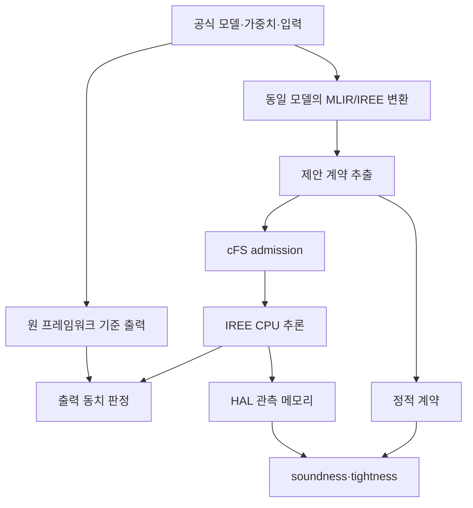

# MLIR 기반 cFS AI 메모리 계약 연구를 위한 레퍼런스 기반 벤치마크 구성안

## 1. 결론

이 연구의 신규 제안은 **MLIR/IREE 컴파일 결과에서 AI 추론의 부분 메모리 계약을 추출하고, cFS가 실행 전에 이를 이용해 ADMIT/DENY를 결정하는 구조**로 한정한다.

그 밖의 요소는 다음 원칙을 따른다.

- AI 모델과 데이터셋: 공개 논문·공식 저장소·실제 우주 실험에 근거
- 비행 소프트웨어: NASA 공식 cFS 버전 고정
- AI–cFS 연계 배경: NASA OnAIR 공식 구조를 참조하되, 실제로 통과하지 않은 경로를 OnAIR 실행으로 부르지 않음
- 컴파일러·런타임: 공식 LLVM/MLIR 및 IREE 버전 고정
- 타깃 ISA와 에뮬레이터: 공식 문서가 있는 AArch64/QEMU 설정 사용
- 정확도 기준과 입력 전처리: 원 벤치마크 정의를 변경하지 않음
- 합성 모델: 논문의 대표 AI 사례가 아니라 회귀·경계 검증용으로만 사용

따라서 논문의 중심 실험은 **비행 유래 1개 + 표준 임베디드 AI 2개 + 내부 회귀시험군**으로 구성하는 것이 적절하다.

---

## 2. 연구의 신규성 경계

| 구분 | 내용 | 지위 |
|---|---|---|
| 신규 제안 | MLIR의 lowering 이후 정보로부터 정적 메모리 계약 생성 | 본 연구의 기여 |
| 신규 제안 | 계약과 cFS 런타임 예산을 비교하는 실행 전 admission | 본 연구의 기여 |
| 신규 제안 | 동적·미지원 상태에서의 fail-closed 처리 | 본 연구의 기여 |
| 기존 기술 | cFS, OnAIR, LLVM/MLIR, IREE, QEMU | 공식 구현을 고정해 사용 |
| 기존 워크로드 | OPS-SAT 및 MLPerf Tiny 모델·데이터 | 원 출처를 보존해 사용 |
| 내부 보조물 | 기존 9→16384→2 합성 모델 및 구조별 micro-model | 회귀·진단용, 현실성 근거로 사용 금지 |

핵심 원칙은 **제안 구조의 효과를 보이기 위해 주변 조건까지 임의로 설계하지 않는 것**이다.

---

## 3. 벤치마크 포트폴리오

### 3.1 B0 — 내부 회귀시험군: 기존 합성 모델

| 항목 | 구성 |
|---|---|
| 모델 | 기존 canonical MLP `9→16384→2`, conv2d·multibranch·dynamic micro-model |
| 목적 | 빌드 재현성, 런타임 간 출력 동치, 계약 경계 `B-1/B/B+1`, 미지원·동적 형상의 거부 검증 |
| 논문상 위치 | 구현 검증 또는 부록 |
| 금지할 주장 | 실제 위성 임무 모델의 대표성, 비행 성능, 일반적 AI 워크로드 대표성 |

이 시험군은 제거하지 않는다. 이미 확보한 E25 결과를 회귀 기준으로 유지하되, 본 실험의 대표 모델로 내세우지 않는다.

### 3.2 B1 — 주 벤치마크: OPS-SAT 영상 분류

#### 권장 구성

- 임무: 위성 영상의 온보드 분류 및 다운링크 우선순위 결정
- 기준 구조: **EfficientNet-Lite0 계열의 OPS-SAT 공식 경쟁 사양**
- 입력: `200×200×3`
- 출력: 8개 클래스
- 기준 산출물: H5 가중치와 float16 TFLite 변환 절차
- 기준 플랫폼: OPS-SAT SEPP의 ARM 기반 CPU 환경

#### 선정 이유

1. 단순히 우주용으로 보이는 모델이 아니라, OPS-SAT 온보드 실행 캠페인과 직접 연결된 사례다.
2. 영상 CNN이므로 convolution, activation, intermediate tensor 등 메모리 계약의 효용을 충분히 드러낸다.
3. 모델 구조·입력 형상·정밀도 규칙이 외부 사양으로 정해져 있어 연구자가 결과에 유리하게 모델을 임의 설계했다는 비판을 줄인다.

#### 엄격한 재현 구분

| 확보 상태 | 논문에서 사용할 명칭 | 허용되는 주장 |
|---|---|---|
| 실제 공개된 비행 가중치와 동일 입력을 확보 | OPS-SAT flight-artifact reproduction | 해당 산출물의 재실행 |
| 공식 구조·학습 규칙·데이터만 확보하고 재학습 | OPS-SAT reference-derived benchmark | 공개 사양에 따른 파생 재현 |
| 임의 이미지 또는 임의 가중치 사용 | 구조 호환성 시험 | 비행 모델 또는 임무 성능 주장 불가 |

실제 비행 가중치가 공개적으로 확보되지 않으면 **“비행 모델을 재현했다”라고 쓰지 않고 “OPS-SAT reference-derived”라고 명시**한다.

#### 실행 단계

1. 공식 전처리·입력·레이블·품질 기준을 고정한다.
2. 원 TFLite 또는 H5 경로에서 기준 출력을 생성한다.
3. 동일 가중치를 MLIR/IREE 입력 형식으로 변환한다.
4. 변환 전후 출력 동치를 확인한 뒤에만 메모리 계약 실험에 포함한다.
5. float16/quantized 연산이 현재 import 경로에서 지원되지 않으면 FP32 대체 사실을 명시하며, 이를 동일 비행 산출물로 간주하지 않는다.

### 3.3 B2 — 표준 CNN 기준: MLPerf Tiny Image Classification

| 항목 | 구성 |
|---|---|
| 모델 | MLPerf Tiny 공식 ResNet 계열 참조 모델(저장소의 기준 버전을 고정) |
| 데이터 | CIFAR-10, `32×32×3`, 10개 클래스 |
| 품질 기준 | MLPerf Tiny 해당 버전의 Top-1 기준 사용 |
| 연구 역할 | 공개 표준 CNN에서 계약 추출 가능성, soundness, tightness, 연산자 coverage 측정 |

OPS-SAT 모델 하나만 쓰면 결과가 특정 임무·변환 경로에 종속될 수 있다. B2는 공개 표준 모델을 사용해 CNN 계열에서 결과가 반복되는지 확인한다.

### 3.4 B3 — 비-CNN 기준: MLPerf Tiny Anomaly Detection

| 항목 | 구성 |
|---|---|
| 모델 | MLPerf Tiny 공식 Deep Autoencoder |
| 데이터 | ToyADMOS toy-car anomaly-detection 데이터 |
| 품질 기준 | MLPerf Tiny 해당 버전의 AUC 기준 사용 |
| 연구 역할 | fully connected/autoencoder 구조에서 활성화 메모리와 계약 tightness 평가 |

B3는 영상 CNN만으로 결론을 내리는 것을 막는다. 다만 ToyADMOS는 위성 텔레메트리 데이터가 아니므로 **표준 임베디드 이상탐지 기준**이라고만 부른다.

### 3.5 B4 — 선택적 비행 ML 기준: OPS-SAT OrbitAI

- 대상: 공개된 비행 로그와 직렬화 모델을 포함하는 AROW 기반 FDIR 사례
- 장점: 실제 OPS-SAT에서 수집된 입력과 비행 중 학습된 모델을 사용할 수 있음
- 한계: 심층신경망이 아니며, 고정 추론부는 작아서 메모리 계약의 주 효과를 충분히 압박하지 못함
- 사용 위치: 작은 모델에서의 하한선 또는 applicability/control 사례

따라서 B4는 **선택 항목**이다. Random Forest나 온라인 학습 전체를 현재 IREE 텐서 파이프라인에 억지로 이식해 연구 범위를 넓히지 않는다. 포함한다면, 공개된 AROW 모델의 **고정 추론 단계만** 동일 수식과 파라미터로 표현하고 변환 동치를 먼저 입증한다.

---

## 4. 최종 권장 세트

| 우선순위 | 벤치마크 | 성격 | 논문에서의 역할 |
|---:|---|---|---|
| 1 | OPS-SAT EfficientNet-Lite0 계열 | 비행 유래 | 주 사례, 임무 타당성 |
| 2 | MLPerf Tiny ResNet/CIFAR-10 | 공개 표준 | CNN 일반화 확인 |
| 3 | MLPerf Tiny Deep Autoencoder/ToyADMOS | 공개 표준 | 비-CNN 구조 확인 |
| 4 | 기존 synthetic/micro-model | 내부 통제 | 회귀·경계·오류 경로 검증 |
| 선택 | OPS-SAT OrbitAI AROW | 실제 비행 ML | 소형 FDIR control |

논문 분량과 구현 부담을 고려하면 **1~4를 필수 세트**, OrbitAI를 선택 세트로 둔다.

---

## 5. 실험환경의 출처 고정 원칙

### 5.1 구성요소별 provenance

| 구성요소 | 기준 출처 | 고정해야 할 정보 | 연구상 의미 |
|---|---|---|---|
| 비행 SW | NASA cFS 공식 저장소 | cFS bundle 및 각 submodule SHA, mission 설정 | admission이 실제 cFS 앱 경계에서 동작함을 검증 |
| AI–cFS 구조 배경 | NASA OnAIR 공식 저장소 | 참조 SHA, 사용한 모듈과 미사용 모듈 | 연구 맥락 제공; 직접 실행하지 않은 경로는 결과로 주장하지 않음 |
| 컴파일러 | 공식 LLVM/MLIR·IREE | release 또는 commit SHA, build flags | 계약 추출 시점과 lowering 결과 재현 |
| 모델 | OPS-SAT·MLPerf 공식 자료 | 원본 URL, SHA256, 모델 버전, 정밀도 | 임의 모델 선택 방지 |
| 데이터 | 각 벤치마크 공식 배포본 | split, 파일 checksum, 전처리 | 입력과 정확도 재현 |
| AArch64 실행 | 공식 QEMU 및 배포판 이미지 | QEMU 버전, machine, CPU, image checksum | ISA/backend 실행 검증 |
| 크로스 툴체인 | 공식 배포 툴체인 | compiler/linker 버전, sysroot checksum | 바이너리 재현 |
| x86-64 실행 | 동일 IREE/cFS 소스 | CPU·OS·compiler 기록 | 개발 기준 및 ISA 변화 분리 |

모든 항목은 `provenance.json`과 사람이 읽을 수 있는 `ENVIRONMENT.md`에 함께 기록한다. `latest`, 부동 브랜치, 자동 갱신 모델은 사용하지 않는다.

### 5.2 x86-64와 AArch64의 역할

- **x86-64는 유지**한다. 빠른 회귀, 기준 출력 생성, cFS 통합 오류와 ISA 백엔드 오류의 분리에 필요하다.
- **AArch64/QEMU를 주 배치 ISA 검증 경로**로 둔다.
- 두 ISA의 VMFB는 서로 다른 컴파일 산출물이다. 비트 동일 파일을 요구하지 않고, 같은 소스 모델·가중치·입력에 대한 출력 허용오차를 검증한다.
- QEMU 결과로 실제 하드웨어의 latency, WCET, 전력, cache 거동을 주장하지 않는다.
- E26의 메모리 계약 soundness와 admission 검증에는 물리 하드웨어가 필수는 아니다. 성능 주장을 추가할 때만 Cortex-A53급 실제 보드를 별도 확장 실험으로 둔다.

OPS-SAT의 실제 SEPP는 ARM Cortex-A9 계열/ARM32 환경이므로, Cortex-A53/AArch64 QEMU를 **OPS-SAT 하드웨어 재현**이라고 부르면 안 된다. 이는 실제 배치 후보 ISA에 대한 별도 검증이다.

---

## 6. 모델별 실행 경로



비교 단위는 모델 이름이 아니라 다음 5개가 모두 고정된 **artifact tuple**로 정의한다.

`(source model, weights, preprocessing, compiler configuration, target ISA)`

---

## 7. E26 실험 행렬

### 7.1 최소 행렬

| 축 | 값 |
|---|---|
| 모델 | B0 canonical, B1 OPS-SAT, B2 MLPerf-CNN, B3 MLPerf-AE |
| ISA | x86-64, AArch64 |
| 실행 | standalone IREE, cFS+IREE |
| 예산 | `B-1`, `B`, `B+1` |
| 관측 | 정적 계약, HAL 동일 경계 peak, admission 결과, 출력 |

OnAIR 경로는 실제 plugin/telemetry 연결을 통과한 경우에만 별도 열로 추가한다. 단순 IREE Python 실행을 OnAIR 실행으로 표기하지 않는다.

### 7.2 모델당 수행 순서

1. 출처와 라이선스를 확인하고 원본 checksum을 고정한다.
2. 공식 평가 입력으로 원 프레임워크 품질 기준을 재현한다.
3. IREE 변환 전후의 단일 입력 및 평가 세트 출력을 대조한다.
4. x86-64 VMFB에서 standalone/cFS 출력을 대조한다.
5. AArch64용 별도 VMFB를 만들고 QEMU cFS 출력을 대조한다.
6. 정적 계약 `B`와 같은 정의 경계의 HAL peak `P`를 수집한다.
7. `B-1`, `B`, `B+1`에서 DENY/ADMIT/ADMIT을 확인한다.
8. 미지원 연산·동적 크기 모델은 계약 생성을 거부하는지 확인한다.

---

## 8. 측정값과 판정 기준

### 8.1 1차 지표

| 지표 | 정의 | 판정 |
|---|---|---|
| Contract soundness | 관측한 동일 경계 peak `P ≤ B` | 지원 모델·입력에서 위반 0건 |
| Admission correctness | 예산과 계약 비교 결과 | `B-1`: DENY, `B`: ADMIT, `B+1`: ADMIT |
| Tightness | `P/B` 및 slack `B-P`를 함께 보고 | 모델별 분포 제시; 임의 합격선 설정 금지 |
| Extraction coverage | 계약 생성 성공 모델 수 / 전체 모델 수 | 실패 연산과 원인을 함께 공개 |
| Semantic equivalence | 원 프레임워크와 IREE 출력 비교 | 분류 일치 + 수치 오차 기준을 정밀도별 사전 고정 |
| Fail-closed | unknown/dynamic/unsupported 처리 | 계약 미생성 또는 admission 거부 |

`P ≤ B`가 모든 실행에 관측되었다는 결과는 **관측 범위 내 경험적 soundness**다. 이를 모든 입력·플랫폼에 대한 형식적 증명으로 확대하지 않는다.

### 8.2 별도 계상 항목

다음은 VM/HAL 계약 경계와 섞지 않고 분리해서 보고한다.

- VMFB 파일 및 상주 상수
- IREE runtime/wrapper 고정 오버헤드
- cFS 앱 자체 heap/stack
- 입력·출력 버퍼
- OS/QEMU 프로세스 RSS

경계가 다른 수치를 합산해 단일 “총 메모리 계약”이라고 부르지 않는다.

### 8.3 성능 지표의 범위

- QEMU latency는 기능 검증용 참고치일 뿐 성능 결론에 사용하지 않는다.
- 본 논문의 1차 결과는 계약의 생성 가능성, soundness, tightness, admission 경계다.
- 실제 하드웨어를 추가할 경우에만 latency·throughput·RSS를 보조 지표로 보고한다.
- 정확도는 새로운 SOTA를 주장하기 위한 값이 아니라 변환 과정에서 모델 의미가 유지됐는지 확인하는 guardrail이다.

---

## 9. E27에서 사용할 비교 기준

MLIR의 필요성을 보이려면 같은 벤치마크 세트를 다음 분석기와 비교한다.

| 기준 | 설명 | 비교 질문 |
|---|---|---|
| Source/tensor-sum estimate | 입력 그래프 텐서 크기의 단순 합 또는 생존구간 미반영 추정 | lowering 전 정보만으로 얼마나 부정확한가 |
| LLVM IR/ELF-only analysis | 최종 저수준 산출물에서 복구 가능한 정보로 추정 | MLIR 구조 정보가 실제로 추가 이득을 주는가 |
| Proposed MLIR contract | post-layout/lowering 지점에서 추출 | coverage와 tightness가 개선되는가 |
| Runtime HAL observation | 같은 경계의 관측 peak | 경험적 기준점 |

TensorFlow Lite Micro arena 값은 메모리 경계와 런타임 allocator가 IREE와 다르다. 경계 정합성을 입증하지 못하면 직접 수치 baseline으로 섞지 말고 관련 체계로만 설명한다.

---

## 10. 산출물 구조

```text
benchmarks/
  manifest.yaml              # 모델·데이터·라이선스·원본 URL·checksum
  opssat_efficientnet_lite0/
  mlperf_tiny_resnet/
  mlperf_tiny_autoencoder/
  synthetic_regression/
artifacts/
  x86_64/<model>/
  aarch64/<model>/
contracts/
  <model>/<target>.json
measurements/
  hal_peak/
  admission/
  equivalence/
provenance.json
ENVIRONMENT.md
RESULTS.md
```

각 결과 행에는 최소한 `model_hash`, `input_hash`, `compiler_sha`, `target_triple`, `vmfb_hash`, `contract_hash`, `cfs_sha`를 포함한다.

---

## 11. 실행 우선순위

### 단계 A — 즉시 수행

1. 기존 B0를 회귀시험으로 명칭 변경
2. MLPerf Tiny B2/B3를 가져와 변환 가능 연산 확인
3. OPS-SAT B1의 실제 공개 가중치·데이터 접근 가능성 확인
4. 모든 외부 파일의 버전과 checksum 기록

### 단계 B — E26 본 실험

1. B1~B3 출력 동치 확보
2. x86-64에서 계약/peak/tightness 측정
3. cFS `B-1/B/B+1` admission 확인
4. AArch64/QEMU에서 의미 동치와 admission 재검증
5. 미지원 연산은 숨기지 않고 coverage 결과로 보고

### 단계 C — E27

동일 모델·입력·컴파일 설정으로 source estimate, LLVM IR/ELF-only, MLIR 계약, HAL 관측을 비교한다. 벤치마크를 E27에 맞춰 다시 바꾸지 않는다.

---

## 12. 중단·대체 기준

| 상황 | 처리 |
|---|---|
| OPS-SAT 실제 비행 가중치 비공개 | 공식 사양으로 재학습하고 `reference-derived`로 명명 |
| float16/TFLite import 미지원 | FP32 변환 결과를 별도 variant로 보고; 비행 산출물 동일성 주장 금지 |
| 특정 연산의 계약 추출 불가 | 모델을 몰래 단순화하지 말고 unsupported로 기록 |
| MLPerf 정확도 기준 미달 | 메모리 실험 전에 변환·전처리 오류를 해결 |
| AArch64 출력 불일치 | admission 실험과 분리해 backend/수치 차이 원인 분석 |
| QEMU 성능 변동 | 시간 성능 주장에서 제외 |
| OrbitAI 이식이 온라인 학습 연구로 확장 | B4 제외; 고정 추론만 가능한 경우에만 선택 포함 |

---

## 13. 논문에서 가능한 주장과 금지할 주장

### 가능한 주장

- 실제 비행 유래 및 공개 임베디드 AI 모델에서 계약을 추출할 수 있는지 평가했다.
- 동일 메모리 경계에서 정적 계약과 HAL 관측 peak를 비교했다.
- cFS가 실행 전 예산 경계에서 일관되게 ADMIT/DENY하는지 검증했다.
- x86-64와 AArch64용 서로 다른 VMFB에서 의미 동치를 확인했다.
- 미지원·동적 사례의 fail-closed 동작과 추출 coverage를 공개했다.

### 금지할 주장

- QEMU 결과가 실제 우주용 보드의 WCET·전력·실시간성을 입증한다.
- 공개 사양으로 재학습한 모델이 실제 비행 가중치와 동일하다.
- OnAIR를 직접 통과하지 않은 실행을 OnAIR 통합 결과라고 부른다.
- 관측된 `P ≤ B`만으로 보편적·형식적 soundness를 증명했다.
- 합성 MLP 하나로 위성 AI 전반의 대표성을 주장한다.
- 보안·공급망·서명 문제를 본 연구의 필수 검증 범위로 확장한다.

---

## 14. 최종 판단

이 구성은 현재 연구를 크게 바꾸지 않으면서 가장 약한 부분이었던 **실험 워크로드의 현실성과 외부 타당성**을 보강한다.

가장 타당한 논문 구조는 다음과 같다.

1. 합성 모델로 구현과 경계조건을 엄밀히 검증한다.
2. OPS-SAT 비행 유래 모델로 임무 타당성을 보인다.
3. MLPerf Tiny 두 모델로 구조 다양성과 재현성을 보인다.
4. 같은 벤치마크를 E27의 MLIR/LLVM IR baseline 비교에도 그대로 재사용한다.

이렇게 하면 새로운 것은 MLIR 기반 계약 구조뿐이고, 나머지는 모두 추적 가능한 외부 레퍼런스에 기대므로 연구의 인과관계와 재현성이 선명해진다.

---

## 참고 자료

1. NASA cFS: <https://github.com/nasa/cFS>
2. NASA OnAIR: <https://github.com/nasa/OnAIR>
3. IREE: <https://github.com/iree-org/iree>, <https://iree.dev/>
4. OPS-SAT SmartCam: <https://github.com/georgeslabreche/opssat-smartcam>
5. OPS-SAT SmartCam training guide: <https://github.com/georgeslabreche/opssat-smartcam/tree/master/training>
6. OPS-SAT image-classification competition specification: <https://kelvins.esa.int/opssat-data-analysis-competition/scoring/>
7. Labrèche et al., “The OPS-SAT case: A data-centric competition for onboard satellite image classification,” *CEAS Space Journal*, DOI: <https://doi.org/10.1007/s42064-023-0196-y>
8. Labrèche et al., “OPS-SAT SmartCam: A Deep Learning On-Board Image Classification Experiment,” *IEEE Aerospace Conference*, DOI: <https://doi.org/10.1109/AERO53065.2022.9843402>
9. OPS-SAT OrbitAI: <https://github.com/georgeslabreche/opssat-orbitai>
10. MLPerf Tiny working group: <https://mlcommons.org/working-groups/benchmarks/tiny/>
11. MLPerf Tiny reference repository: <https://github.com/mlcommons/tiny>
12. QEMU Arm system emulator: <https://www.qemu.org/docs/master/system/target-arm.html>

### 검토 시점에 확인한 외부 저장소 버전

| 저장소 | 확인 SHA |
|---|---|
| `georgeslabreche/opssat-smartcam` | `be09ecee41f0a5db52afe0ee929dbd339cb68672` |
| `georgeslabreche/opssat-orbitai` | `79a1df070c2eea384c457013e8305b7798d30b05` |
| `mlcommons/tiny` | `4addd0fa08d216e20637637874e084895f289da4` |

실제 실험 시작 시에는 위 SHA를 그대로 쓸지, 특정 release/tag로 고정할지를 결정하고 변경 이유를 기록한다.
