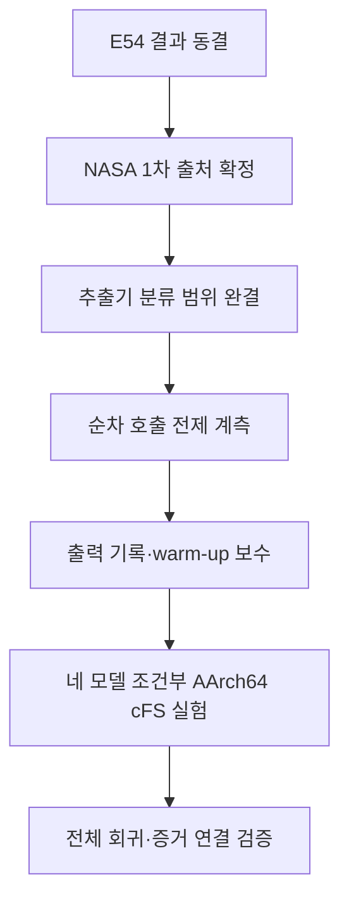

# onAIR-MLIR v0.57 필수 후속 작업 권고안

## 1. 결론

현재 E54까지 기본 실험은 성립했다. 이후에는 선택적 기능 확장이 아니라 다음 네 가지를 완료하는 데 집중한다.

1. 참조 예산의 NASA 1차 출처 확정
2. MLIR/IREE 메모리 요구량 추출기의 지원 범위 완결
3. 순차 실행 전제(`max_in_flight_calls = 1`)의 런타임 관측
4. 네 실제 모델의 AArch64 cFS 조건부 상한 검증

이 네 항목은 각각 **예산 근거**, **정적 상한의 건전성**, **실행 전제**, **모델 간 일반성**을 담당한다. 하나라도 빠지면 현재 결과를 사용할 수 없는 것은 아니지만, 연구의 핵심 논증 중 하나가 소스 논증·단일 모델·미확인 출처에 의존하게 된다.

검토 기준 문서:

- [`OPTIONAL_FOLLOWUPS_v0.57.md`](https://github.com/wookjaeya/onAIR-MLIR/blob/claude/review-and-proceed-4y1sag/docs/OPTIONAL_FOLLOWUPS_v0.57.md)
- [`EVIDENCE_v0.57_E54.md`](https://github.com/wookjaeya/onAIR-MLIR/blob/claude/review-and-proceed-4y1sag/docs/EVIDENCE_v0.57_E54.md)
- [`EVIDENCE_v0.51_E49.md`](https://github.com/wookjaeya/onAIR-MLIR/blob/claude/review-and-proceed-4y1sag/docs/EVIDENCE_v0.51_E49.md)

---

## 2. P0-1 — 참조 예산의 NASA 1차 출처 확정

### 필요한 이유

E54에서 사용한 RAM 마진 `50/50/40/30%`는 수치 자체는 타당하지만, 저장소에서는 `transcribed_from_directive_primary_blocked`로 분류돼 있다. 참조 예산의 근거가 핵심 실험 입력이므로 최종적으로는 지시문 전사가 아니라 취득한 NASA 원문에 연결돼야 한다.

### 수행 내용

1. 다음 공식 원문을 직접 취득한다.
   - NASA Software Engineering Handbook, §9.12 Resource Margins  
     https://swehb.nasa.gov/spaces/SWEHBVD/pages/102695803/9.12%2BResource%2BMargins
   - GSFC-STD-1000 Rev. I, Table 3.07-1 Flight Software Margins, pp. 56–58  
     https://standards.nasa.gov/system/files/tmp/GSFC-STD-1000RevI_Approved_0.pdf
   - NPR 7150.2D, §5.4.5  
     https://nodis3.gsfc.nasa.gov/displayDir.cfm?Internal_ID=N_PR_7150_002D_&page_name=Chapter5
2. 문서명·개정번호·표/조항·URL·취득일·SHA-256을 기록한다.
3. 기존 예산 계산을 읽기 전용으로 재실행해 `budgets.json`과 일치하는지 확인한다.
4. 수치가 동일하면 기존 E54 셀은 재실행하지 않고 출처 등급만 별도 정정 기록으로 보강한다.
5. 수치가 달라질 경우에만 새 계획을 사전 고정하고 영향받는 셀을 재실행한다.

### 완료 기준

- RAM 마진 수치와 계산식이 취득한 NASA 원문에서 확인된다.
- 기존 예산과 재계산값의 동일성 여부가 기계 판독 결과로 남는다.
- 해당 예산을 실제 특정 임무의 할당값이 아니라 **공개 근거로 구성한 참조 예산 시나리오**로 명시한다.

---

## 3. P0-2 — 추출기 분류 범위 완결(G)

### 필요한 이유

현재 네 모델에서 미분류 연산은 없지만, 구조적 walker가 `stream.cmd.*`와 `stream.timepoint.*` 계열을 완전히 판정하지 않는다. 현재 표본에 나타나지 않았다는 사실만으로 지원 범위 전체의 메모리 상한이 건전하다고 할 수 없다.

### 수행 내용

1. 메모리 할당·해제·별칭·수명에 영향을 줄 수 있는 연산을 명시적으로 분류한다.
2. 의미를 확인하지 못한 연산은 0바이트로 처리하지 않고 명세 생성을 거절한다.
3. 동적 형상처럼 이미 거절돼야 하는 입력은 기존 거절 경로가 담당하도록 유지한다.
4. 지원 연산과 미지원 연산을 구분한 음성·양성 회귀시험을 추가한다.
5. 보관된 네 실제 모델의 MLIR dump를 다시 분석해 기존 메모리 수치가 변하지 않는지 확인한다.

### 완료 기준

- 모든 분석 대상 resource 연산이 `지원·비할당 확인·명시적 거절` 중 하나로 분류된다.
- 알 수 없는 연산이 조용히 누락되는 경로가 없다.
- ResNet·DeepAE·SmartCam·WGAN의 기존 상한값이 유지된다.
- 미지원 연산 음성 사례가 실제로 fail-closed 동작을 보인다.

---

## 4. P0-3 — 순차 실행 전제의 관측(E)

### 필요한 이유

메모리 요구량 상한은 한 번에 하나의 추론 호출이 진행된다는 전제를 사용한다. 현재는 배포 소스에서 작업·스레드 생성 호출이 없다는 근거만 있으며, 실제 호출 중 최대 동시 실행 수는 관측하지 않았다.

### 수행 내용

1. cFS AI 실행기의 invoke 진입 시 active-call counter를 증가시킨다.
2. 정상·오류 반환을 포함한 모든 종료 경로에서 감소시킨다.
3. 실행 중 최대값인 `max_active_calls`를 원자료에 기록한다.
4. 최소한 네 모델의 AArch64 cFS 핵심 셀에서 값을 관측한다.
5. 계측 자체가 판정·출력·HAL peak를 바꾸지 않는지 확인한다.

### 완료 기준

- 네 모델 모두에서 `max_active_calls == 1`이 직접 관측된다.
- counter 누락과 음수·미복귀 상태를 탐지하는 회귀시험이 있다.
- 계측 전후의 허용·거절 판정과 모델 출력이 동일하다.

---

## 5. P0-4 — 네 모델의 AArch64 cFS 조건부 상한 검증(A2)

### 필요한 이유

조건부 상한을 실제 실행 허용의 근거로 사용한 AArch64 cFS 증거는 SmartCam에 집중돼 있다. ResNet·DeepAE·WGAN에서도 map 분기가 관측됐지만, 조건부 판정 전체가 모델별로 검증된 것은 아니다. 조건부 계층을 연구의 핵심 방법으로 유지하려면 단일 모델 의존성을 해소해야 한다.

### 사전 보수

다음 두 구현 결함은 새 실험의 연구 기여가 아니지만 A2 전에 수정한다.

- `line[768]` 고정 콘솔 버퍼: 큰 출력을 배열 전체로 기록하지 말고 원소 수·해시·요약값과 별도 출력 파일을 사용한다.
- `WARMUP_CALLS=200`: 기본값은 보존하되 실행별 override를 허용하고 적용값을 원자료에 기록한다.

### 실험 구성

각 모델에서 `P = static_per_call_bytes`로 두고 다음 두 셀을 실행한다.

| 셀 | 조건부 정책 | 예산 | 기대 결과 |
|---|---:|---:|---|
| 대조 셀 | 비활성 | `P` | `NOT_ADMITTED`, 추론 0회 |
| 조건부 셀 | 활성 | `P` | `ADMIT_CONDITIONAL_MAP`, 추론 1회 이상 |

대상 모델:

- MLPerf Tiny ResNet
- Deep AutoEncoder
- OPS-SAT SmartCam
- OPS-SAT WGAN

### 조건부 셀 완료 기준

- 정책 요청값과 실제 적용값이 판정보다 먼저 기록된다.
- 모듈 이미지 포인터의 64바이트 정렬이 확인된다.
- append 직후 copy-arm 할당이 발생하지 않았음이 확인된다.
- 판정이 `ADMIT_CONDITIONAL_MAP`이다.
- 최소 1회 추론을 완료한다.
- 관측 HAL peak가 `P` 이하이다.
- `max_active_calls == 1`이다.
- 기존 AArch64 출력 기준과 일치한다.

DeepAE의 TFLite 대비 수치 동치 FAIL은 그대로 유지한다. 조건부 메모리 판정의 성공을 근거로 기존 수치 동치 결과를 변경하지 않는다.

---

## 6. 실행 순서

---

## 7. 이번 필수 계획에서 제외하는 항목

다음은 연구 범위를 넓힐 때만 필요한 선택 항목이므로 착수하지 않는다.

- OnAIR 조건부 계층과 참조 예산 셀
- OnAIR 반복 실행의 객체 수명·HAL peak 측정
- 다른 IREE 버전 매트릭스
- 앱별 RSS 분리 측정
- 다중 앱 전역 메모리 관리
- RTEMS 및 실물 SBC 성능 측정
- 정확도 평가
- DeepAE 허용오차 재설정
- 정규 MLIR pass 구현

## 8. 최종 종료 조건

다음이 모두 충족되면 추가 범위 확장 없이 실험을 종료할 수 있다.

1. 예산 수치가 NASA 1차 출처와 직접 연결된다.
2. 미지원 MLIR/IREE 연산을 조용히 누락하지 않는다.
3. AArch64 cFS에서 순차 호출 전제가 직접 관측된다.
4. 네 실제 모델 모두 조건부 상한으로 허용되고 상한 이내에서 실행된다.
5. 기존 판정·출력·메모리 결과가 전체 회귀검사에서 유지된다.
