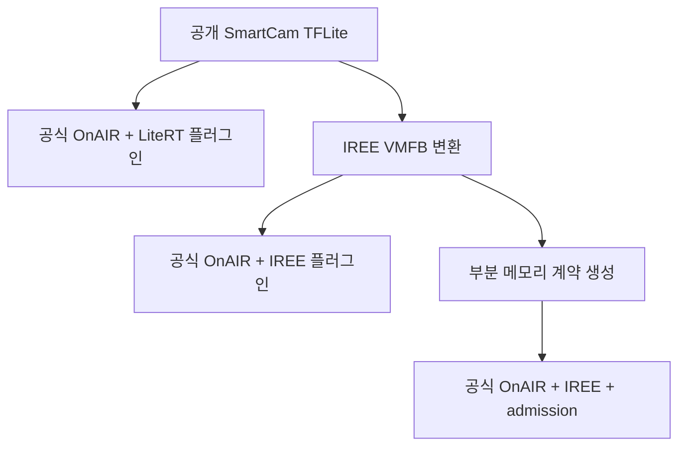
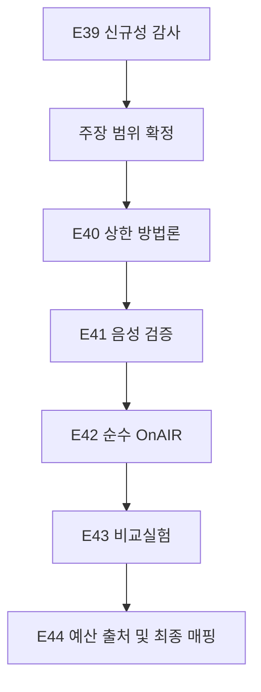

# onAIR-MLIR 추가 연구 필요성 및 비교실험 로드맵

**검토 기준 저장소:** <https://github.com/wookjaeya/onAIR-MLIR>  
**기준 커밋:** `2d128d736339bb12e2efb53ba2afce7f02ba1e48` (`main`, 문서상 v0.42)  
**작성 목적:** 현재 확보한 결과를 바탕으로 신규성, 정적 메모리 상한, 회계 경계, 순수 OnAIR 기준선에 필요한 후속 작업을 결정한다.

## 1. 결론

현재 구현·재현 증거는 상당히 축적됐지만, 논문 완성을 위해서는 다음 작업이 남아 있다.

| 쟁점 | 판단 | 필요한 조치 |
|---|---|---|
| 신규성 | **필수 보강** | 가장 가까운 선행연구와 기능 단위로 비교하여 연구 공백을 입증 |
| 정적 상한의 근거 | **필수 보강** | 분석 영역, 지원 연산, 상한 식, fail-closed 조건을 방법론과 계약에 명시 |
| 회계 경계 | **필수 정리** | 앱별 부분 계약과 전체 OBC RAM 수용성을 구분하고 예산 출처·효력을 기록 |
| 순수 OnAIR 비교 | **강력 권장** | 공개 SmartCam 한 모델로 OnAIR 고유 기능과 제안 구조의 추가 기능을 분리 검증 |
| 전체 시스템 메모리 관리 | **현재 범위 밖** | 전체 RAM 잔여량, 다중 앱 예약, 전역 메모리 격리는 별도 연구로 분리 |

현재 연구의 방어 가능한 중심 기여는 다음과 같다.

> IREE 컴파일 산출물의 post-layout 할당 계획에서 앱별 부분 메모리 계약을 생성하고, 이를 cFS 및 OnAIR의 AI 실행 초기화 이전 예산 판정에 연결하며, 동일한 회계 영역의 실행 관측과 대조하는 MLIR/IREE 기반 방법을 제안한다.

MLIR이 유일하게 계약값을 산출할 수 있다거나 VMFB-only 방법보다 더 정확한 판정을 제공한다는 주장은 현재 결과가 지지하지 않는다.

---

## 2. 현재 저장소에서 확인된 상태

### 2.1 확보된 결과

- [E35](https://github.com/wookjaeya/onAIR-MLIR/blob/2d128d736339bb12e2efb53ba2afce7f02ba1e48/docs/EVIDENCE_v0.38_E35.md): 강화된 artifact-only 분석과 MLIR 기반 계약이 4개 산출물·2개 정책·3개 예산 구간에서 **24/24 동일한 admission 판정**을 냈다.
- [E33](https://github.com/wookjaeya/onAIR-MLIR/blob/2d128d736339bb12e2efb53ba2afce7f02ba1e48/docs/EVIDENCE_v0.36_E33.md): NASA 공식 OnAIR 로더가 SmartCam용 연구 플러그인을 구성했고, OnAIR 코어 수정 없이 실행·거부·출력 동치를 확인했다.
- [E36/E36b](https://github.com/wookjaeya/onAIR-MLIR/tree/2d128d736339bb12e2efb53ba2afce7f02ba1e48/docs): SmartCam, MLPerf Tiny ResNet, Deep AutoEncoder를 AArch64 QEMU cFS에서 실행하고 계약 경계의 승인·거부 및 HAL peak를 확인했다.
- [E37](https://github.com/wookjaeya/onAIR-MLIR/blob/2d128d736339bb12e2efb53ba2afce7f02ba1e48/docs/EVIDENCE_v0.41_E37.md): 최종 주장, 공개 모델, 계약, cFS 판정, 출력, HAL 관측의 연결표와 재현 점검을 구축했다.
- [E38](https://github.com/wookjaeya/onAIR-MLIR/blob/2d128d736339bb12e2efb53ba2afce7f02ba1e48/docs/EVIDENCE_v0.42_E38.md): 조건부 map opt-in 설정을 판정 결과와 독립적으로 기록하고 재검증했다.

### 2.2 아직 남은 약점

1. E35에서 MLIR과 VMFB-only 기준선의 수치·판정 차이가 관측되지 않았다.
2. OnAIR 경로는 x86-64 SmartCam 호환성 실증이며 HAL peak와 런타임 객체 해제는 미검증이다.
3. 정적 상한의 지원 Stream 연산 목록이 코드에 존재하지만 계약에 분석 영역으로 완전히 노출되지 않는다.
4. cFS 앱 예산은 컴파일 매크로 또는 실험용 override로 공급된다. 실제 시스템 RAM 예약이나 전체 가용 메모리 산정은 아니다.
5. 내부 `python_learner_plugin.py`는 Canonical MLP용 NumPy 회귀 구현이므로 공개 모델을 이용한 순수 OnAIR 기준선으로 보기 어렵다.

---

## 3. 신규성 검증

### 3.1 왜 필수인가

다음 요소는 각각 이미 알려진 기술이다.

| 영역 | 기존 기술 또는 연구 |
|---|---|
| OnAIR | Python AI 플러그인, 데이터 어댑터, cFS 연계 |
| IREE/TinyIREE | MLIR 기반 임베디드 AI AOT 컴파일·배포 |
| TFLM·TVM·ExecuTorch | 텐서 크기와 수명에 기반한 정적 메모리 계획 및 arena 산정 |
| TASO | 메모리 상한을 고려한 임베디드 DNN 컴파일 최적화 |
| Quilt | ONNX-MLIR 정적 분석과 다중 GPU 추론의 OOM 방지 |

따라서 다음과 같은 포괄적 최초성 주장은 사용할 수 없다.

- MLIR로 AI 모델 메모리를 분석한 최초 연구
- AI 모델의 메모리 상한을 컴파일 시점에 계산한 최초 연구
- 메모리 부족을 실행 전에 방지한 최초 연구
- MLIR만이 해당 계약값을 산출할 수 있다는 주장

### 3.2 검증할 연구 공백

다음 조합이 선행연구에 존재하는지를 확인해야 한다.

> 타깃별 AI 컴파일 산출물의 할당 계획에서 앱별 부분 메모리 계약을 생성하고, 그 계약을 cFS/OnAIR 실행 초기화 전 admission에 연결하며, 계약과 같은 회계 영역의 실행 관측으로 검증하는 방법

본 연구의 신규성 후보는 개별 기술보다 **컴파일러 분석–계약–비행 소프트웨어 실행 판정의 결합**이다.

### 3.3 수행 방법

1. IEEE Xplore, ACM Digital Library, Scopus, Web of Science에서 검색식을 사전 기록한다.
2. 다음 문헌군을 분리한다.
   - ML compiler memory planning
   - static/upper-bound memory analysis
   - DNN admission control 및 OOM prevention
   - cFS/OnAIR AI integration
   - spacecraft software resource budgeting
3. 논문별로 분석 입력, 메모리 범위, 정적 상한, 실행 전 판정, 실제 예약, cFS/OnAIR 연계, 타깃 ISA를 표로 정리한다.
4. 가장 가까운 연구 5~10편과 본 연구를 동일 기준으로 직접 비교한다.
5. 검색과 원문 대조 전까지 `선행연구가 해결하지 못했다`는 문장은 **미검증**으로 유지한다.

### 3.4 핵심 1차 출처

- NASA OnAIR 논문: <https://doi.org/10.1609/aaai.v39i28.35156>
- NASA OnAIR 저장소: <https://github.com/nasa/OnAIR>
- MLIR: <https://doi.org/10.48550/arXiv.2002.11054>
- TinyIREE: <https://doi.org/10.1109/MM.2022.3178068>
- TVM Unified Static Memory Planning RFC: <https://discuss.tvm.apache.org/t/rfc-unified-static-memory-planning/10099>
- ExecuTorch Memory Planning: <https://docs.pytorch.org/executorch/stable/compiler-memory-planning.html>
- TensorFlow Lite Micro: <https://proceedings.mlsys.org/paper_files/paper/2021/file/6c44dc73014d66ba49b28d483a8f8b0d-Paper.pdf>
- TASO: <https://doi.org/10.1109/SBAC-PAD49847.2020.00036>
- Quilt: <https://doi.org/10.1016/j.sysarc.2026.103696>

---

## 4. MLIR의 논문상 위치

E35 결과 때문에 MLIR을 유일한 해결 수단이나 수치적 우위의 원인으로 설명할 수 없다. 본 연구에서 MLIR의 역할은 다음과 같이 정의한다.

- 컴파일 과정의 형상·할당·수명 정보를 관찰하는 분석 지점
- 서로 다른 모델과 타깃에 동일한 계약 생성 절차를 적용하는 중간표현
- 지원하지 않는 동적 크기와 연산을 `UNKNOWN_BOUND`로 처리하는 구조적 분석 계층
- 계약값과 컴파일 호출, VMFB, 내장 ELF를 추적하는 근거
- 생성된 계약을 cFS/OnAIR 실행 판정으로 전달하는 컴파일–배포 연결점

MLIR 고유의 더 강한 기여를 주장하려면 동적 형상 범위, 조건 분기, 메모리 공간 등 VMFB-only 분석이 복원할 수 없는 실제 사례가 필요하다. 단지 차이를 만들기 위한 무관한 pass 구현은 연구적으로 타당하지 않다.

---

## 5. 정적 메모리 상한의 방법론 보강

### 5.1 현재 상한 구조

호출별 메모리 요구량을 다음과 같이 정의한다.

\[
P = I + O + T
\]

- \(I\): 외부 입력 버퍼
- \(O\): 외부 출력 버퍼
- \(T\): post-layout transient slab 크기의 보수적 합
- \(C\): 모듈 상주 상수

상수 처리 경로에 따른 상한은 다음과 같다.

\[
B_{copy}=P+C, \qquad B_{map}=P
\]

### 5.2 계약에 포함할 분석 전제

| 전제 | 계약·방법론에서 명시할 내용 |
|---|---|
| 형상 | 모든 관련 크기가 컴파일 시 정수로 결정됨 |
| 호출 수 | 동시에 실행 중인 추론은 최대 1개 |
| 출력 수명 | 출력 HAL 객체가 다음 호출 전에 반환됨 |
| 지원 연산 | `alloca`, `import`, `pack`, `subview`, `dealloca`, `export`의 회계 규칙 |
| 미지원 연산 | 발견 시 `UNKNOWN_BOUND`로 처리 |
| 상수 정책 | map/copy 분기와 정렬 전제 |
| 실행 환경 | IREE 버전, 타깃, HAL driver, 컴파일 옵션 |
| 측정 대응 | HAL 통계가 계약과 같은 할당 영역을 계측함 |

### 5.3 권장 구현 변경

1. `iree.compiler.ir` 기반 구조적 walker를 정본 추출기로 사용한다.
2. 정규식 추출기는 독립 교차검사용으로 유지한다.
3. 계약 스키마에 `analysis_domain`을 추가한다.

```json
{
  "analysis_domain": {
    "static_shapes": true,
    "max_in_flight_calls": 1,
    "driver": "local-sync",
    "entry": "infer",
    "supported_resource_ops": [],
    "output_lifetime": "released_before_next_call",
    "constant_policy": ["map_if_aligned", "copy_otherwise"],
    "unknown_operation_policy": "UNKNOWN_BOUND"
  }
}
```

4. 다음 음성 조건에서 계약 생성 또는 실행이 fail-closed 되는지 시험한다.
   - 동적 크기
   - 미지원 resource op
   - 둘 이상의 in-flight 호출
   - 출력을 다음 호출까지 보유
   - 계약과 다른 HAL driver
5. 공개 모델의 HAL peak는 상한의 경험적 확인으로 사용하고, 상한의 일반 근거는 회계 규칙과 분석 전제에서 제시한다.

더 많은 랜덤 입력을 실행하는 것보다 위 방법론 보강이 우선이다. 고정 형상 모델의 메모리 계획이 입력값에 의존하지 않는다는 사실도 분석 영역에 명시해야 한다.

---

## 6. 회계 경계와 예산의 의미

현재 연구가 답하는 질문은 다음과 같다.

> 모델 실행에 배정된 앱별 부분 메모리 예산이 컴파일 산출물에서 도출한 계약 요구량 이상인가?

현재 연구가 직접 답하지 않는 질문은 다음과 같다.

> 현재 OBC의 전체 잔여 RAM으로 모든 비행 소프트웨어와 AI 앱을 함께 실행할 수 있는가?

### 6.1 권장 용어

- `partial per-app model-execution memory contract`
- `contract admission against an assigned per-app budget`
- `pre-runtime deployment eligibility check`

### 6.2 추가할 배포 정보

- `budget_source`: mission configuration, cFS table, experiment override
- `budget_scope`: model HAL allocation
- `reservation_semantics`: declared 또는 enforced
- 제외 영역: IREE runtime 고정비, cFS/OSAL 메모리, 태스크 스택, wrapper I/O, 파일 로드 임시 메모리

cFS Table Service로 `budget_bytes`와 조건부 정책을 공급하면 임무 설정과의 연결이 강화된다. 그러나 테이블 값은 그 자체로 물리 RAM을 예약하지 않으므로 `declared budget`으로 표시해야 한다.

전체 RAM 잔여량, 다중 앱 예산 합산, 실제 메모리 풀 예약과 격리는 별도 시스템 메모리 관리 연구로 분리한다.

---

## 7. MLIR 없는 순수 OnAIR 비교실험

### 7.1 필요성 판단

순수 OnAIR 기준선은 **강하게 권장**한다. 이 비교의 목적은 OnAIR의 결함을 찾는 것이 아니라 다음을 분리하는 것이다.

> 기존 OnAIR 실행 경로에 본 연구가 추가하는 기능은 무엇인가?

순수 OnAIR에는 본 연구가 정의한 계약이 없으므로 `OnAIR가 계약을 위반했다`거나 `OnAIR가 메모리를 관리하지 못한다`고 표현해서는 안 된다.

### 7.2 비교 아키텍처



### 7.3 실험 경로

| 경로 | MLIR/IREE | 계약 판정 | 목적 |
|---|---|---|---|
| O0: OnAIR + LiteRT | 없음 | 없음 | 공개 모델을 실행하는 순수 OnAIR 기준선 |
| O1: OnAIR + IREE | 있음 | 비활성 | 실행기 변경과 계약 기능을 분리 |
| O2: OnAIR + IREE + 계약, 예산 \(B\) | 있음 | ADMIT | 정상 승인·실행 확인 |
| O3: OnAIR + IREE + 계약, 예산 \(B-1\) | 있음 | DENY | 런타임 생성 전 거부 확인 |

### 7.4 구현 방안

1. NASA `AIPlugin`을 상속한 `LiteRTLearner` 플러그인을 연구 저장소에 추가한다.
2. NASA 공식 loader가 전달하는 `(construct_name, headers)` 인터페이스를 그대로 사용한다.
3. E33의 `file_replay` 입력 경로와 37개 SmartCam fixture를 재사용한다.
4. O0는 원본 `.tflite`를 LiteRT interpreter로 실행한다.
5. O1은 같은 SmartCam의 x86-64 VMFB를 사용하되 `budget_bytes`를 지정하지 않아 `NOT_EVALUATED`로 실행한다.
6. O2와 O3는 같은 VMFB, 계약, OnAIR 설정을 사용하고 예산만 변경한다.
7. 모든 경로가 공식 loader를 통과하며 OnAIR 코어 추적 파일이 수정되지 않았음을 확인한다.

### 7.5 측정값

- 공식 loader 구성 여부
- OnAIR 코어 무수정 여부
- admission 판정
- IREE runtime 생성 여부
- 실제 추론 횟수
- 프로세스 정상 생존 여부
- 전체 출력의 oracle 대비 오차
- 거부 사유와 거부 시점

LiteRT 프로세스 RSS와 MLIR/IREE 부분 계약값은 회계 범위가 다르므로 직접 우열 비교에 사용하지 않는다.

### 7.6 가능한 결론

> 순수 OnAIR 경로는 공개 AI 모델의 실행 기능을 제공한다. 제안 경로는 여기에 컴파일 산출물 기반 앱별 예산 판정을 추가하여, 예산이 계약 요구량보다 작은 배포에서 IREE 런타임 생성과 추론을 시작하지 않았다.

이 실험은 제안 구조의 **추가 기능**을 입증한다. MLIR의 독점적 수치 우월성은 입증하지 않으며, 해당 쟁점은 E35 및 신규성 비교에서 다룬다.

---

## 8. 권장 후속 로드맵

| 순서 | 작업 | 중요도 | 완료 기준 |
|---|---|---:|---|
| **E39** | 선행연구·신규성 감사 | 필수 | 최근접 연구와 기능별 차이를 DOI·URL·원문 위치로 입증 |
| **E40** | 정적 상한 분석 영역과 회계 규칙 공식화 | 필수 | 지원 op, 전제, 상한 식이 코드·계약·방법론에 일치 |
| **E41** | 분석 영역 음성 실험 | 필수 | 동적 크기·미지원 op·동시 호출 등이 fail-closed |
| **E42** | 공개 SmartCam 순수 OnAIR/LiteRT 기준선 | 강력 권장 | 공식 loader 실행 및 원본 출력 재현 |
| **E43** | OnAIR O0~O3 비교 | 강력 권장 | 실행기 변경과 계약 admission 효과를 분리 |
| **E44** | 예산 출처 명시 또는 cFS table 연결 | 권장 | 예산값·출처·적용 시점이 실행 기록에 남음 |
| **마감** | 최종 주장–증거–문헌 매핑 | 필수 | 모든 핵심 주장에 코드·실험·1차 출처 연결 |

### 권장 실행 순서



신규성 감사는 추가 구현보다 먼저 수행한다. 선행연구 대조 결과에 따라 논문의 중심 주장이 달라질 수 있기 때문이다.

---

## 9. 연구 완료 기준

다음 조건이 충족되면 논문 초고 이전의 핵심 실험을 완료한 것으로 판단할 수 있다.

1. 가장 가까운 선행연구와의 차이가 검증 가능한 표로 정리돼 있다.
2. 정적 상한의 식, 지원 연산, 실행 전제, 미지원 조건이 코드·계약·방법론에서 일치한다.
3. 분석 영역을 벗어난 입력과 경로가 `UNKNOWN_BOUND` 또는 실행 전 거부로 처리된다.
4. 공개 실물 모델의 AArch64 cFS 실행에서 계약 판정, 출력 동치, 동일 영역 HAL peak가 연결된다.
5. 순수 OnAIR와의 비교에서 기존 기능과 제안 구조의 추가 기능이 구분된다.
6. 앱별 부분 계약을 전체 OBC RAM 보증으로 확대하지 않는다.
7. 모든 주장에 문서명, 절, URL 또는 DOI가 연결되고 미검증 항목이 명시된다.

## 10. 최종 방향

현재 연구는 다음과 같이 정리하는 것이 가장 타당하다.

> MLIR의 필연성이나 VMFB-only 방법 대비 수치적 우월성을 주장하는 연구가 아니라, 컴파일러가 알고 있는 모델 실행 메모리 요구량을 명시적 계약으로 만들고, 이를 cFS/OnAIR의 실행 전 판단으로 전달·검증하는 시스템 연계 연구다.

이를 논문으로 방어하려면 새로운 모델을 계속 추가하기보다 **신규성의 문헌 증빙, 정적 상한의 조건부 건전성, 순수 OnAIR 대비 추가 기능**을 먼저 완성해야 한다.
