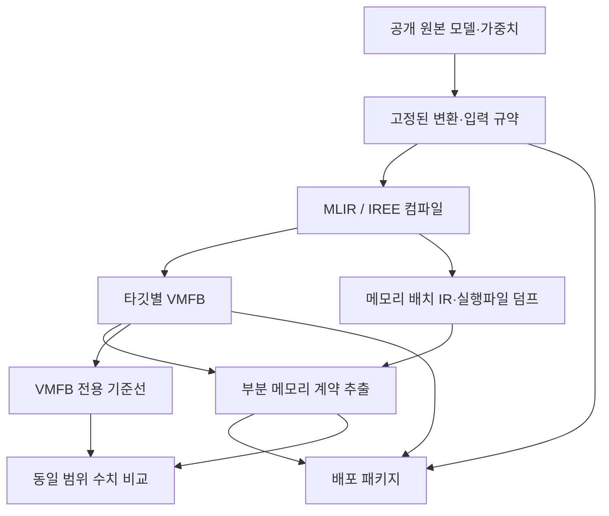
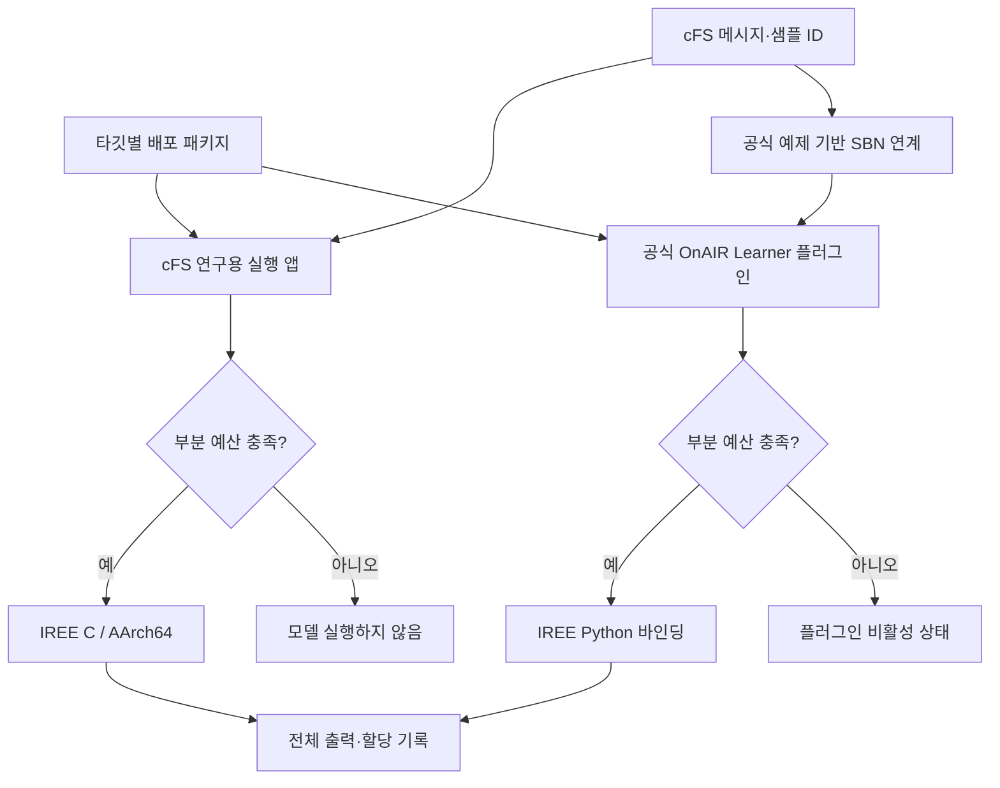

# OnAIR–MLIR 연구 아키텍처 구축안 및 학술적 타당성 검토

검토일: 2026-09-10  
대상: [wookjaeya/onAIR-MLIR](https://github.com/wookjaeya/onAIR-MLIR)  
검토 브랜치: `claude/review-and-proceed-4y1sag`  
검토 커밋: `da2e3f145891bc336b117e57eac754ddabb8c79e`

> **결론:** 컴파일러·계약·native C·cFS 실행기를 폐기할 이유는 없다. 이미 존재하는 **NASA OnAIR 공식 인터페이스 기반 플러그인을 최신 실제 모델·메모리 admission과 연결**하고, 별도의 **AArch64 cFS 직접 실행 경로를 실제 모델로 완결**하는 것이 타당하다. 두 경로를 직렬 연결하거나, 현재의 자체 cFS 앱을 NASA OnAIR의 구성물로 소개해서는 안 된다.
>
> 더 중요한 학술적 과제는 “OnAIR를 썼는가” 하나가 아니다. **계약이 보장하는 메모리 범위, 실제 모델의 의미 보존, 출력까지 소비하는 실행 수명주기, VMFB 전용 기준선 대비 기여**가 함께 정리되어야 한다.

## 1. 검토 범위와 근거 수준

본 검토는 저장소 소스·실험 기록·보관된 요약 결과와 NASA OnAIR 원본을 대조한 **설계 검토**다. 실험을 새로 실행하거나 사용자의 저장소를 수정하지 않았다. 아래의 “확인됨”은 소스 또는 보관 증거에서 확인했다는 뜻이며, 이번 검토자가 재실행했다는 뜻이 아니다.

현재 판단은 README의 오래된 진행 표가 아니라 최신 소스와 `EVIDENCE_v0.22_E25.md`, `EVIDENCE_v0.27_E26e.md`, `EVIDENCE_v0.28_E26f.md`, `EVIDENCE_v0.29_E27.md`, `EVIDENCE_v0.33_E30.md` 및 관련 결과에 근거한다. 과거 실험의 수정·정정 절도 함께 적용했다. [S1–S8]

NASA OnAIR 원본 대조에는 `e8af1187203dbda3af00fbf3b1eec05103996e01`을 사용했다. 이는 이번 검토의 기준 커밋이며, 과거 실험이 모두 이 버전으로 실행되었다는 뜻은 아니다. 기존 설치 스크립트의 비고정 clone과 과거 실행 버전은 구분해야 한다. [S9–S10]

## 2. 먼저 바로잡아야 할 아키텍처 이해

### 2.1 실제로 무엇이 누구의 구성물인가

| 구성요소 | 출처·정체 | 현재 역할 | 구축 판단 |
|---|---|---|---|
| OnAIR `AIPlugin`, `LearnersInterface`, 플러그인 로더 | NASA OnAIR 원본 | Python AI 플러그인을 불러오고 데이터를 전달 | 공식 확장점을 그대로 사용 |
| `plugins/compiled_learner/compiled_learner_plugin.py` | 이 연구의 OnAIR 플러그인 | NASA `AIPlugin`을 상속하고 IREE 호출 | 폐기하지 말고 최신 모델·admission 지원으로 갱신 |
| `native/native_learner.c` | 이 연구의 독립 C 실행기 | Python 없이 계약·IREE·할당 계측 확인 | 개발·원인분리용으로 유지 |
| `native/cfs_app/fsw/src/ai_learner.c` | 이 연구의 cFE 애플리케이션 | cFS 내부에서 admission과 IREE 실행 | AArch64 핵심 배포 실험에 유지 |
| NASA OnAIR의 SBN 연계 예제 | 공식 문서가 안내하는 연결 방식 | cFS 메시지를 외부 OnAIR 프로세스에 전달 | OnAIR–cFS 연계를 주장할 때 재사용 |
| MLIR/IREE | 외부 컴파일러·런타임 기반 | 모델 변환·CPU 코드 생성·실행 | 기반 도구와 연구가 추가한 분석을 구분 |
| SmartCam / MLPerf Tiny 모델 | 외부 공개 모델 | 현실적 워크로드 | 원본 가중치·출처를 고정해 사용 |

**자체 플러그인이나 cFS 앱을 만드는 것 자체는 학술적 결함이 아니다.** 공식 프레임워크의 확장점을 이용해 새 기능을 구현하는 것은 자연스럽다. 문제는 그것을 NASA가 제공한 기존 구현으로 오인하게 하거나, 공식 프레임워크를 통과하지 않은 실험을 OnAIR 실행이라고 부르는 경우다.

따라서 기존 앱의 디렉터리·심볼을 전부 바꾸는 작업은 필요 없다. 논문과 도식에서 `AI_LEARNER`를 **“연구용 cFS/IREE 실행 어댑터”**라고 정확하게 표기하면 된다. [S2, S3, S9]

### 2.2 OnAIR는 이미 사용되었지만, 최신 증거와 연결이 끊겨 있다

- 초기 `EVIDENCE_v0.1.md`에는 공식 OnAIR 실행 경로를 이용한 실험 기록이 있다.
- 현재 `compiled_learner_plugin.py`도 실제 NASA `AIPlugin`을 상속한다. 따라서 “OnAIR를 전혀 사용하지 않았다”는 평가는 틀리다.
- 반면 E25 §11.4는 당시 `OnAIR-IREE`라는 이름으로 집계한 경로가 **OnAIR 프레임워크가 아니라 pip IREE 바인딩 직접 호출**임을 정정한다.
- 최신 플러그인은 여전히 외부 `weights.npz`를 받는 기존 MLP 호출에 맞춰져 있다. SmartCam처럼 가중치가 포함된 단일 입력 VMFB를 그대로 처리하지 못한다.
- 파일·인터페이스 확인은 있지만, 최신 부분 메모리 계약을 이용한 **예산 admission은 연결되어 있지 않다.**

정확한 현황은 **“공식 OnAIR 통합의 초기 구현은 있으나, 최신 실제 모델·메모리 계약 경로로 갱신한 증거가 없다”**다. [S2, S4, S11]

### 2.3 NASA의 OnAIR–cFS 예제도 하나의 프로세스가 아니다

NASA 안내는 cFS의 SBN과 SBN-client를 이용하고, OnAIR는 별도로 `python3 cf/onair/driver.py ...`로 실행한다. `onair_app` 디렉터리를 cFS 배포 트리에 복사했다는 사실만으로 Python OnAIR가 cFE 관리 태스크가 되지는 않는다. [S10]

따라서 다음 두 배포는 **대안적인 실행 경로**다.

1. **cFS 직접 실행:** cFE 앱 → IREE C 런타임 → 모델.
2. **OnAIR 연계 실행:** cFS/SBN → 별도 OnAIR Python 프로세스 → 공식 Learner 플러그인 → IREE 런타임.

`OnAIR Learner → 연구용 cFS AI_LEARNER → IREE`로 연결하는 구조가 아니다. 두 실행기를 연속해서 통과시킬 이유가 없다.

## 3. 무엇을 연구하는 것으로 정리할 것인가

### 3.1 권고하는 연구 질문

> **정적으로 형상이 정해진 공개 AI 모델을 CPU용으로 컴파일할 때, 컴파일 결과의 메모리 배치 정보를 명시적인 부분 메모리 계약으로 추출하고, 실제 실행기의 할당 조건과 연결해 cFS에서 실행 전에 설정 예산의 충족 여부를 판단할 수 있는가?**

OnAIR 통합은 이 계약이 독립적인 실험용 C 프로그램에만 붙는 장치가 아니라, **기존 공개 AI 프레임워크의 공식 확장 경로에도 적용 가능한지**를 보여주는 보조 검증으로 둔다.

핵심은 “AI를 실행할 수 있다”가 아니다. 그 자체는 OnAIR와 여러 임베디드 런타임이 이미 한다. **어떤 메모리 영역에 대해, 어떤 배포 조건에서, 실행 전에 무엇을 판단할 수 있는지**가 연구의 대상이다.

### 3.2 현재 말할 수 있는 것과 아직 말할 수 없는 것

| 주장 | 판단 | 필요한 조치 |
|---|---|---|
| 공개 실제 모델에서 계약 자동 추출이 가능하다 | 호스트 E26-ext/E30 근거 있음 | AArch64 산출물에서 다시 추출·검증 |
| 원본 SmartCam과 변환 모델의 수치 의미가 보존된다 | E30만으로는 미입증 | 원본 TFLite와 전체 출력 비교 |
| 실제 공개 모델이 AArch64 cFS에서 admission 후 완주한다 | 검토한 실제 모델 증거에서는 미완료 | SmartCam부터 직접 실행 경로 완결 |
| 최신 실제 모델이 공식 OnAIR에서 계약 검사를 거쳐 실행된다 | 미입증 | 공식 loader/driver 통합 시험 |
| 계약은 온보드 컴퓨터 전체 RAM의 무고장을 보증한다 | 현재 범위로 성립하지 않음 | 부분 계약으로 표현; 전체 RAM 보증으로 확대하지 않음 |
| MLIR에서만 얻을 수 있는 메모리 수치다 | 현재 기준선에 의해 지지되지 않음 | VMFB 전용 기준선과 대등 비교 |
| map 경로는 가중치가 RAM을 쓰지 않는다 | 잘못된 해석 | HAL 할당과 VMFB 호스트 저장공간을 구분 |
| 정적 메모리 계획·실행 전 용량 확인 자체가 새롭다 | 기존 기법 존재 | 배포 조건·계약 전달·실행 연계 기여로 구체화 |

## 4. 권고 아키텍처

### 4.1 컴파일·계약 생성 경로



여기서 MLIR로 컴파일하는 대상은 **AI 모델의 계산 그래프**다. OnAIR 전체 Python 소스나 cFS 전체 C 소스를 MLIR로 변환하는 연구가 아니다.

동일 타깃의 계약·VMFB·덤프는 기존 원칙대로 **동일한 컴파일 호출에서 생성된 산출물**을 사용한다. AArch64와 x86-64는 같은 원본 모델에서 출발하더라도 다른 VMFB이며, 계약값도 타깃별로 다시 산출한다. [S5, S8]

### 4.2 실행 경로: 핵심 실험과 공식 프레임워크 검증을 분리



위 도식은 **구축 목표**다. 현재 모든 연결이 구현되어 있다는 뜻이 아니다. 입력 텐서는 로컬 재생 파일로 제공하고, 메시지는 샘플 식별·실행 촉발에 이용한다. 이 경우 “영상 자체가 SBN으로 전송되었다”고 표현하지 않는다.

### 4.3 우선순위와 플랫폼

| 경로 | 역할 | 필요한 수준 |
|---|---|---|
| AArch64 Linux/QEMU + cFS + IREE C | 논문의 핵심 배포 증거 | 세 실제 모델의 계약·admission·전체 출력·반복 실행 |
| 공식 OnAIR + 갱신된 플러그인 | 기존 프레임워크 확장 가능성 | 최소 SmartCam의 공식 driver 실행과 admission |
| native C | 원인분리·동일 런타임 대조 | 유지하되 본문 주인공으로 만들지 않음 |
| x86-64 VMFB·cFS | 내부 회귀·빠른 개발 | 필요한 시험만 유지; 주요 결과표에서 생략 가능 |
| AArch64 OnAIR Python | 동일 ISA에서 두 배포를 직접 비교할 때 | 해당 주장을 선택할 경우 추가 |

**OnAIR의 모든 실험을 처음부터 AArch64에 올릴 필요는 없다.** 먼저 공식 OnAIR 연결을 호스트에서 닫고, 주된 AArch64 cFS 경로와 분리해 진행할 수 있다. 다만 이때 “AArch64에서 OnAIR도 검증했다”는 주장은 하지 않는다.

현재 `scripts/61_build_iree_runtime_aarch64.sh`는 Python 바인딩을 끈 C 런타임을 만든다. 따라서 기존 AArch64 런타임이 있다는 사실만으로 AArch64 OnAIR 실행환경까지 준비되었다고 판단하면 안 된다. [S12]

## 5. 가장 먼저 확정할 메모리 계약의 의미

### 5.1 현재 숫자는 전체 RAM이 아니다

현재 계약의 핵심 항을 다음과 같이 표기한다.

- `P`: `static_per_call_bytes` — 입력·출력과 컴파일 후 transient 메모리 배치에 대응하는 바이트.
- `C`: `module_resident_constant_bytes` — 계약이 집계하는 packed 상수 버퍼 바이트.
- `B = P + C`: map 성공을 전제하지 않는 현재 부분 경계.
- 커널 호출 스택은 별도 항이다. 위 메모리와 동일한 영역으로 취급하거나 task 전체 스택과 혼동하지 않는다.

현재 도구와 실험은 주로 **IREE HAL이 소유·추적하는 할당 영역**과 이 값의 대응을 다룬다. VMFB를 저장한 호스트 메모리, Python·NumPy, IREE 세션, cFS/OSAL, 앱의 입력 재생 버퍼, 실행 코드 등까지 포함한 전체 프로세스 RAM 계약이 아니다. [S3, S8, S13]

따라서 논문의 핵심 표현은 다음이 적절하다.

> “지정된 CPU 실행 구성과 수명주기에서, 모델의 계약 대상 메모리 요구를 설정 예산과 비교한다.”

반대로 “이 AI는 이 OBC의 RAM에 반드시 들어간다”는 결론은 현재 부분 계약만으로 도출할 수 없다.

### 5.2 map 성공 시 가중치 메모리가 사라지는 것은 아니다

검토된 조건에서는 상수 map 성공 시 HAL 피크가 `P`, copy 경로에서는 `P+C`에 대응한다. 그러나 map은 **이미 존재하는 VMFB 저장공간을 참조**하는 것이므로 상수의 호스트 메모리는 남는다.

| 항목 | map 경로 | copy 경로 |
|---|---|---|
| VMFB 호스트 저장공간 | 필요 | 필요 |
| HAL의 추가 상수 소유 할당 | 생략 가능 | `C`만큼 발생 |
| 관측 HAL 피크의 모델 | `P` | `P+C` |
| 전체 RAM이 `P`라는 결론 | 불가 | 해당 없음 |

한 개의 VMFB 호스트 저장공간을 `L`이라고 가정하면, 일부 저장공간만의 단순 회계는 `L+P` 대 `L+P+C`로 설명할 수 있다. 이것도 **전체 RSS 공식은 아니다.** 파일 적재 중 사본, 바인딩이 만드는 정렬 사본, 페이지 상주 상태, 실행기 부가 메모리는 따로 고려해야 한다.

DeepAE의 `172.30×`는 보관 증거에서의 **HAL 피크 대비 무조건 경계의 비율**이다. “실제 OBC RAM이 172배 절약된다”로 바꾸어 쓰면 안 된다. [S6, S8]

### 5.3 예산 검사는 실제 메모리 확보와 다르다

현재 cFS 앱의 예산은 구성된 값이며, OS의 현재 여유 RAM을 읽어 원자적으로 예약하는 자원 관리자가 아니다. 그러므로 다음 세 상태를 구분한다.

1. `ADMITTED`: 명시된 계약 범위와 조건에서 요구 경계가 설정 예산 이하.
2. `NOT_ADMITTED`: 경계가 예산보다 커서 이 계약으로 승인하지 않음. 실제로 반드시 OOM이라는 뜻은 아님.
3. `UNKNOWN_BOUND`: 지원하지 않는 형상·구성 등으로 경계를 산출하지 못함. 도구 실행 실패는 별도 오류로 기록.

예산 초과 거부는 메모리 부족 사고의 재현이 아니라 **사전 정책 결정의 검증**이다. 실제 실행 실패와 동일하게 집계하지 않는다.

### 5.4 조건부 경계의 적용 규칙

조건부 map admission은 다음 순서를 충족해야 한다.

1. 계약과 배포 설정을 읽는다.
2. 런타임·driver·모델 적재 방식이 해당 조건을 지원하는지 확인한다.
3. map 조건이 성립함을 실행기가 보장할 때에만 `P`를 선택한다.
4. 보장하지 못하면 `P+C`로 돌아가거나 승인하지 않는다.
5. 최종 승인 전에 예산을 초과하는 상수 copy가 이미 발생하지 않도록 한다.

VMFB를 읽기 위한 호스트 메모리까지 “승인 전 할당 0”이라고 주장하지 않는다. **검사 시점과 보호 대상 할당**을 분리해 기록한다.

기존 계약의 `C`를 0으로 덮어쓰는 방식은 권하지 않는다. 계약의 원래 수치는 보존하고 실행 평가 결과에 `selected_bound_bytes`, `constant_mode`, `precondition_verified`, `budget_scope`, `decision`을 남긴다. 이 필드들은 **추가 제안**이며 현재 모두 구현된 것으로 읽으면 안 된다.

## 6. 파일 수준 구축 변경안

### 6.1 OnAIR 플러그인: 이름만 연결하는 것이 아니라 실제 호출을 갱신

대상: `plugins/compiled_learner/compiled_learner_plugin.py` [S2]

| 현재 구현 | 필요한 변경 | 완료 기준 |
|---|---|---|
| `shape[-1]`을 입력 개수로 사용 | 전체 shape와 원소 수를 사용; rank-4 정적 텐서 지원 | SmartCam 입력 150,528개가 정확한 순서로 전달 |
| 입력 폭을 OnAIR header 수와 직접 비교 | 텔레메트리 직접 입력과 파일 재생 입력 모드 분리 | 이미지 입력을 수십만 header 필드로 만들지 않음 |
| `weights.npz`를 읽고 `infer(x, *weights)` 호출 | 최신 VMFB의 입력 ABI에 따라 호출; 기존 MLP 모드는 회귀용으로 명시 분리 | SmartCam은 `infer(x)`로 실행 |
| 엔트리 `infer`와 모듈명을 사실상 고정 | 계약의 엔트리와 실제 모듈 export 대조 | 잘못된 엔트리로 실행하지 않음 |
| 파일·인터페이스 검사 후 즉시 런타임 적재 | 부분 예산 판정을 연결하고 검사 시점 기록 | 거부 경로에서 보호 대상 모델 실행이 발생하지 않음 |
| `score`, `argmax`만 반환 | 전체 출력을 검증용으로 보존·전달하고 프레임워크 응답은 요약 | 분류 외 DeepAE의 640개 출력도 검증 가능 |
| 출력 배열과 시간 표본을 계속 보유 가능 | 출력 소유권·해제 확인, 집계/고정 길이 버퍼 사용 | 결과를 실제 읽는 반복 실행에서 계약 전제가 유지 |
| 입력 변환 실패를 0으로 대체 | 실험 모드에서는 명시적으로 입력 오류 처리 | 잘못된 데이터가 정상 모델 실행으로 집계되지 않음 |

**공식 로더의 제약을 반영해야 한다.** NASA `plugin_import.py`는 `Plugin(construct_name, headers)` 두 인자만 전달한다. 현재 생성자의 `artifact_dir`, `driver` 같은 선택 인자에 새 값을 추가하는 것만으로는 공식 설정에서 활성화되지 않는다. [S9]

권고하는 최소 해법은 플러그인이 환경변수 `ONAIR_MLIR_DEPLOYMENT_CONFIG`로 지정된 설정 파일을 읽고, `construct_name`에 해당하는 모델·예산·입력 규약을 선택하도록 하는 것이다. 이는 **제안 인터페이스**다. OnAIR 코어를 수정하지 않고 공식 플러그인 로딩 규약을 유지한다.

거부 시 동작은 플러그인을 비활성 상태로 유지하며 결과에 사유를 표시하는 방식이 적절하다. 예외 하나로 전체 OnAIR 프로세스가 종료되는 설계와 구분한다. 실제 상위 프레임워크 동작으로 확인해야 한다.

### 6.2 cFS 앱: 유지하되 벤치마크 루프와 정상 실행을 구분

대상: `native/cfs_app/fsw/src/ai_learner.c` [S3]

현재 앱은 단일 f32 입력·출력의 정적 shape를 다룰 수 있다. 세 우선 모델 때문에 처음부터 다중 입력·다중 출력·모든 dtype을 처리하는 범용 런타임을 새로 만들 필요는 없다.

다만 아래 부분은 실제 모델 실험에 직접 영향을 준다.

- **정상 메시지 입력:** 현재 HK 메시지 바이트를 반복해 feature를 채우는 경로는 실제 영상·음향 특징 입력이 아니다. 실물 모델 성능·의미 검증에 사용하지 않는다.
- **E25 파일 모드:** 입력 파일 전체를 `malloc`하고 초기화 과정에서 배치 추론을 수행한다. 정상 SB 수신 루프 전에 끝나는 이 경로는 “cFS 태스크 안의 배치 실행”이지 “운용 메시지 경로 완주”가 아니다.
- **대형 입력:** SmartCam 입력 한 개가 약 602 KB다. 모든 입력을 한꺼번에 적재하지 말고 한 샘플씩 읽어 재사용한다.
- **스택:** E25 모드의 출력 VLA 등 입력·출력 크기에 비례하는 자동 배열을 점검하고 고정·재사용 버퍼로 옮긴다. 커널 스택 분석만으로 앱 자체 스택을 보증하지 않는다.
- **중복 버퍼:** 앱 입력·전처리·출력 버퍼는 HAL 영역과 별도 회계로 남긴다. cFS 정상 경로의 정적 배열도 “메모리를 사용하지 않는다”가 아니다.
- **결과 경로:** EVS/JSON 기록과 Software Bus 결과 발행은 다르다. 논문에 필요한 것이 실행·출력 대조라면 전자로 충분하다. 자동 의사결정 폐루프를 추가로 만들 필요는 없다.

권고 구현은 기존 추론·해제 함수를 재사용하면서 **오프라인 배치 실행 모드**와 **초기화 완료 후 메시지로 한 샘플씩 실행하는 재생 모드**를 분리하는 것이다. 메시지에는 샘플 ID/순번을 사용하고, 실제 텐서는 공유된 fixture 규약의 로컬 파일에서 읽는다.

기존 앱이 계약 JSON을 직접 동적으로 읽는 것으로 설명하면 안 된다. 현재는 JSON → `harness/gen_contract_header.py` → C 헤더 → 앱 빌드 경로다. 모델 변경 실험은 우선 **새 계약·헤더로 빌드 후 재시작**으로 정의한다. 임의 모델 hot-swap 지원을 필수 과제로 추가하지 않는다.

예산만 바꾸는 시험에 재빌드가 번거롭다면 작은 런타임 예산 설정을 추가할 수 있다. 이는 편의 개선이며, 일반 JSON 모델 로더 전체를 만드는 전제조건은 아니다.

### 6.3 추가·수정 파일 목록

아래의 “신설 제안”은 현재 저장소에 존재한다고 주장하는 경로가 아니다.

| 경로 | 구분 | 작업 |
|---|---|---|
| `plugins/compiled_learner/compiled_learner_plugin.py` | 기존 수정 | 모델 ABI, admission, 입력 모드, 출력 수명주기 |
| `native/cfs_app/fsw/src/ai_learner.c` | 기존 수정 | 샘플 단위 파일 재생, 초기화 후 메시지 실행, 버퍼 관리 |
| `native/native_learner.c` | 기존 최소 수정 | cFS와 같은 입력 fixture·출력 규약; 원인분리 유지 |
| `harness/make_contract.py` | 기존 점검 | 분석 대상 할당·수명·분기와 지원 조건 문서화; 실제 모델 AArch64 추출 |
| `harness/gen_contract_header.py` | 기존 수정/재사용 | Python 판정과 동일한 의미의 필드·판정 벡터 |
| `harness/e25_compare.py` | 기존 확장 | 원본 TFLite 대조와 모델별 출력 판정; 기존 MLP 규칙 보존 |
| `harness/e27_baseline_vmfb_only_hardened.py` | 기존 재사용 | 같은 VMFB·같은 범위·같은 조건부 정보로 비교 |
| `harness/model_fixture.py` | 신설 제안 | 원본 입력 전처리, 레이아웃 변환, 텐서 파일·manifest 생성 |
| `harness/admission_policy.py` | 신설 제안 | 부작용 없는 계약·설정 예산 판정; 실제 컴파일·측정을 수행하지 않음 |
| `harness/onair_integration_check.py` | 신설 제안 | 공식 driver/loader 실행과 전체 출력·상태 수집 |
| `configs/onair_compiled_learner.ini` | 신설 제안 | 공식 `LearnersPluginDict` 규약으로 플러그인 등록 |
| `configs/deployments/` | 신설 제안 | 모델별 경로·예산·입력/출력 규약; contract와 역할 분리 |
| `scripts/20_setup_onair.sh` | 기존 수정 | NASA OnAIR 버전 고정·실행 버전 기록 |
| `scripts/51_build_cfs_aarch64.sh`, `scripts/61_build_iree_runtime_aarch64.sh`, `scripts/70_setup_qemu_system_aarch64.sh`, `scripts/71_boot_guest_aarch64.sh` | 기존 재사용 | 먼저 현존 환경 점검, 필요한 구성만 갱신 |
| `native/cfs_app/WIRING.md`, `docs/ASSUMPTIONS_AND_SCOPE.md`, `README.md` | 기존 동기화 | 세 경로·최신 기능·현재 증거 상태를 소스에 맞춤 |

기존 `harness/admission_check.py`는 초기 실험용 흐름을 포함하므로 이름만 보고 운영 플러그인에 그대로 import하지 않는다. 순수 판정 로직과 컴파일·계측 하네스를 분리하는 것이 목적이다. Python과 C를 무조건 하나의 공용 라이브러리로 통합할 필요는 없고, 동일한 판정 시험 벡터로 의미를 맞추면 된다. [S13]

### 6.4 배포 설정의 최소 형태

다음은 **새로 구현할 설정 형식의 예시**다. 현재 동작하는 명령·설정이라고 주장하지 않는다. 호스트 OnAIR 시험을 예로 들며, AArch64 실행에는 반드시 해당 타깃의 다른 패키지를 선택한다.

```json
{
  "compiled_smartcam": {
    "artifact_dir": "deploy/smartcam/x86_64",
    "driver": "local-sync",
    "budget_scope": "iree_hal_owned_allocations",
    "budget_bytes": 20971520,
    "admission_policy": "unconditional",
    "input_mode": "fixture_replay",
    "input_manifest": "fixtures/smartcam/manifest.json",
    "output_mode": "full_tensor_for_validation",
    "max_in_flight": 1
  }
}
```

- `compiled_smartcam`은 공식 `LearnersPluginDict`의 플러그인 이름과 대응시킨다.
- shape·dtype·entry·`P,C,B`는 계약에서 읽는다. 설정 파일에 서로 다른 정답을 중복 작성하지 않는다.
- 입력 manifest는 원본 샘플 ID, 원본 전처리 규약, 준비된 텐서의 레이아웃·파일을 연결한다.
- 위 20 MiB는 형식 설명용 예산이다. 실제 실험 예산은 §9.2의 원칙으로 사전에 정한다.
- 조건부 정책은 사용자가 문자열로 `mapped`라고 선언했다고 승인하지 않는다. 실행기가 조건을 검증해야 한다.
- cFS에 이 JSON 전체의 런타임 파서를 이식할 필요는 없다. 같은 설정 의미를 기존 헤더 생성과 mission 설정으로 반영하면 된다.

실행 결과는 최소 `model_id`, `target`, `sample_id`, `selected_bound_bytes`, `budget_bytes`, `constant_mode`, `decision`, `invoke_count`, `hal_peak_bytes`, `output_file`을 남긴다. 거부한 실행의 출력은 없는 상태로 기록하며, 0으로 채운 가짜 출력과 구별한다.

## 7. 실제 모델과 입력 데이터 구성

### 7.1 우선순위는 세 모델이면 충분하다

| 우선순위 | 모델·출처 | 입력·출력 | 선택 이유 | 현재 증거의 한계 |
|---|---|---|---|---|
| 1 | OPS-SAT SmartCam 공개 `model.tflite` | 원본 `[1,224,224,3]` f32 → `[1,3]`; 현재 IREE 입력은 `[1,3,224,224]` | 실제 우주 응용과 직접 연결되는 영상 모델 | 호스트 반입·smoke 완료; 원본 수치 동치와 AArch64 cFS 미완료 |
| 2 | MLPerf Tiny ResNet `pretrainedResnet.tflite` | 현재 IREE `[1,3,32,32]` f32 → 10개 출력 | 공개 임베디드 CNN 기준 워크로드 | 호스트 pip/native 근거; 실데이터 정확도·cFS 미검증 |
| 3 | MLPerf Tiny Deep AutoEncoder `ad01_fp32.tflite` | `[1,640]` f32 → `[1,640]` | 상수 비중이 크고 전체 벡터 출력의 처리를 점검 | 호스트 pip/native 근거; ToyADMOS 평가·cFS 미검증 |

SmartCam은 MobileNetV2 계열 기반의 해당 공개 분류 모델이지, 임의의 표준 ImageNet MobileNetV2로 대체해도 같은 실험이 되는 것은 아니다. MLPerf Tiny의 두 모델은 **공개 임베디드 모델**이며, 우주 비행 모델이라고 부르지 않는다. 이 계획은 저장소가 이미 반입한 float 모델을 사용하며 공식 양자화 제출 구성 전체를 재현한다고 주장하지 않는다. [S5, S6, S8, S14, S15]

SmartCam 원본 고정값:

- 출처 커밋: `be09ecee41f0a5db52afe0ee929dbd339cb68672`
- 경로: `home/exp1000/models/default/model.tflite`
- SHA-256: `fd1ecbd01ad2d46bd35cbac17809cfa24b1d929b8f14871fc1fb6fca5ff06aae`
- 출력 라벨: `bad`, `earth`, `edge`
- IREE 실행 조건: 배치 1로 고정. 원본의 기호적 batch signature 전체를 지원한다는 뜻은 아님.

**하드웨어 출처도 정확하게 구분해야 한다.** SmartCam 원본은 SEPP의 `armhf`/ARM32 경로를 명시한다. 따라서 AArch64 실험은 “우주 응용 공개 모델의 AArch64 이식 검증”이며, SmartCam 비행 하드웨어의 완전한 재현이 아니다. [S14]

### 7.2 모델의 현실성과 데이터셋 정확도 평가는 별개다

실제 가중치·그래프는 메모리 구조의 외적 타당성을 제공한다. 그러나 random/zero 입력만으로 원본 전처리와 응용 의미가 유지되었다고 말할 수는 없다.

| 모델 | 권고 입력 | 용도와 주의점 |
|---|---|---|
| SmartCam | 원본 저장소 예제 이미지부터 확보; 공개된 추가 이미지가 있으면 출처를 확인해 보완 | 원본 TFLite와 IREE의 수치 대조. 예제 파일을 검증된 비행 평가 데이터셋으로 격상하지 않음 |
| ResNet | CIFAR-10 test split의 사전 고정 subset | 동일 전처리·출력 비교. 전체 정확도 재현은 필요할 때만 확장 |
| DeepAE | 원본 MLPerf Tiny/ToyADMOS 특징 생성 규약을 적용한 공개 입력 또는 공개 평가 특징 | 640개 재구성 출력과 필요 시 이상 점수 비교. 임의 640개 숫자는 오디오 평가 자료가 아님 |

SmartCam 저장소의 `mocks/pictures`에는 예제 이미지가 있지만, 이것만으로 촬영 출처·정답 라벨·학습/평가 분리가 보장되지는 않는다. **수치 동치용 공개 fixture**로 사용할 수 있는 것과, 분류 정확도 평가에 적합한 것은 구분한다.

표본 수는 메모리 계약의 보편적 정확성을 통계적으로 증명하는 수단이 아니다. 권고 시작점은 모델별 공개 입력 20–100개 또는 이용 가능한 예제 전부이며, 이는 **실행·변환 검증을 위한 제안값**이다. 실험 전 고정하고 실제 확보량과 선택 방법을 공개한다. 데이터 접근이 막히면 이를 명시하고 random 입력을 실데이터로 대체 표기하지 않는다.

합성 모델과 입력은 SQUEEZE 축 보존, 예산 경계, 버퍼 생명주기 등 **특정 구현 속성을 반증하는 단위시험**에 계속 필요하다. 다만 실제 모델의 주요 결과와 별도 묶음으로 둔다.

### 7.3 SmartCam 전처리는 P2의 핵심이다

1. 원본 설정과 분류기에서 이미지 크기, 채널 순서, resize 방식, mean/std 적용을 확인한다.
2. 원본 모델 내부의 `MUL`, `SUB`와 외부 정규화를 함께 확인하여 중복 정규화를 피한다.
3. 동일한 전처리 결과로 TFLite용 NHWC와 IREE용 NCHW 텐서를 만든다.
4. **reshape가 아니라 축 전치**를 적용한다.
5. 각 텐서의 shape·dtype·레이아웃·전처리 식별자와 원본 이미지 연결을 기록한다.
6. TFLite와 IREE의 전체 출력 세 값을 비교한다.

기존 SQUEEZE 확장은 E30/E30b에서 C1–C5와 회귀 사례까지 보완되었다. 이를 처음부터 다시 설계할 필요는 없다. 다만 구조적 감사만으로 원본 모델의 전체 수치 동치가 완료되는 것은 아니다. [S8]

## 8. 학술적 타당성: 반드시 검토해야 할 네 가지

### 8.1 기존 OnAIR가 있는데 왜 새 연구가 필요한가

이번에 대조한 OnAIR의 `AIPlugin`·플러그인 로더는 AI 모듈의 탑재와 호출을 제공한다. 그것과 **컴파일 결과에서 특정 실행의 메모리 경계를 추출하여 예산 정책으로 전달하는 기능**은 서로 다른 계층이다.

따라서 OnAIR의 존재가 연구를 곧바로 불필요하게 하지는 않는다. 다만 “기존 온보드 AI 프레임워크는 AI 실행을 지원하지 못한다”는 식의 문제제기는 성립하지 않는다. 필요성은 **기존 실행 확장점에 어떤 사전 자원 판단을 추가하는가**로 설명해야 한다.

이번 검토에서 OnAIR 저장소 전체의 모든 과거 버전·연구를 대상으로 메모리 admission 부재를 증명한 것은 아니다. 논문에서는 확인한 API·코드 범위에 한정해 비교해야 한다.

### 8.2 정적 메모리 계획 자체는 기존 기술이다

- TFLite Micro는 tensor arena를 head/temporary/tail 영역으로 관리하고 메모리 계획·할당 기록 기능을 제공한다. 따라서 “실행 전 메모리 배치를 다루는 기존 기법이 없다”는 주장은 틀리다. [S16]
- TVM의 USMP 제안과 정적 메모리 계획 기능은 버퍼 재사용·정적 배치라는 직접적인 관련 기술이다. RFC는 제안 문서라는 성격을 유지하고, 구현 현황은 공식 API와 구분해 인용한다. [S17]
- IREE 자체가 stream 자원·수명·배치 표현을 제공한다. 연구는 그 기반 위에서 무엇을 추가하는지 표시해야 한다. [S18]

연구가 새로 제시해야 하는 것은 범용 정적 planner의 재발명이 아니라 **컴파일 정보 → 명시적 부분 계약 → 배포 조건 판정 → 실제 cFS 실행 경로**를 연결하는 방법과 그 한계에 대한 증거다.

“OnAIR를 사용했다”, “MLIR를 사용했다”, “AArch64에서 실행했다”는 각각 구현 선택이나 검증 조건이며, 그 자체로 학술적 신규성은 아니다.

### 8.3 현재 가장 큰 신규성 위험: VMFB 기준선도 같은 값을 얻는다

E27 정정과 E30 SmartCam 결과에서 hardened VMFB-only 기준선은 MLIR 경로와 같은 주요 메모리 수치를 얻는다. SmartCam에서는 `18,222,796 / 9,382,092 / 8,840,704`가 일치한다. [S7, S8]

따라서 다음의 강한 주장은 현재 근거로 지지되지 않는다.

- “MLIR가 없으면 이 메모리 값을 계산할 수 없다.”
- “하위 산출물에서는 안전한 거부가 불가능하다.”
- “MLIR 기반이므로 다른 방법보다 반드시 더 정확하다.”

권고하는 표현은 **“MLIR 기반 계약 추출·연계 방법”**이다. “MLIR만의 필수적 우월성”을 제목·초록의 중심에 놓으려면, 실제 차이가 나는 기능과 공정한 증거가 더 필요하다.

특히 조건부 map의 효과를 MLIR 기여로 평가하려면 **VMFB-only 기준선에도 같은 map 조건 지식을 제공**해야 한다. MLIR 쪽만 조건부 승인을 허용하고 기준선은 무조건 `P+C`로 두면, 차이가 정보 표현 때문인지 실행 정책 때문인지 분리되지 않는다.

동일한 조건에서도 차이가 없다면 이를 정직하게 보고하고 기여를 통합·계약화에 한정한다. 차이를 만들기 위한 인위적인 기준선 약화나 무관한 compiler pass 신설은 하지 않는다.

### 8.4 실측 상한 일치와 정적 보장의 논증은 다르다

여러 실행에서 `peak ≤ B`가 관측되었다는 것은 좋은 검증이지만, 지원하는 모든 실행에서의 상한 보장과 동일하지 않다.

방법 절에는 최소한 다음을 설명해야 한다.

1. 어떤 컴파일 단계의 메모리 배치를 읽는가.
2. 어떤 할당이 계약 범위에 포함되는가.
3. alias·재사용된 영역을 중복 집계하지 않는 근거는 무엇인가.
4. 이후 lowering이나 런타임에서 생기는 할당은 어떻게 포함하거나 분리하는가.
5. 고정 shape, 단일 in-flight 호출, 출력 해제, driver 등 어떤 조건에서 식이 성립하는가.
6. 분석 불가능한 경우 왜 숫자를 추측하지 않고 미지원 상태로 처리하는가.

동일 IR을 읽는 텍스트 추출기와 구조적 순회기의 일치는 구현 교차점검이지, 독립적인 의미론적 증명 전체가 아니다. 회귀 시험 개수도 이 설명을 대체하지 못한다.

## 9. 논문에 필요한 최소 실험 설계

### 9.1 실험군

| 실험 | 질문 | 필수 관측 |
|---|---|---|
| A. 원본 의미 보존 | 변환한 모델이 같은 계산을 하는가? | 원본 TFLite 대 IREE 전체 출력, 입력·레이아웃·허용오차 |
| B. AArch64 부분 경계 | 타깃 코드의 분석값과 실행 할당이 대응하는가? | AArch64 `P,C,B`, 선택 경로, HAL peak, 범위별 메모리 |
| C. admission 효용 | 설정 예산에 따른 실행/비실행 결정이 올바른가? | 예산·선택 경계·판정·모듈 적재/호출 여부 |
| D. 출력 소비 수명주기 | 결과를 실제 사용하는 반복 실행에서도 조건이 유지되는가? | 반복별 현재 할당·피크·출력 보유/해제·전체 출력 |
| E. 공식 OnAIR 통합 | 공식 프레임워크의 확장점에서 같은 기능이 작동하는가? | 실제 driver·loader 로그, 플러그인 상태, 입력 대응·전체 출력 |
| F. 공정한 기준선 | MLIR 기반 방법이 무엇을 더 제공하는가? | 동일 VMFB의 artifact-only·조건부/무조건 정책 비교 |

A–D와 F는 우선 SmartCam 한 모델로 완결한 후 ResNet·DeepAE로 확장한다. E는 최소 SmartCam에서 수행한다. 모든 조합을 모든 운영체제·런타임·프레임워크에 펼치는 전수 매트릭스는 필요 없다.

### 9.2 예산 설계: 1바이트 경계는 단위시험, 효용은 별도

`B−1`, `B`, `B+1`은 비교 연산의 구현을 확인하는 단위시험이다. 이것만으로 실용적 가치가 입증되지는 않는다.

핵심 실험에는 다음을 추가한다.

- 실험 전에 정한 예산 구간: 무조건 경계 이상, 조건부 경계와 무조건 경계 사이, 조건부 경계 미만.
- 모델별 `P`, `C`의 비중 차이: SmartCam, ResNet, DeepAE.
- 동일 VMFB에서 map/copy 조건을 통제한 결과. Python과 C 배포 전체 차이만으로 단일 원인을 단정하지 않음.
- 모델 변경 시 동일 정책을 다시 적용한 결과. 초기 범위에서는 재빌드·재시작 방식임을 명시.

예산은 guest 전체 RAM이 아니라 **계약 대상 영역에 할당한 설정값**으로 표시한다. 모델마다 결과를 본 뒤 가장 유리한 예산만 선택하지 않는다.

### 9.3 수치 비교 기준

- 원본 TFLite와 IREE, x86-64와 AArch64는 다른 실행 구현 또는 다른 산출물이다. 비트 동일을 일반적 합격 조건으로 강제하지 않는다.
- 같은 VMFB·고정된 동일 런타임 조건의 실행기 간에는 기존 강한 비교를 유지할 수 있다.
- 허용오차는 실험 전에 정하고, 원소별 판정식과 0 근처 처리를 명시한다. 기존 E25의 abs/rel OR 규칙을 새 모델에서 바꾼다면 변경 사실을 남긴다.
- `argmax`만 같다는 이유로 수치 동치라고 판정하지 않는다.
- DeepAE에는 분류 모델의 argmax 기준을 적용하지 않는다. 전체 640개 출력과, 사용하는 경우 원본의 재구성 오차 계산을 대조한다.

초기 허용오차를 고정한 뒤 실패 원인을 조사하는 것은 가능하지만, 통과할 때까지 값을 넓히고 이를 사전 기준처럼 보고하면 안 된다.

### 9.4 가장 시급한 반복 실행 문제

E30은 고정된 pip 바인딩에서 결과를 호스트로 읽은 뒤 HAL 출력 버퍼가 계속 계측되는 현상을 기록한다. 그래서 출력 폐기 호출의 피크와 출력 읽기 이후 통계를 분리했다. [S8]

이 측정은 반입 smoke의 범위에서는 정직하다. 그러나 **OnAIR는 매번 결과를 읽어야 하므로**, “결과를 버리는 호출에서 피크가 맞았다”만으로 실제 플러그인의 반복 실행 계약을 확인했다고 할 수 없다.

우선 동일 API·버전에서 출력 읽기와 해제의 소유권을 확인한다. 명시적 해제·복사·버퍼 재사용으로 해결되는지 검증하고, 해결되지 않으면 해당 Python 경로의 제한으로 보고한다. 그때에만 기존 C 실행 API를 얇게 연결하는 대안을 검토한다. 처음부터 새로운 공용 C 프레임워크를 만드는 것은 과하다.

이 문제는 일반적인 메모리 누수 찾기 과제가 아니라 **계약이 가정하는 호출 수명주기가 실제 실행 경로에서 성립하는가**라는 핵심 검증이다.

## 10. 단계별 구축 순서와 완료 기준

### 단계 0 — 범위·현재 상태 고정

작업:

- 현재 커밋과 각 경로의 실제 상태를 고정한다.
- 계약 대상이 부분 HAL 메모리임을 명시한다.
- cFS 앱·OnAIR 플러그인·직접 pip 호출의 이름을 구분한다.
- AArch64 guest·툴체인·런타임의 현존 상태를 먼저 점검한다. 무조건 재구축하지 않는다.

완료 기준: 한 페이지 구성표에서 **어느 코드가 어느 프로세스·ISA에서 무엇을 실행하는지**와 계약 범위가 모호하지 않다.

### 단계 1 — SmartCam P2: 원본 의미 보존

작업:

- 원본 TFLite 실행 oracle을 확보한다.
- 공개 입력과 전처리 manifest를 만든다.
- 원본 NHWC와 IREE NCHW 입력을 정확히 대응시킨다.
- 전체 출력 비교와 변환 이력을 보존한다.

완료 기준: 사전 고정 기준에서 원본과 변환 모델이 일치한다. 실패하면 P3 성공을 위해 모델을 바꾸거나 출력을 축약하지 않고 변환·입력을 먼저 수정한다.

### 단계 2 — SmartCam AArch64 cFS 실행

작업:

- 기존 AArch64 컴파일·런타임 경로로 VMFB·덤프·계약·헤더를 생성한다.
- 먼저 native C로 입력·IREE 실행을 점검한다.
- cFS에서 한 샘플씩 재생하고 전체 출력을 수집한다.
- admission, map/copy 조건, 출력 소비 반복 실행을 검증한다.
- 초기화 배치 모드와 정상 메시지 재생 모드의 결과를 구분한다.

완료 기준: 원본과 대응되는 실제 입력에 대해 AArch64 cFS의 전체 출력이 기준을 만족하고, 설정 예산에 따른 판정과 계약 대상 할당이 일치한다. 비승인 상태에서도 cFS의 다른 기능이 계속 동작함을 확인한다.

### 단계 3 — 공식 OnAIR 경로 갱신

작업:

- 공식 loader가 읽을 수 있는 설정 경로를 연결한다.
- 갱신한 플러그인을 NASA driver로 실행한다.
- SmartCam 입력·출력·admission·반복 호출을 확인한다.
- cFS 연계를 주장하려면 NASA 안내의 SBN 흐름을 사용해 샘플 식별 메시지를 전달한다. 단독 CSV OnAIR 실행만으로 이 연결을 완료 처리하지 않는다.

완료 기준: NASA 코어를 수정하지 않은 공식 플러그인 로딩과 실제 모델 실행이 기록된다. 단순히 `AIPlugin` import를 흉내내는 stub 시험은 통합 완료가 아니다.

단계 2의 환경 점검과 단계 3의 호스트 설정 작업은 독립적으로 진행할 수 있다. 다만 둘 다 단계 1에서 정한 동일 모델·입력 규약을 사용한다.

### 단계 4 — 두 공개 임베디드 모델로 확장

작업: ResNet과 DeepAE에 같은 fixture·계약·AArch64 cFS 평가 절차를 적용한다. 출력 형식 때문에 필요한 최소 수정만 한다.

완료 기준: 모델마다 새 임시 하네스를 만들지 않고 같은 정적 f32 단일 입력·출력 경로에서 완료된다. 실제 데이터가 없는 셀은 의미 검증 미완료로 남긴다.

### 단계 5 — 공정한 기준선과 논문 주장 확정

작업:

- 동일 VMFB와 같은 계약 범위에서 MLIR·VMFB-only 값을 비교한다.
- 조건부 정보를 양쪽에 동일하게 제공한다.
- 실측 기반 판단도 같은 runtime·수명주기·측정 범위로 맞춘다.
- 실제 차이와 동률을 모두 보고한다.

완료 기준: 결과표의 차이가 MLIR 정보, 실행기 적재 정책, 측정 범위 중 어디서 발생했는지 구분된다. MLIR 우위가 없으면 기여를 과장하지 않고 연구 문장을 수정한다.

## 11. AArch64 환경을 어떻게 고정할 것인가

기존 스크립트와 일치하는 출발점은 다음과 같다. [S12]

| 항목 | 기준 |
|---|---|
| QEMU machine/CPU | `virt,gic-version=3` / `cortex-a53` |
| 실험 guest | AArch64 Linux, 단일 vCPU; 기존 기본 RAM 1024 MiB |
| IREE 타깃 | `aarch64-unknown-linux-gnu`; CPU 옵션을 실제 빌드 기록으로 고정 |
| IREE 실행 | `local-sync`, embedded ELF loader, threading 비활성 |
| IREE 버전 | 저장소와 일치하는 `e4a3b0405d7d23554da26403658d0e8c3c5ecf25`를 기준으로 도구·런타임 대조 |
| cFS | 기존 mission·앱 구성 재사용; cFE/OSAL/PSP 및 참조 버전 기록 |
| 결과 보존 | VMFB, 계약, 덤프, 빌드 옵션, 입력 fixture, 전체 출력, admission/할당 원시 로그 |

RAM 1024 MiB는 guest 설정이지 실제 OBC의 규격이나 모델별 예산이 아니다. CPU 모델명도 실물 Cortex-A53 보드의 캐시·메모리 성능을 재현했다는 보증이 아니다.

이 환경은 **AArch64 산출물의 기능·계약 적용·실행 연계 증거**에 적절하다. 이 연구 범위에서 실물 보드를 필수 선행조건으로 두지는 않는다. 단, AArch64 Linux에서 얻은 결과를 RTEMS에서의 실행 결과로 바꾸어 부르지 않는다.

## 12. 학술적 수준에 대한 냉정한 판정

### 현재 강점

- 단순 아이디어가 아니라 실제 모델 반입·계약 추출·실행 할당 대조가 존재한다.
- map/copy 조건과 계약 보수성의 원인을 구체적으로 다루고 있다.
- SmartCam 반입 과정에서 원본 변경 없이 변환 조건과 레이아웃 변화를 기록했다.
- VMFB-only 기준선이 유리한 결과도 숨기지 않고 보존하고 있다.
- AArch64 cFS와 공식 OnAIR 확장점에 접근할 기존 기반이 있다.

### 현재 핵심 약점

1. **실제 SmartCam 의미 보존과 AArch64 cFS 완주가 아직 하나의 증거 사슬로 닫히지 않았다.**
2. **최신 메모리 admission과 공식 OnAIR 플러그인 사이에 구현·실험의 공백이 있다.**
3. **부분 HAL 경계를 전체 OBC 메모리 수용성으로 읽으면 주장이 과도해진다.**
4. **VMFB-only와 값이 같아 MLIR 고유 우월성은 아직 근거가 없다.**
5. **출력 소비까지 포함한 반복 실행 조건을 별도로 확인해야 한다.**

따라서 현재는 **근거가 축적된 연구 프로토타입이지만, 실물 모델 기반 시스템 논증과 신규성의 범위가 아직 완결되지 않은 상태**로 평가한다. 시험 수가 늘었다는 이유만으로 높은 학술적 완성도를 선언할 단계는 아니다.

SCI급을 목표로 할 때 더 필요한 것은 수십 개의 합성 모델이나 새로운 프레임워크 전체가 아니다. **실제 모델의 의미 보존 → AArch64 계약 → cFS admission → 결과를 사용하는 실행**을 닫고, 그 방법이 기존 artifact 분석·정적 planning 대비 무엇을 제공하는지 공정하게 설명하는 것이다. 이 조건을 충족해도 게재 수준이 자동 보장되는 것은 아니며, 기준선 대비 차이가 작으면 연구 기여는 시스템 통합·검증 중심으로 제한된다.

## 13. 연구 범위를 지키기 위한 실행 지침

### 반드시 할 것

- 실제 모델·실제 입력 규약·전체 출력 검증.
- 계약 범위와 실행 수명주기 일치.
- AArch64 cFS 경로의 실제 모델 증거.
- 공식 OnAIR 통합 여부의 정확한 구분.
- 동등한 정보와 조건을 제공한 기준선 비교.

### 유지하되 본문에서 비중을 낮출 것

- native C와 x86-64 실행기.
- canonical MLP, 내부 회귀모델, SQUEEZE 합성 반례.
- 기존 재현성·형상·기본 산출물 대응 검증.

### 새로 확대하지 않을 것

- 논문의 핵심 주장과 관계없는 배포 체계 재설계.
- 모든 dtype·모든 모델·모든 플랫폼을 지원하는 범용 실행기.
- 연구용 cFS 앱 전체를 폐기하고 OnAIR를 cFE 태스크로 이식하는 작업.
- 기존 코드의 명칭을 바꾸기 위한 대규모 리팩터링.
- MLIR의 차별성을 인위적으로 만들기 위한 약한 기준선.

검토 항목을 추가할 때는 **“이 항목이 틀리면 핵심 실험 결론도 틀리는가?”**를 먼저 묻는다. 그렇다면 필수다. 그렇지 않고 단지 장기적 제품 완성도에 도움이 되는 정도라면 후순위로 둔다.

## 14. 최종 권고

> **기존 코드는 살린다. SmartCam의 원본 의미 보존을 먼저 닫고, AArch64 cFS의 부분 메모리 admission 실험을 완결한다. 동시에 기존 공식 OnAIR 플러그인을 같은 모델·계약 규약으로 갱신한다.**
>
> 논문의 기여는 “OnAIR를 대체하는 AI 실행 도구”가 아니라 **“컴파일 결과로부터 얻은 명시적 부분 메모리 계약을 기존 실행 환경의 사전 판단에 연결하는 방법”**으로 정리한다. MLIR가 반드시 더 낫다는 결론은 미리 정하지 않는다.

지금 가장 먼저 착수할 구현은 **SmartCam 입력 fixture·원본 출력 oracle·전체 출력 comparator**다. 그 뒤 cFS와 OnAIR가 이 공통 규약을 소비하도록 만든다. 이렇게 해야 프레임워크를 바꾸는 과정에서 모델·입력까지 달라져 비교의 의미가 사라지는 일을 피할 수 있다.

## 출처

### 연구 저장소: 검토 커밋으로 고정

- **S1.** [검토 스냅샷](https://github.com/wookjaeya/onAIR-MLIR/tree/da2e3f145891bc336b117e57eac754ddabb8c79e), [ASSUMPTIONS_AND_SCOPE.md](https://github.com/wookjaeya/onAIR-MLIR/blob/da2e3f145891bc336b117e57eac754ddabb8c79e/docs/ASSUMPTIONS_AND_SCOPE.md).
- **S2.** [현재 OnAIR compiled learner 플러그인](https://github.com/wookjaeya/onAIR-MLIR/blob/da2e3f145891bc336b117e57eac754ddabb8c79e/plugins/compiled_learner/compiled_learner_plugin.py).
- **S3.** [현재 cFS AI_LEARNER 소스](https://github.com/wookjaeya/onAIR-MLIR/blob/da2e3f145891bc336b117e57eac754ddabb8c79e/native/cfs_app/fsw/src/ai_learner.c), [native learner](https://github.com/wookjaeya/onAIR-MLIR/blob/da2e3f145891bc336b117e57eac754ddabb8c79e/native/native_learner.c).
- **S4.** [E25 증거 및 정정 §11.4·E25b](https://github.com/wookjaeya/onAIR-MLIR/blob/da2e3f145891bc336b117e57eac754ddabb8c79e/docs/EVIDENCE_v0.22_E25.md).
- **S5.** [E26e: MLPerf Tiny ResNet](https://github.com/wookjaeya/onAIR-MLIR/blob/da2e3f145891bc336b117e57eac754ddabb8c79e/docs/EVIDENCE_v0.27_E26e.md).
- **S6.** [E26f: Deep AutoEncoder](https://github.com/wookjaeya/onAIR-MLIR/blob/da2e3f145891bc336b117e57eac754ddabb8c79e/docs/EVIDENCE_v0.28_E26f.md).
- **S7.** [E27: 기준선 및 정정](https://github.com/wookjaeya/onAIR-MLIR/blob/da2e3f145891bc336b117e57eac754ddabb8c79e/docs/EVIDENCE_v0.29_E27.md), [VMFB-only hardened 분석기](https://github.com/wookjaeya/onAIR-MLIR/blob/da2e3f145891bc336b117e57eac754ddabb8c79e/harness/e27_baseline_vmfb_only_hardened.py).
- **S8.** [E30/E30b: SmartCam 반입·정정·출력 수명주기](https://github.com/wookjaeya/onAIR-MLIR/blob/da2e3f145891bc336b117e57eac754ddabb8c79e/docs/EVIDENCE_v0.33_E30.md), [feasibility summary](https://github.com/wookjaeya/onAIR-MLIR/blob/da2e3f145891bc336b117e57eac754ddabb8c79e/results/p1_smartcam_feasibility/feasibility_summary.json).
- **S11.** [초기 OnAIR 실험 기록](https://github.com/wookjaeya/onAIR-MLIR/blob/da2e3f145891bc336b117e57eac754ddabb8c79e/docs/EVIDENCE_v0.1.md), [E11 native/cFS 도입 근거](https://github.com/wookjaeya/onAIR-MLIR/blob/da2e3f145891bc336b117e57eac754ddabb8c79e/docs/EVIDENCE_v0.6_E11.md).
- **S12.** [AArch64 C 런타임 빌드](https://github.com/wookjaeya/onAIR-MLIR/blob/da2e3f145891bc336b117e57eac754ddabb8c79e/scripts/61_build_iree_runtime_aarch64.sh), [QEMU 실행 구성](https://github.com/wookjaeya/onAIR-MLIR/blob/da2e3f145891bc336b117e57eac754ddabb8c79e/scripts/71_boot_guest_aarch64.sh).
- **S13.** [계약 추출기](https://github.com/wookjaeya/onAIR-MLIR/blob/da2e3f145891bc336b117e57eac754ddabb8c79e/harness/make_contract.py), [C 헤더 생성기](https://github.com/wookjaeya/onAIR-MLIR/blob/da2e3f145891bc336b117e57eac754ddabb8c79e/harness/gen_contract_header.py), [기존 admission 하네스](https://github.com/wookjaeya/onAIR-MLIR/blob/da2e3f145891bc336b117e57eac754ddabb8c79e/harness/admission_check.py).

### 외부 1차 자료

- **S9.** NASA OnAIR: [AIPlugin](https://github.com/nasa/OnAIR/blob/e8af1187203dbda3af00fbf3b1eec05103996e01/onair/src/ai_components/ai_plugin_abstract/ai_plugin.py), [공식 plugin loader](https://github.com/nasa/OnAIR/blob/e8af1187203dbda3af00fbf3b1eec05103996e01/onair/src/util/plugin_import.py), [LearnersInterface](https://github.com/nasa/OnAIR/blob/e8af1187203dbda3af00fbf3b1eec05103996e01/onair/src/ai_components/learners_interface.py).
- **S10.** NASA OnAIR: [cFS–OnAIR guide](https://github.com/nasa/OnAIR/blob/e8af1187203dbda3af00fbf3b1eec05103996e01/doc/cfs-onair-guide.md), [SBN adapter](https://github.com/nasa/OnAIR/blob/e8af1187203dbda3af00fbf3b1eec05103996e01/onair/data_handling/sbn_adapter.py), [SBN 설정 예제](https://github.com/nasa/OnAIR/blob/e8af1187203dbda3af00fbf3b1eec05103996e01/onair/config/sbn_cfs_config.ini). 문서가 연결하는 cFS 통합 예제 저장소와 NASA 자체 저장소의 소유 주체는 구분한다.
- **S14.** OPS-SAT SmartCam: [고정 원본 저장소](https://github.com/georgeslabreche/opssat-smartcam/tree/be09ecee41f0a5db52afe0ee929dbd339cb68672), [실행 스크립트·armhf 설정](https://github.com/georgeslabreche/opssat-smartcam/blob/be09ecee41f0a5db52afe0ee929dbd339cb68672/home/exp1000/smartcam.py).
- **S15.** [MLCommons MLPerf Tiny 공식 저장소](https://github.com/mlcommons/tiny). 반입 버전은 연구 저장소 E26-ext가 기록한 `4addd0fa`; 실제 재실험 manifest에는 전체 SHA·원본 모델 경로를 고정한다.
- **S16.** [TFLite Micro 공식 메모리 관리 문서](https://github.com/tensorflow/tflite-micro/blob/main/tensorflow/lite/micro/docs/memory_management.md).
- **S17.** TVM: [Unified Static Memory Planning RFC](https://discuss.tvm.apache.org/t/rfc-unified-static-memory-planning/10099), [공식 Relax transform API의 StaticPlanBlockMemory](https://tvm.apache.org/docs/reference/api/python/relax/transform.html).
- **S18.** [IREE 공식 Stream dialect 문서](https://iree.dev/reference/mlir-dialects/Stream/). 일반 의미 설명을 위한 문서이며, 실험의 API·분기 조건은 고정된 IREE 소스와 실험 산출물을 기준으로 판정한다.
