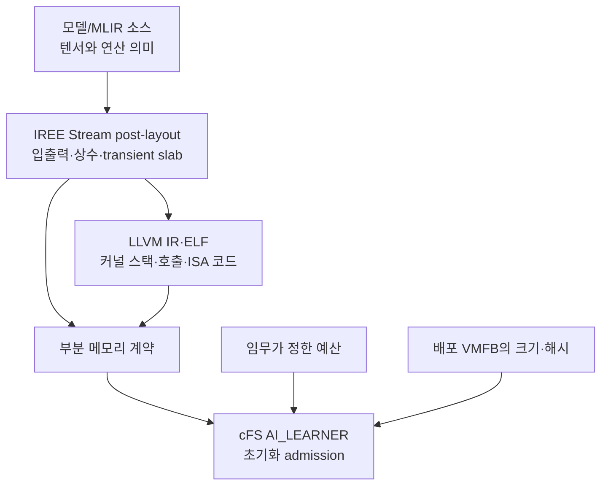

# 우주 온보드 CPU AI와 MLIR/IREE 기반 cFS 자원 계약 연구 통합 의견서

작성일: 2026-09-08

검토 저장소: <https://github.com/wookjaeya/onAIR-MLIR>

기준 브랜치: `claude/review-and-proceed-4y1sag`

기준 커밋: `33e1ebc50de30e110f1947e60def308b35b4ed1d`

## 1. 최종 의견

이 연구는 **계속 추진할 가치가 있다.** 실제 우주 임무에서 범용 CPU 또는 ARM 기반 처리 플랫폼으로 AI·ML 알고리즘을 실행하고, 모델을 비행 중 배포하거나 교체한 사례가 존재한다. 따라서 제한된 온보드 자원 안에서 새로운 모델을 실행해도 되는지 배포 전에 확인하려는 문제는 현실적이다.

다만 연구의 필요성을 다음과 같이 주장해서는 안 된다.

> cFS는 AI 모델의 메모리를 전혀 검사할 수 없고, 이를 해결할 유일한 방법이 MLIR이다.

메모리 예산 비교, 고정 tensor arena, 수동 계산 및 런타임 계측은 MLIR 없이도 가능하다. 이 연구가 다루어야 할 문제는 단순한 검사 가능 여부가 아니라 다음과 같다.

> **모델과 컴파일 설정이 변경될 때, 실제 컴파일 결과에서 정적으로 분석 가능한 자원 요구량을 자동 추출하고, 그 계약이 실제 배포되는 아티팩트와 대응하는지 확인하여 cFS 앱 초기화 단계에서 허용·거부할 수 있는가?**

MLIR/IREE를 사용하는 가장 분명한 이점은 최적화 전의 모델 의미와 최종 기계어 사이에서 **버퍼 크기·배치·수명 정보가 드러나는 분석 지점**을 제공한다는 것이다. 현재 구현은 이 장점을 이용해 부분 메모리 계약을 만들고 cFS에 연결했다. 그러나 텍스트 정규식 파서, 제한된 검증 조건, 일부 미완료 실험 때문에 아직 일반적인 메모리 안전 보장이나 비행 적합성을 주장할 단계는 아니다.

현재 결과에 가장 적합한 연구 방향은 다음과 같다.

> **MLIR/IREE 컴파일 결과에서 모델의 정적 버퍼 요구량과 커널 스택 요구량을 추출하고, 실행 아티팩트에 결합된 부분 자원 계약으로 만들어 cFS의 AI 모델 초기화 admission에 적용하는 방법**

## 2. 실제 우주 CPU AI 사례가 주는 근거

### 2.1 확인된 사례

| 사례 | 확인된 내용 | 연구에 주는 근거 | 해석할 때의 제한 |
|---|---|---|---|
| NASA EO-1 / Autonomous Sciencecraft Experiment | NASA JPL 자료는 Mongoose V에서 SVM과 Random Decision Forest를 실행한 전례를 기술한다. ASE는 2003년부터 온보드 분석·계획·재관측에 활용됐다. [1][2] | 전용 AI 가속기 없이 비행 CPU에서 ML과 자율 판단을 실행한 전례 | 현대 신경망이나 IREE의 비행 실증은 아니다. JPL 발표자료의 SVM·forest 실행 기간에는 불확실성 표시가 있어 정확한 연도를 단정하지 않는다. |
| ESA OPS-SAT / SmartCam | OPS-SAT 실험 처리 플랫폼은 Linux를 실행하는 dual-core ARM Cortex-A9과 Cyclone V FPGA로 구성됐다. SmartCam은 TensorFlow Lite 기반 CNN으로 촬영 영상을 분류하고 업링크된 모델을 분류 파이프라인에 연결했다. [3][4] | CPU 소프트웨어 기반 추론과 비행 중 모델 갱신이 실제 운영 시나리오임을 보여준다. | FPGA 탑재가 CNN의 FPGA 가속 사용을 뜻하지는 않는다. Cortex-A9은 32비트 ARM이며 본 연구의 AArch64와 동일하지 않다. 버스 OBC와 실험용 payload processor도 구분해야 한다. |
| ISS Snapdragon 855 실험 | JPL은 ARM CPU·GPU·DSP·NPU를 포함한 Snapdragon 855에서 계획·영상처리·ML workload를 ISS에서 벤치마크했다. [1] | 우주 실증에서도 COTS 이기종 SoC와 ARM 소프트웨어 경로가 연구 대상이 됨을 보여준다. | 자료에 열거된 모든 ML 모델이 CPU-only로 실행됐다고 볼 수 없다. ISS 내부 실험 장치와 독립 위성의 방사선 내성 OBC는 환경이 다르다. |
| NASA OnAIR | NASA의 OnAIR는 Python AI 알고리즘이 cFS와 상호작용하도록 하는 연구 프레임워크다. [5] | AI 알고리즘과 cFS 데이터·운영 경로를 연결하는 공개 연구 기반을 제공한다. | OnAIR의 사용 이력이 특정 신경망의 CPU 비행 실증이나 본 연구의 IREE 계약 검증을 증명하지는 않는다. |

이 사례 중 본 연구와 가장 직접적으로 연결되는 것은 다음 두 가지다.

- EO-1은 제한된 비행 CPU에서도 ML 기반 판단이 실제로 수행됐음을 보여준다.
- OPS-SAT은 모델 파일을 비행 중 배포하고 CPU 소프트웨어 프레임워크로 추론하는 운영 형태가 실제임을 보여준다.

Snapdragon 사례는 CPU-only 연구의 직접 근거라기보다 실제 온보드 AI가 CPU·GPU·DSP·NPU로 확장될 수 있음을 알려준다. 따라서 현재 연구는 **CPU backend를 명시적인 1차 범위로 선택하고**, 가속기 메모리까지 포괄한다고 일반화하지 않는 편이 정확하다.

OnAIR의 SCENIC 실증에서 사용된 칼만 필터는 학습된 신경망과 구분해야 한다. OnAIR의 비행 활용 사례를 AI 플랫폼의 타당성 근거로 제시할 수는 있지만, 이를 CPU 신경망 추론 사례로 계산해서는 안 된다.

### 2.2 사례로부터 도출할 수 없는 결론

- 우주 온보드 AI의 대부분이 CPU에서 실행된다는 결론
- 모든 비행 CPU가 현대 CNN·Transformer 실행에 적합하다는 결론
- CPU에서 AI를 실행하려면 MLIR이 필요하다는 결론
- 기존 우주 임무에는 자원 검증 절차가 없었다는 결론
- QEMU Cortex-A53 구성이 OPS-SAT 또는 특정 비행 OBC를 재현한다는 결론
- 현재 cFS/IREE 프로토타입이 비행급 소프트웨어라는 결론

실제 사례가 입증하는 것은 **연구 대상의 현실성**이다. MLIR 선택과 자원 계약의 우수성은 별도의 기술적·실험적 근거로 입증해야 한다.

## 3. 연구가 해결하려는 문제

AI 모델의 원본 그래프에서 파라미터와 텐서 크기를 계산할 수 있다. 그러나 실제 실행 메모리는 컴파일 과정에서 달라진다.

- 연산 fusion으로 중간 텐서가 제거된다.
- 서로 동시에 사용되지 않는 텐서가 같은 버퍼를 재사용한다.
- alignment와 padding이 추가된다.
- 상수가 HAL 상수 버퍼나 실행 파일의 read-only 영역으로 나뉜다.
- backend codegen이 커널 지역 배열, register spill 및 stack realignment를 만든다.
- runtime 객체와 모델 파일 로딩 버퍼가 별도로 필요하다.

원본 모델의 모든 텐서를 더하면 실제 peak보다 지나치게 클 수 있고, 임시 버퍼나 padding을 놓치면 과소 추정할 수 있다. 반대로 최종 ELF만 분석하면 구체적인 스택과 명령은 보이지만 어느 메모리가 모델 버퍼·상수·입출력인지 의미를 파악하기 어렵다.



이 연구는 위 단계 중 정적으로 분석할 수 있는 영역을 계약으로 만들고, 다음 질문에 답하려 한다.

1. 컴파일러가 계획한 모델 버퍼 요구량은 얼마인가?
2. 그 값을 정적으로 결정할 수 없는 모델을 구분할 수 있는가?
3. 계약이 설명하는 VMFB와 실제 배포 VMFB가 같은가?
4. 요구량이 앱에 할당된 정책 예산을 넘는가?
5. CPU codegen이 만든 커널 스택 요구량을 별도 예산으로 반영했는가?

여기서 `AI_LEARNER_BUDGET_BYTES`는 실시간 free-memory 값이 아니라 임무 또는 앱 구성이 정한 정책 예산이다. 현재 admission은 자원을 전역적으로 예약하지 않으므로 다른 앱과 동시에 예산을 소비하는 상황까지 해결하지 않는다.

## 4. MLIR/IREE를 사용하는 확실한 장점과 필요성

### 4.1 가장 분명한 장점

MLIR의 bufferization은 tensor 기반 연산을 물리적 메모리 버퍼인 `memref` 기반 표현으로 변환한다. [6] IREE Stream dialect는 transient resource allocation과 크기·실행 순서를 표현한다. [7]

따라서 이 연구는 **메모리 배치가 결정됐지만 모델 자원의 의미가 완전히 사라지지 않은 단계**를 분석할 수 있다. 이 위치가 MLIR/IREE 사용의 가장 확실한 이점이다.

| 장점 | 이 연구에서의 효과 | 여전히 필요한 검증 |
|---|---|---|
| 다단계 표현 | 모델 버퍼와 최종 커널 스택을 서로 다른 단계에서 분석 | 단계 간 대응 식별자와 변환 기록 유지 |
| 최적화 이후 정보 | 원본 tensor 단순 합계보다 실제 배치에 가까운 값 계산 | 분석한 pass 지점과 메모리 경계 명시 |
| 정적·동적 값 구분 | 증명할 수 없는 크기를 UNKNOWN_BOUND로 거부 | 미지원 표현을 누락하지 않는 검증 |
| 수명·재사용 반영 | post-layout transient slab에서 alignment와 재사용 결과 관찰 | slab 집계가 대상 runtime 구성에서 보수적인지 확인 |
| pass 확장성 | Operation·Type·SSA를 직접 순회하는 계약 pass 구현 가능 | pass 구현만으로 soundness가 자동 보장되지는 않음 |
| 여러 backend 연결 | 같은 모델을 x86-64와 AArch64로 컴파일하고 하위 코드를 비교 | CPU 이외 device memory에는 별도 계약 필요 |

현재 v0.9에서 HAL 버퍼 계약은 x86-64와 AArch64에서 동일했지만 커널 스택은 달랐다. 이는 Stream 수준과 ELF 수준을 함께 분석해야 한다는 점을 실제로 보여준다. Conv2D는 AArch64에서 최대 191바이트, x86-64에서 239바이트의 호출당 스택 분석값을 기록했다.

### 4.2 MLIR이 필수인가

**문제 자체를 해결하는 데 MLIR이 유일하거나 필수적인 것은 아니다.** TensorFlow Lite Micro도 공유 tensor arena를 관리하며, 고정 모델 하나에는 수동 계산이나 정적 arena 방식이 더 단순할 수 있다. [8]

MLIR/IREE 선택이 타당해지는 조건은 다음과 같다.

- 모델 또는 입력 shape가 변경될 수 있다.
- 컴파일 설정과 CPU target이 달라질 수 있다.
- 원본 모델이 아니라 최적화된 배포 결과를 기준으로 계약을 만들고 싶다.
- 계약 생성 과정을 사람의 수작업 없이 반복하고 싶다.
- 모델 버퍼에서 LLVM/ELF 커널 잔차까지 단계별 근거를 남기고 싶다.
- 미지원 모델을 추정값으로 허용하지 않고 명시적으로 거부하고 싶다.

따라서 논문에서 주장할 것은 **MLIR의 독점적 필수성**이 아니라 **변경 가능한 모델의 컴파일·배포 과정에 자원 계약을 통합하기에 적합한 구조**다.

### 4.3 MLIR 고유 장점으로 주장하면 안 되는 요소

다음 기능은 전체 연구 시스템의 기능이지 MLIR 고유 기능은 아니다.

- SHA-256을 이용한 계약과 VMFB의 결합
- cFS 앱 초기화 단계의 예산 비교
- 예산 초과 또는 UNKNOWN_BOUND 거부
- 계약 JSON에서 C 헤더 생성
- 실패 시 cleanup과 cFS OPERATIONAL 유지
- 모델 파일 크기 검사

또한 지금까지의 실험은 MLIR/IREE가 NumPy보다 빠르다거나 특정 lowering을 자동 선택하면 항상 유리하다는 근거를 제공하지 않았다.

## 5. 현재 저장소의 실제 구조

저장소에는 연구의 발전 과정에 따라 세 실행 경로가 있다.

| 경로 | 역할 | 현재 논문에서의 위치 |
|---|---|---|
| OnAIR Python `CompiledLearner` | OnAIR AIPlugin 인터페이스 안에서 IREE와 NumPy 경로를 비교 | 초기 통합·가설 형성 과정 |
| Native C learner | Python 없이 IREE runtime, admission, binding, HAL 계측 실행 | 모델 계약의 독립 실행 검증 |
| cFS `AI_LEARNER` C 앱 | cFS 초기화와 SB 메시지 처리 안에서 IREE 직접 실행 | 현재 핵심 시스템 통합 결과 |

최신 cFS 앱은 OnAIR Python plugin을 cFS 안에서 실행하는 구조가 아니다. `AI_LEARNER`가 IREE C runtime을 직접 링크하는 별도 cFS 앱이다. 따라서 논문에서는 관계를 다음처럼 표현하는 것이 정확하다.

- OnAIR는 cFS와 AI plugin을 연결하는 연구 배경과 초기 실험 기반이다.
- 본 연구의 최신 배포 경로는 OnAIR의 Python 실행 계층을 우회한 cFS Native C 앱이다.
- MLIR/IREE의 직접 대상은 AI 모델이며 cFS 전체 C 소스가 아니다.
- cFS는 계약을 소비하고 모델 실행을 허용·거부하는 통합 환경이다.

## 6. 실험 이력에 대한 판단

### 6.1 가설 판정

| 가설 | 현재 판정 | 논문 처리 |
|---|---|---|
| H1: IREE AOT가 Python/NumPy보다 빠르고 예측 가능하다 | 지지되지 않음. 정정 후에도 NumPy/BLAS 대비 2.2–4.1배 느린 구간이 보고됨 | 중심 가설에서 제외하고 실패·교훈으로 기록 |
| H2: 계약 기반 lowering 선택이 고정 설정보다 유리하다 | 선택 이점 미입증. 초기 신호는 가중치 per-call 복사 결함의 영향 | 중심 가설에서 제외 |
| H3: 컴파일러 기반 메모리 admission이 가능하다 | 시험 조건 안에서 부분 지지 | 현재 논문의 중심 |
| MLIR/IREE가 대안보다 우월하다 | 미검증 | 동일 경계 baseline 비교 필요 |

저장소는 D1–D10의 결함과 정정을 이력으로 보존했다. 특히 가중치 복사, 상수 오귀속, slice 합의 padding 누락, 해제 순서, 계측 경계 및 ISA별 스택 정의 문제가 실제로 수정됐다. 이 이력은 연구가 스스로 반증을 받아들였다는 장점이지만, 동시에 현재 결과를 일반적 보장으로 확대하면 안 되는 이유이기도 하다.

### 6.2 현재 부분 계약

현재 모델 버퍼 계약은 대략 다음 범위를 계산한다.

\[
M_{partial}=M_{module\ constants}+M_{static\ input/output}+M_{static\ transient}
\]

대표 MLP 계약:

\[
720{,}896+44+65{,}536=786{,}476\ \text{bytes}
\]

이는 전체 cFS 프로세스 peak가 아니다. IREE runtime context, VM과 HAL 관리 객체, allocator 부가비용, VMFB 로딩 blob, 전체 task stack, cFS Software Bus와 다른 앱의 메모리는 같은 수치에 포함되지 않는다.

커널 stack은 ELF 분석 결과를 별도의 task-stack 예산으로 반영한다. 이는 부분 계약의 범위를 넓힌 의미 있는 진전이지만, 앱과 runtime 전체 call chain의 WC stack 사용량을 증명한 것은 아니다.

## 7. v0.9 코드·원자료에서 확인한 결과

### 7.1 아티팩트와 계약

기준 커밋에서 정적 기본 모델 3개, 교체용 모델 3개, 동적 모델 1개를 x86-64와 AArch64로 컴파일한 14개 VMFB가 보관돼 있다. 이번 검토에서 각 파일의 크기와 SHA-256을 다시 계산한 결과 계약과 **14/14 일치**했다.

여기서 “7개 모델”은 서로 독립적인 실제 임무 모델 7종을 뜻하지 않는다. 기본 구조는 MLP, Conv2D, multibranch 세 종류이고 여기에 교체 검사용 변형과 동적 모델이 포함된다.

| 모델 | 부분 계약(B) | AArch64 호출당 커널 스택 분석값(B) | x86-64 분석값(B) | AArch64 Native HAL peak(B) | AArch64 cFS HAL peak(B) |
|---|---:|---:|---:|---:|---:|
| MLP h=16384 | 786,476 | 16 | 16 | 786,476 | 786,476 |
| Conv2D | 3,528 | 191 | 239 | **1,352** | **3,528** |
| multibranch | 38,216 | 16 | 16 | 38,216 | 38,216 |

세 정적 모델의 Stream 기반 계약값은 x86-64와 AArch64에서 동일했다. 저장소의 구조적 설명은 `iree-stream-layout-slices`가 target codegen보다 앞서 수행되기 때문이라는 것이다. 반면 VMFB 바이트, ELF 구조와 스택 요구량은 target별로 달랐다.

Conv2D의 Native HAL peak 1,352바이트와 cFS peak 3,528바이트 차이는 계약 상수 영역 2,176바이트와 같다. 상수의 매핑·할당 및 계측 경계 차이가 원인일 가능성이 있지만, 이번 검토에서 인과를 확정하지 않았다.

그러므로 결과는 다음처럼 기술해야 한다.

> 관측한 실행 구성에서 HAL peak가 부분 계약 이하였으며, 계약의 tightness는 런타임 구성과 상수 매핑 방식에 따라 달랐다.

모든 경우에 `HAL peak = contract`라고 쓰면 Conv2D Native 결과와 모순된다.

### 7.2 AArch64 cFS guest 실행

저장된 cFS 원시 로그와 summary를 다시 대조한 결과 선택된 7개 시나리오는 저장소 checker 기준으로 모두 PASS였다.

| 시나리오 | 실제 로그가 뒷받침하는 결과 |
|---|---|
| A1 Conv2D | 정상 실행 5/5, HAL peak 3,528, 설정 stack 262,335 |
| A1 multibranch | 정상 실행 5/5, HAL peak 38,216, 설정 stack 262,160 |
| A3 MLP model swap | 같은 ABI의 다른 VMFB를 해시 불일치로 거부, cleanup 1회 |
| A4 MLP file missing | 파일 부재 처리, cleanup 1회 |
| A6 MLP repeat | 마지막 보고 시점 20/20, 보고된 추론 실패 0 |
| A8 dynamic shape | UNKNOWN_BOUND, VMFB binding 전에 거부, cleanup 1회 |
| A7 MLP restart | 재시작 명령 1회, 초기화 2회, cleanup 1회, 재시작 후 마지막 보고 15/15 |

이 결과는 cFS 앱 초기화에서 계약과 VMFB를 확인하고, 정상·거부·재시작 경로를 AArch64 Linux guest 안에서 실행했다는 근거다.

다만 7/7은 원래 계획한 모든 조합의 완료를 의미하지 않는다.

- cFS에서 모델별 예산 경계 `B-1/B/B+1`를 모두 실행하지 않았다.
- A5b runtime loader 실패에 대응하는 원자료가 확인되지 않았다.
- 재시작은 계획된 2회 후 삭제가 아니라 1회다.
- 정상 실행 로그는 timeout이 cFS 전체 프로세스에 SIGINT를 보내 종료했다.
- 정상 A1·A6 로그의 앱 cleanup 횟수는 0이므로 정상 앱 종료의 자원 회수 근거가 아니다.
- 반복 횟수는 장기 안정성을 주장할 규모가 아니다.

QEMU TCG의 latency, jitter 및 RSS는 실제 Cortex-A53의 성능 증거로 사용하지 않는다. QEMU 공식 문서도 TCG instruction counting을 cycle-accurate simulation과 구분한다. [9]

## 8. 최신 코드 검토에서 확인한 핵심 약점

### 8.1 A5a와 A5b의 증거가 혼동돼 있다

- A5a는 원본 계약과 손상 VMFB의 해시가 달라 gate에서 거부되는 시험이다.
- A5b는 손상 파일의 해시를 계약에 넣어 binding을 통과시킨 뒤 IREE loader가 구조 손상을 안전하게 처리하는 시험이다.

보관된 Native summary와 원시 로그에서 확인한 것은 A5a다. cFS summary의 `runtime_load_failed`도 모두 null이다. 따라서 A5b는 **미검증 또는 근거 미보관**으로 정정해야 한다.

임의 바이트를 뒤집으면 실행 구조가 아니라 가중치만 바뀔 수 있다. A5b를 수행할 때는 FlatBuffer·VM bytecode·embedded ELF의 구조 필드를 목표로 하여 loader 실패가 예상되는 손상 파일을 만들어야 한다.

### 8.2 텍스트 정규식 파서가 allocation을 누락할 수 있다

현재 `static_mem_bound.py`는 출력된 IREE IR을 정규식으로 분석한다. 저장된 Conv2D IR의 allocation 표현에 줄바꿈만 추가한 진단에서 다음 결과가 나왔다.

```text
원본: inputs=[256], outputs=[8], transient_slabs=[1088], unresolved=[]
변형: inputs=[256], outputs=[],  transient_slabs=[],     unresolved=[]
```

변형 후에도 `entry_found=true`, `unresolved=[]`여서 계약 생성기가 이를 UNKNOWN_BOUND로 바꾸지 않을 수 있다. 이는 현재 원본 14개 계약이 잘못됐다는 증거가 아니라, **미지원 문법을 누락으로 처리할 수 있는 파서 구조의 위험을 재현한 결과**다.

정규 MLIR/IREE pass가 필요한 가장 구체적인 이유가 여기에 있다. Operation·Type·SSA를 직접 분석하고, 지원하지 않는 자원 연산이나 크기 표현이 하나라도 있으면 계약 생성을 거부해야 한다.

### 8.3 계약 헤더 생성기의 검증 조건이 부족하다

`gen_contract_header.py` 직접 실행 진단에서 다음 입력이 모두 종료 코드 0으로 헤더를 생성했다.

| 비정상 입력 | 결과 |
|---|---|
| `bounded_bytes=-10` | `CONTRACT_BOUND_KNOWN=1`, bound `-10L` |
| `bound_method="UNSUPPORTED"` | `CONTRACT_BOUND_KNOWN=1` |
| stack 분석값 누락 | stack unknown을 기록하지만 값은 0으로 생성 |

정상 wrapper가 JSON schema 검증을 먼저 수행한다면 일부 잘못된 입력은 앞 단계에서 차단될 수 있다. 그러나 독립 실행이 가능한 헤더 생성기도 신뢰 경계를 명시하거나 자체 검증해야 한다.

현재 C 실행 경로는 단일 f32 입력·출력을 전제로 하지만 계약의 입력·출력 개수와 dtype을 gate에서 충분히 확인하지 않는다. compiler/runtime commit과 target 조건도 계약에 기록하는 것과 실제 수용 조건으로 검사하는 것은 다르다.

### 8.4 스택 회계는 admission이 아니라 설정·보고다

커널 stack 분석값은 시작 스크립트 stack 크기에 더해진다. 앱은 `CFE_ES_GetAppInfo`로 실제 설정 크기를 읽고 `kernel_stack_accounted`를 기록한다. 그러나 `accounted=false`여도 초기화를 거부하는 분기가 없다.

이 확인은 IREE runtime과 입력 버퍼를 만든 뒤 수행된다. 또한 base stack 262,144바이트는 설정값이며 앱·IREE runtime 전체 call chain에 대한 증명된 WC stack이 아니다. `feat[CONTRACT_INPUT_ELEMS]`처럼 모델 입력 크기에 따라 변하는 앱 stack 배열도 존재한다.

현재 근거에 맞는 표현은 다음과 같다.

> 커널 dispatch의 정적 스택 분석값을 cFS task stack 설정에 반영하고, 초기화 시 설정값이 반영됐음을 확인했다.

“전체 task stack 안전을 보장했다”거나 “스택 admission을 수행했다”고 표현하면 과장이다.

### 8.5 one-invocation 검사는 완전한 provenance 증명이 아니다

현재 도구는 VMFB에 포함된 ELF와 dump ELF의 해시 일치, 입력 basename과 dump 파일명의 대응을 검사한다. 이는 산출물 혼입을 탐지하는 유용한 방어다.

그러나 layout IR의 전체 버퍼 계획이 해당 VMFB와 같은 컴파일 호출에서 나왔음을 독립적으로 완전히 증명하지는 않는다. layout IR 해시를 계약에 기록하는 것만으로 VMFB와의 관계가 성립하는 것도 아니다.

논문에서는 “동일 호출을 wrapper로 강제하고 대표적인 산출물 혼입을 검사한다”고 표현하는 편이 정확하다. “수학적으로 provenance를 증명한다”는 표현은 피해야 한다.

### 8.6 시나리오 checker는 관측 부재를 성공으로 오인할 여지가 있다

checker는 `run` 또는 `stack` 로그가 없으면 `runtime_created=false`로 추정하고, 특정 crash 문자열이 없으면 `no_crash=true`로 처리한다. 빈 로그에 일부 음성 조건만 주면 통과할 수 있는 진단이 재현됐다.

실제 저장된 7개 로그는 admission 등 추가 조건을 만족하므로 전부 무효라는 뜻은 아니다. 다만 향후에는 runtime create/destroy 카운터, 기대 이벤트 존재, 로그 종료 marker 및 scenario별 필수 관측값을 명시해야 한다.

### 8.7 binding 전에 VMFB 전체 blob을 할당한다

cFS 앱은 파일을 열어 전체 크기만큼 `malloc`하고 읽은 뒤 SHA-256을 비교한다. 모델 예산 gate는 그 전에 실행되지만, VMFB blob은 부분 버퍼 계약 범위 밖이다. 예상보다 큰 파일이면 해시 불일치를 확인하기 전에 큰 메모리 할당을 시도한다.

먼저 파일 크기를 `artifact.bytes`와 비교하고, 별도의 로딩 예산을 확인한 뒤 blob을 할당하는 편이 계약 경계와 일관된다.

## 9. 현재 연구가 주장할 수 있는 것과 없는 것

| 현재 근거로 주장 가능 | 현재 근거로 주장 불가 |
|---|---|
| 세 정적 모델 계열에서 post-layout 기반 부분 계약을 생성했다. | 모든 MLIR/IREE 모델에 sound한 상한을 생성한다. |
| 시험한 실행에서 HAL peak가 부분 계약 이하였다. | 전체 cFS 프로세스가 해당 메모리 안에서 실행된다. |
| x86-64와 AArch64 target에서 세 모델의 Stream 계약값이 같았다. | 모든 CPU target에서 계약이 불변이다. |
| VMFB 14개의 크기·해시가 저장된 계약과 일치했다. | 계약의 모든 provenance가 암호학적으로 증명됐다. |
| cFS guest에서 선택한 정상·거부·재시작 사례 7건을 실행했다. | 원래 계획한 모든 cFS 생명주기 시나리오를 통과했다. |
| 동적 shape 예제는 UNKNOWN_BOUND로 거부했다. | 모든 미지원·동적 메모리 경로를 탐지한다. |
| 커널 스택 분석값을 task stack 설정에 반영했다. | 전체 task stack의 WC 사용량을 보장한다. |
| QEMU로 AArch64 실행·통합 기능을 확인했다. | 실제 Cortex-A53의 지연·WCET·전력·열을 검증했다. |
| CPU 기반 온보드 AI는 실제 사례가 있는 연구 대상이다. | 현재 프로토타입이 비행급 또는 방사선 내성 시스템이다. |

## 10. 하드웨어와 실험환경에 대한 의견

AArch64 Linux + QEMU를 유지하는 것은 타당하다. QEMU로 검증할 수 있는 범위를 다음처럼 고정해야 한다.

| QEMU로 검증할 항목 | 실제 하드웨어 또는 별도 분석이 필요한 항목 |
|---|---|
| AArch64 VMFB와 runtime의 기능적 호환 | 실제 실행시간·WCET |
| cFS 앱 초기화와 admission 순서 | 전력·열·클록 변동 |
| 계약 초과·해시 불일치·UNKNOWN 거부 | 실제 물리 메모리 압박과 OS 정책 |
| cFS 재시작·cleanup 경로 | 방사선 오류와 비행 환경 내성 |
| ELF 기반 커널 stack 구조 | 전체 task의 동적 WC stack |

연구 대상은 “OPS-SAT 재현”이 아니라 다음과 같이 표현하는 것이 적절하다.

> 실제 우주 임무에서 확인된 ARM CPU 기반 온보드 AI 배포를 동기로 하여, AArch64 Linux 참조 환경에서 MLIR/IREE 모델 아티팩트와 cFS 자원 admission의 기능적 성립을 평가한다.

GPU·NPU backend를 후속 연구에 추가할 경우 device-local memory, host/device transfer, DMA, pinned buffer, driver workspace와 비동기 in-flight 수를 새 계약 경계로 정의해야 한다. 현재 CPU 계약을 그대로 적용할 수 없다.

## 11. 다음 실험과 구현의 권장 순서

### 1순위: 증거와 문서 정합성 복구

- A5b를 미검증 또는 근거 미보관으로 정정한다.
- A7을 재시작 1회 실험으로 기술한다.
- 7/7 PASS를 선택된 7개 시나리오 결과로 한정한다.
- timeout에 의한 cFS 종료와 정상 앱 STOP/DELETE를 구분한다.
- cross-target JSON의 `both_sound=null`을 계약 수치 비교와 양쪽 runtime 실행 검증의 차이로 설명한다.

### 2순위: fail-closed 계약 verifier

- 허용되는 `bound_method`를 열거한다.
- 모든 크기에 대해 정수·비음수 조건을 확인한다.
- 입력·출력 수, shape, dtype과 entry ABI를 검증한다.
- target triple, CPU profile, driver, compiler/runtime commit 조건을 검사한다.
- stack 분석값이 없을 때 HAL-only 계약으로 제한하거나 전체 admission을 거부한다.
- 미지원 operation과 크기 표현이 존재하면 UNKNOWN 또는 계약 생성 실패로 처리한다.

### 3순위: 남은 cFS 음성·생명주기 시험

- 모델별 `B-1/B/B+1` 경계값
- 구조를 의도적으로 손상한 A5b
- 실제 stack 미달 설정과 거부 동작
- 재시작 2회 후 DELETE
- 정상 STOP/DELETE 이후 runtime·buffer·blob 해제 카운터 확인
- 실제 파일 크기 검사 후 blob 할당 순서 확인

### 4순위: 정규 MLIR/IREE pass 구현

텍스트 IR 정규식 대신 compiler 내부 Operation·Type·SSA 정보를 사용한다. pass의 출력은 구조화된 계약 조각 또는 machine-readable manifest로 만든다. 지원하지 않는 dialect operation, 외부 call 및 동적 allocation을 탐지하면 fail-closed 처리한다.

이 단계의 평가지표는 구현했다는 사실보다 다음이 중요하다.

- 알려진 allocation을 빠뜨리지 않는가?
- 미지원 표현을 조용히 무시하지 않는가?
- compiler 버전 변경에서 실패가 명시적으로 드러나는가?
- 기존 텍스트 파서와 같은 정상 모델에서 같은 값을 내는가?
- 적대적 변형에서 과소 추정을 막는가?

### 5순위: 동일 경계의 대안 비교

MLIR의 필요성을 논문에서 설득하려면 수동 모델 크기 계산, 원본 graph 기반 추정, runtime 계측 및 가능한 경우 TFLite Micro의 arena 계획과 비교한다. 서로 다른 메모리 경계를 숫자 하나로 비교하면 안 된다.

권장 지표:

- 과소 추정 발생률
- 계약의 tightness 또는 과도한 거부 정도
- 분석 가능한 model/operator 범위
- 모델·compiler·target 변경 시 계약 재생성 자동화
- stale contract와 artifact 불일치 탐지
- 분석 및 통합 비용

### 6순위: 임무 유사 workload와 다중 앱

영상 선별용 경량 CNN 또는 텔레메트리 이상 탐지 모델을 추가한다. 실제 비행 모델을 사용하지 못했다면 “임무 유사 workload”라고 명시한다.

다중 AI 앱 admission은 단일 앱의 계약 수용 규칙을 완성한 뒤 수행한다. 이 단계에서는 각 앱의 개별 비교만으로 부족하며, 전역 예산의 예약·해제·경합과 동시 초기화를 설계해야 한다.

시간 계약은 QEMU가 아니라 전용 실물 CPU 환경에서 core isolation과 scheduler 설정을 통제할 수 있을 때 별도 연구축으로 다룬다.

## 12. 권장 연구 제목과 핵심 문장

### 제목

**Compiler-Derived Partial Resource Contracts for CPU-Based AI Deployment in cFS**

한국어:

**cFS 기반 CPU AI 배포를 위한 컴파일러 유래 부분 자원 계약**

메모리만 최종 범위로 유지한다면 다음 제목도 가능하다.

**Compiler-Derived Partial Memory Contracts for CPU-Based AI Deployment in cFS**

### 권장 연구 질문

> 명시된 정적 shape·단일 entry·단일 in-flight·CPU local-sync 조건에서, MLIR/IREE의 컴파일 결과로부터 모델 버퍼와 커널 스택의 부분 자원 계약을 자동 생성하고, 계약 조건 및 실행 아티팩트의 일치를 확인하여 cFS가 부적합한 모델 초기화를 사전에 거부할 수 있는가?

### 권장 기여 문장

> 본 연구는 IREE Stream post-layout 표현에서 정적으로 결정 가능한 모델 버퍼 요구량을 추출하고, LLVM IR·ELF에서 CPU 커널의 스택 요구량을 별도로 분석하여 아티팩트 결합형 부분 자원 계약을 생성한다. 생성된 계약을 cFS AI 애플리케이션 초기화 경로에 연결해 예산 초과, 알 수 없는 bound 및 아티팩트 불일치를 실행 runtime 생성 전에 판정한다.

스택 부족에 대한 실제 거부 분기를 구현하기 전에는 마지막 문장의 판정 대상에 stack을 포함하지 않는 것이 정확하다.

## 13. 최종 평가

| 평가 항목 | 판정 |
|---|---|
| 우주 온보드 CPU AI 연구의 현실성 | 충분함 |
| cFS를 통합 실험 대상으로 사용한 타당성 | 충분함 |
| AArch64 QEMU를 기능 검증 환경으로 사용한 타당성 | 충분함 |
| MLIR/IREE 구현 기반의 적합성 | 높음 |
| 문제 해결에서 MLIR의 독점적 필수성 | 성립하지 않음 |
| 현재 프로토타입의 연구 가치 | 의미 있음 |
| 현재 계약의 일반적 soundness | 미입증 |
| 현재 결과의 논문 준비도 | 조건부 — verifier와 미완료 음성 시험 보강 필요 |
| 우선 연구 과제 | fail-closed 계약 생성·수용 조건 완성 |

이 연구의 가치는 우주에서 CPU AI가 실행된다는 사실 자체에 있지 않다. 실제 사례는 연구 문제의 현실성을 제공한다. MLIR/IREE는 컴파일 결과의 자원 정보를 얻는 분석 기반을 제공한다. 논문 기여는 그 정보를 **누락 없이 제한된 계약으로 만들고, 계약이 성립하지 않을 때 안전하게 거부하며, cFS의 실제 배포 경로에서 검증하는 방법**에서 나온다.

현재 저장소는 그 방향의 의미 있는 통합 프로토타입이다. 다음 단계에서는 모델 수를 늘리는 것보다 “어떤 정보가 없거나 잘못됐을 때 절대로 ADMIT하지 않는가”를 명확히 구현하고 검증하는 편이 연구의 질을 더 크게 높인다.

## 참고자료

1. NASA JPL, *Flight Validating Artificial Intelligence Software on the Qualcomm Snapdragon Processor Onboard the ISS*, ISS R&D Conference, 2021. [공식 발표자료](https://ai.jpl.nasa.gov/public/documents/papers/ISS-RD-2021-Snapdragon.pdf)
2. NASA JPL, *Autonomous Sciencecraft Experiment*. [공식 프로젝트 설명](https://ai.jpl.nasa.gov/public/projects/ase/)
3. ESA, *OPS-SAT*. [공식 플랫폼 설명](https://esoc.esa.int/content/ops-sat)
4. Labrèche et al., *OPS-SAT Spacecraft Autonomy with TensorFlow Lite, Unsupervised Learning, and Online Machine Learning*, IEEE Aerospace Conference, 2022. [DOI](https://doi.org/10.1109/AERO53065.2022.9843402), [SmartCam 코드와 설명](https://github.com/georgeslabreche/opssat-smartcam)
5. NASA, *OnAIR*. [공식 저장소](https://github.com/nasa/OnAIR)
6. LLVM/MLIR, *Bufferization*. [공식 문서](https://mlir.llvm.org/docs/Bufferization/)
7. IREE, *Stream Dialect* 및 *Stream Passes*. [Dialect 문서](https://iree.dev/reference/mlir-dialects/Stream/), [Pass 문서](https://iree.dev/reference/mlir-passes/Stream/)
8. TensorFlow Lite Micro, *Memory Management*. [공식 문서](https://github.com/tensorflow/tflite-micro/blob/main/tensorflow/lite/micro/docs/memory_management.md)
9. QEMU, *TCG Instruction Counting*. [공식 문서](https://qemu.readthedocs.io/en/v9.1.3/devel/tcg-icount.html)

## 검토한 저장소 근거

- [기준 커밋](https://github.com/wookjaeya/onAIR-MLIR/commit/33e1ebc50de30e110f1947e60def308b35b4ed1d)
- [실험 원장](https://github.com/wookjaeya/onAIR-MLIR/blob/33e1ebc50de30e110f1947e60def308b35b4ed1d/EXPERIMENT_LOG.md)
- [v0.9 근거 문서](https://github.com/wookjaeya/onAIR-MLIR/blob/33e1ebc50de30e110f1947e60def308b35b4ed1d/docs/EVIDENCE_v0.9_E14_stage1.md)
- [정적 메모리 파서](https://github.com/wookjaeya/onAIR-MLIR/blob/33e1ebc50de30e110f1947e60def308b35b4ed1d/harness/static_mem_bound.py)
- [계약 생성기](https://github.com/wookjaeya/onAIR-MLIR/blob/33e1ebc50de30e110f1947e60def308b35b4ed1d/harness/make_contract.py)
- [계약 헤더 생성기](https://github.com/wookjaeya/onAIR-MLIR/blob/33e1ebc50de30e110f1947e60def308b35b4ed1d/harness/gen_contract_header.py)
- [cFS AI_LEARNER](https://github.com/wookjaeya/onAIR-MLIR/blob/33e1ebc50de30e110f1947e60def308b35b4ed1d/native/cfs_app/fsw/src/ai_learner.c)
- [cFS 실행 로그와 summary](https://github.com/wookjaeya/onAIR-MLIR/tree/33e1ebc50de30e110f1947e60def308b35b4ed1d/results/e14_aarch64_qemu/cfs)
- [Native 실행 로그와 summary](https://github.com/wookjaeya/onAIR-MLIR/tree/33e1ebc50de30e110f1947e60def308b35b4ed1d/results/e14_aarch64_qemu/native)
- [교차 타깃 비교 자료](https://github.com/wookjaeya/onAIR-MLIR/tree/33e1ebc50de30e110f1947e60def308b35b4ed1d/results/e14_aarch64_qemu/comparison)

외부 사례와 도구 기능에 관한 설명은 참고자료에 근거한다. 저장소의 구현·실험 평가는 기준 커밋의 코드와 보관된 원자료를 대조한 결과다. 이번 검토에서 전체 QEMU/cFS 환경을 새로 빌드하거나 모든 추론을 독립 재실행하지는 않았다.
