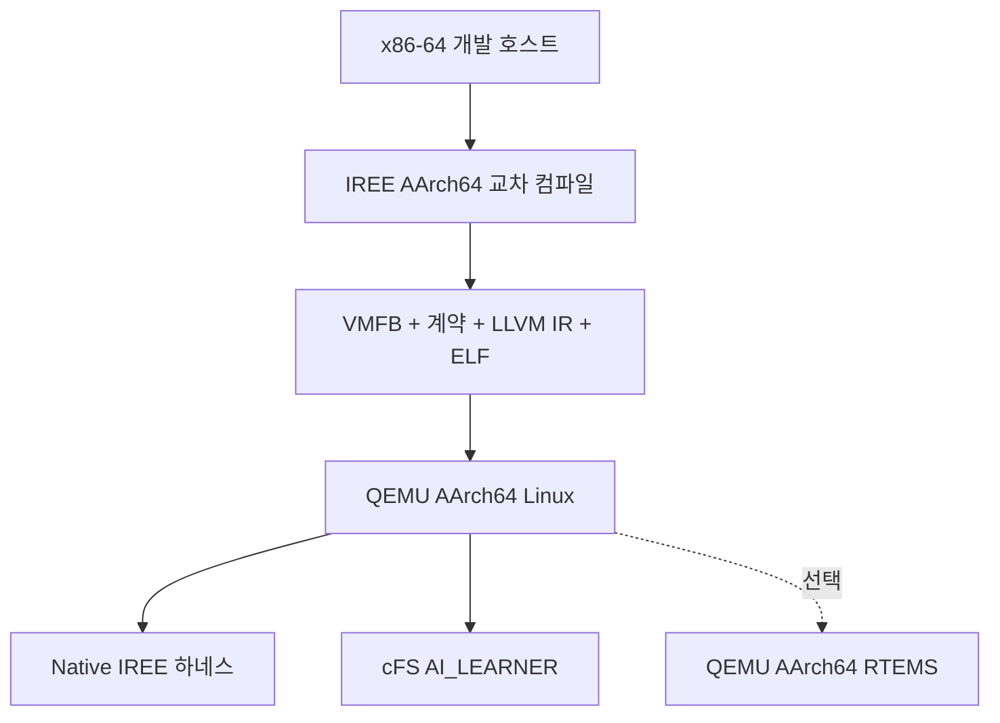

# QEMU AArch64 기반 cFS–IREE 메모리 계약 실험환경 구축안

## 1. 목적

본 구축안은 기존 x86-64 실험에서 검증한 MLIR/IREE 기반 부분 메모리 계약을 AArch64 타깃으로 확장하기 위한 것이다. 실물 보드 없이 다음 항목을 검증한다.

1. AArch64용 VMFB 및 Embedded ELF 생성
2. 타깃별 메모리 계약 생성과 VMFB SHA-256 결합
3. AArch64 ABI에서 LLVM IR·ELF·스택·외부 호출 구조 확인
4. QEMU AArch64 Linux에서 Native IREE 실행 및 HAL 할당량 검증
5. QEMU AArch64 환경에서 cFS 앱의 admission 허용·거부·실패 처리 검증
6. x86-64와 AArch64 사이의 계약 건전성 및 코드 생성 차이 비교

본 실험은 기능·구조·논리적 할당량 검증을 목적으로 한다. QEMU에서 얻은 실행시간, jitter, RSS, 전력 및 WCET는 연구 근거로 사용하지 않는다.

---

## 2. 핵심 연구 질문

### RQ1. 교차 ISA 계약 건전성

> 실행 코드와 ABI가 x86-64에서 AArch64로 바뀌어도 타깃별로 생성된 메모리 계약이 해당 타깃의 HAL 메모리 피크를 안전하게 포괄하는가?

검증 조건은 다음과 같다.

\[
\text{observed\_HAL\_peak}_{t,m} \leq \text{bounded\_bytes}_{t,m}
\]

- \(t\): 컴파일 타깃(x86-64 또는 AArch64)
- \(m\): 시험 모델

타깃별 `bounded_bytes`가 서로 같을 필요는 없다. 각 타깃에서 계약이 sound한지가 핵심이다.

### RQ2. 커널 외부 메모리

> AArch64 코드 생성 과정에서 x86-64에는 없었던 스택 프레임, spill, 외부 함수 호출 또는 별도 메모리가 발생하는가?

발생 자체를 실패로 간주하지 않는다. 발생한 메모리가 계약에 포함됐는지, 아니면 별도 잔차로 분류해야 하는지를 확인한다.

### RQ3. cFS admission의 타깃 독립성

> 계약–아티팩트 결합, 예산 경계 판정, 모델 교체 거부 및 자원 회수가 AArch64 cFS 실행환경에서도 동일하게 동작하는가?

---

## 3. 실험 범위와 비범위

### 검증 범위

| 분류 | 검증 항목 |
|---|---|
| 컴파일 | AArch64 VMFB·LLVM IR·Embedded ELF 생성 |
| 계약 | transient, I/O, module constants, bounded bytes |
| 결합 | VMFB 크기·SHA-256·entry·shape·dtype·target profile |
| 정적 구조 | `alloca`, 함수 호출, 스택 프레임, 벡터 명령, ELF/rodata 크기 |
| Native 실행 | binding, HAL peak, steady-state per-call allocation |
| cFS 실행 | ADMIT, NOT_ADMITTED, mismatch, missing model, cleanup |
| 교차 타깃 | x86-64와 AArch64의 계약 및 실행 코드 비교 |

### 검증 비범위

| 항목 | 제외 이유 |
|---|---|
| QEMU inference latency | 명령어 번역기와 호스트 부하가 포함됨 |
| QEMU p99·jitter·WCET | 실제 CPU·캐시·인터럽트 구조를 반영하지 않음 |
| QEMU 프로세스 RSS | 에뮬레이터와 호스트 메모리 매핑이 혼입됨 |
| 전력·온도·thermal throttling | 물리 장치가 없음 |
| 비행 적격성·방사선 내성 | 대상 하드웨어 검증이 아님 |
| 실제 탑재 컴퓨터 대표성 | AArch64 기능 이식성만 검증함 |

---

## 4. 권장 실험 토폴로지



권장 QEMU 실행 모드는 `qemu-system-aarch64`이다. `qemu-aarch64` user-mode는 Native 실행 파일의 빠른 사전 확인에만 사용한다.

---

## 5. 기준 소프트웨어 구성

| 구성요소 | 권장 설정 |
|---|---|
| 개발 호스트 | 기존 x86-64 Linux 실험환경 유지 |
| QEMU | `qemu-system-aarch64`, TCG 실행 |
| 가상 머신 | `virt`, GICv3 |
| 가상 CPU | `cortex-a53` |
| vCPU | 1개를 기본값으로 사용 |
| 게스트 메모리 | 1 GiB |
| 게스트 OS | AArch64 Linux 최소 설치본 |
| IREE compiler/runtime | 기존 실험과 동일 커밋 `e4a3b04` |
| IREE backend | `llvm-cpu` |
| IREE HAL | `local-sync` |
| 실행 파일 형식 | Embedded ELF |
| 타깃 triple | `aarch64-unknown-linux-gnu` |
| 타깃 CPU | `cortex-a53` |
| cFS | 기존 실험과 동일 커밋 |
| OSAL/PSP | cFS와 함께 사용한 버전 고정 |

`local-sync`, 단일 vCPU 및 단일 in-flight 호출을 유지하여 기존 계약의 유효 조건과 실험 조건을 일치시킨다.

---

## 6. 호스트 도구

호스트에는 다음 도구가 필요하다.

```text
qemu-system-aarch64
qemu-utils
AArch64 GNU binutils
AArch64 cross compiler
CMake
Ninja
Clang/LLVM
Python 3
OpenSSL 또는 sha256sum
Git
```

배포판별 패키지 이름은 다를 수 있으므로 설치 후 다음 정보를 환경 manifest에 기록한다.

```bash
qemu-system-aarch64 --version
aarch64-linux-gnu-objdump --version
clang --version
cmake --version
ninja --version
```

---

## 7. QEMU AArch64 Linux 구성

### 7.1 권장 가상 머신 설정

다음 구성은 예시다. UEFI 펌웨어와 디스크 이미지 경로는 실제 설치 위치로 지정한다.

```bash
QEMU_AARCH64_EFI=/absolute/path/to/QEMU_EFI.fd
QEMU_AARCH64_DISK=/absolute/path/to/aarch64-linux.qcow2

qemu-system-aarch64 \
  -machine virt,gic-version=3 \
  -cpu cortex-a53 \
  -smp 1 \
  -m 1024 \
  -bios "$QEMU_AARCH64_EFI" \
  -drive if=virtio,file="$QEMU_AARCH64_DISK",format=qcow2 \
  -device virtio-net-device,netdev=net0 \
  -netdev user,id=net0,hostfwd=tcp::2222-:22 \
  -nographic
```

### 7.2 게스트 확인 항목

```bash
uname -a
uname -m
lscpu
getconf LONG_BIT
```

기대값:

- `uname -m`: `aarch64`
- user-space ABI: LP64
- CPU 모델: Cortex-A53 또는 QEMU가 노출한 동등 AArch64 모델

게스트 내부에서 cFS를 빌드하는 방법과 호스트에서 교차 컴파일한 바이너리를 복사하는 방법 모두 가능하다. 최초 구축은 디버깅이 쉬운 게스트 native build를 사용하고, 재현성이 확보된 후 cross build로 전환한다.

---

## 8. AArch64 IREE 아티팩트 생성

### 8.1 단일 컴파일 호출 원칙

계약 IR, 실행 파일 덤프 및 배치할 VMFB는 반드시 동일한 `iree-compile` 호출에서 생성한다. 입력 경로 또는 파일명이 바뀌면 VMFB 바이트와 심볼명이 달라질 수 있으므로 별도 재컴파일 결과를 혼합하지 않는다.

```bash
iree-compile model.mlir \
  --iree-hal-target-backends=llvm-cpu \
  --iree-llvmcpu-target-triple=aarch64-unknown-linux-gnu \
  --iree-llvmcpu-target-cpu=cortex-a53 \
  --mlir-print-ir-after=iree-stream-layout-slices \
  --iree-hal-dump-executable-files-to=results/e14/aarch64/dump \
  -o results/e14/aarch64/model.vmfb \
  2> results/e14/aarch64/layout.mlir
```

컴파일 직후 다음 값을 고정한다.

```bash
sha256sum results/e14/aarch64/model.vmfb
stat -c '%s' results/e14/aarch64/model.vmfb
```

### 8.2 계약 필수 필드

```json
{
  "target": {
    "triple": "aarch64-unknown-linux-gnu",
    "cpu": "cortex-a53",
    "driver": "local-sync",
    "executable_format": "embedded-elf"
  },
  "resources": {
    "static_transient_bytes": 0,
    "static_io_bytes": 0,
    "module_resident_constant_bytes": 0,
    "bounded_bytes": 0
  },
  "artifact": {
    "file": "model.vmfb",
    "sha256": "<actual sha256>",
    "bytes": 0
  },
  "validity": {
    "static_shapes": true,
    "single_in_flight": true,
    "entry": "infer"
  }
}
```

숫자는 기존 계약 추출기로 AArch64 컴파일 호출의 IR과 아티팩트에서 다시 생성한다. x86-64 계약값을 복사하지 않는다.

---

## 9. LLVM IR 및 ELF 분석

### 9.1 ELF 추출 및 디스어셈블

IREE dump 디렉터리에 생성된 AArch64 ELF를 대상으로 다음을 수행한다.

```bash
aarch64-linux-gnu-readelf -h kernel.elf
aarch64-linux-gnu-readelf -S kernel.elf
aarch64-linux-gnu-readelf -s kernel.elf
aarch64-linux-gnu-objdump -d kernel.elf > kernel.aarch64.objdump.txt
```

### 9.2 정적 조사 항목

| 조사 항목 | 판단 목적 |
|---|---|
| LLVM `alloca` | 명시적 스택 객체 존재 여부 |
| LLVM external declaration | 외부 런타임·수학 함수 의존성 |
| AArch64 `bl`/`blr` | 함수 호출 존재 여부 |
| `stp x29, x30` 및 `sub sp, sp` | 스택 프레임 존재와 크기 |
| stack-relative load/store | spill 또는 로컬 데이터 가능성 |
| `fmla`, `fmul`, NEON 레지스터 | 벡터 코드 생성 여부 |
| ELF section/segment 크기 | 코드와 rodata 귀속 |
| relocation·undefined symbol | 로딩 시 추가 의존성 |

스택 프레임 또는 호출이 발견되면 이를 숨기지 않고 다음 중 하나로 분류한다.

1. HAL 계약에 이미 포함된 메모리
2. 태스크 스택 예산에 포함할 메모리
3. IREE 런타임 잔차에 포함할 메모리
4. 현재 계약 밖의 미회계 메모리

4번이 발생하면 계약 경계를 수정한 뒤 실험을 재수행한다.

---

## 10. Native IREE 실험

### 10.1 시험 순서

1. 계약 JSON으로 `contract_gen.h` 생성
2. AArch64 `native_learner` 빌드
3. VMFB와 실행 파일을 게스트로 복사
4. 정상 모델 실행
5. 동일 ABI의 다른 모델로 교체
6. `B-1`, `B`, `B+1` 예산 경계 실행
7. 워밍업 후 정상 상태 할당량 측정
8. 모델 파일 부재 및 손상 실험

### 10.2 필수 판정

| 사례 | 기대 결과 |
|---|---|
| 정상 계약 + 정상 VMFB | `MATCH`, 실행 성공 |
| 정상 계약 + 동일 ABI 다른 VMFB | `CONTRACT_ARTIFACT_MISMATCH` |
| budget = `B-1` | `NOT_ADMITTED` |
| budget = `B` | `ADMITTED` |
| budget = `B+1` | `ADMITTED` |
| VMFB 파일 부재 | 런타임 생성 전 실패 또는 안전한 cleanup |
| 정상 반복 실행 | attempted = completed, 실패 0 |
| HAL peak | `hal_peak <= bounded_bytes` |
| steady allocation | `steady_bytes <= per_call_bytes` |

### 10.3 측정 횟수

- 워밍업: 200회 이상
- 측정 실행: 10,000회 이상
- 시간값은 저장할 수 있으나 결론 및 타깃 비교에는 사용하지 않음
- HAL allocator counter는 워밍업 전후 및 측정 구간 전후를 분리 기록

---

## 11. cFS AI_LEARNER 실험

### 11.1 구축 경로

1. AArch64 Linux 게스트에서 cFS 빌드
2. `AI_LEARNER`에 AArch64 IREE runtime 정적 또는 동적 연결
3. 계약 헤더 자동 생성
4. VMFB를 cFS 가상 파일 경로에 배치
5. cFS 시작 스크립트에 AI_LEARNER 등록
6. SB 메시지를 이용해 추론 요청 발생

### 11.2 필수 시나리오

| ID | 시나리오 | 기대 결과 |
|---|---|---|
| A1 | 정상 계약·정상 VMFB·충분한 예산 | 앱 초기화 및 추론 성공 |
| A2 | 예산 `B-1` | 앱만 기동 거부, cFS는 OPERATIONAL |
| A3 | 동일 ABI 모델 교체 | SHA mismatch, IREE 런타임 미생성 |
| A4 | 모델 파일 부재 | 오류 이벤트, cleanup, cFS 유지 |
| A5 | 손상된 VMFB | 안전한 로드 실패 및 자원 회수 |
| A6 | 반복 추론 | attempted/completed/errors 일치 |
| A7 | 정상 종료 또는 앱 재시작 | 이중 해제·누수·crash 없음 |

### 11.3 로그 필드

```json
{
  "target": "aarch64-cortex-a53-qemu",
  "stage": "run",
  "binding": "MATCH",
  "budget_bytes": 0,
  "bounded_bytes": 0,
  "hal_peak_bytes": 0,
  "steady_per_call_bytes": 0,
  "attempted": 0,
  "completed": 0,
  "fail_input": 0,
  "fail_invoke": 0,
  "fail_output": 0,
  "cfs_operational": true
}
```

---

## 12. 시험 모델 구성

단일 MLP만으로 교차 ISA 일반성을 주장하지 않는다. 최소 세 가지 정적 형상 모델과 하나의 부정 사례를 사용한다.

| 모델 | 목적 |
|---|---|
| MLP | 상수 비중이 큰 기존 기준선 |
| 소형 Conv2D | tiling·workspace·fusion 구조 변화 |
| residual 또는 multi-branch 모델 | 텐서 lifetime 중첩 검증 |
| 동적 형상 모델 | `UNBOUNDED` 또는 정책 기반 거부 확인 |

모든 정적 모델은 동일한 절차로 x86-64와 AArch64 아티팩트 및 계약을 각각 생성한다.

---

## 13. 교차 타깃 실험 행렬

| 모델 | x86-64 host | x86-64 generic | AArch64 Cortex-A53 QEMU |
|---|---:|---:|---:|
| MLP | 계약·HAL·ELF | 계약·HAL·ELF | 계약·HAL·ELF·cFS |
| Conv2D | 계약·HAL·ELF | 선택 | 계약·HAL·ELF·cFS |
| Multi-branch | 계약·HAL·ELF | 선택 | 계약·HAL·ELF·cFS |
| Dynamic shape | 거부 | 선택 | 거부 |

각 정적 모델과 타깃 조합에서 다음을 기록한다.

```text
contract bounded bytes
contract per-call bytes
module constants bytes
VMFB SHA-256 and size
Embedded ELF size
LLVM alloca count
ELF call count
ELF stack-frame bytes
HAL observed peak
steady-state per-call allocation
admission boundary results
binding and failure-path results
```

---

## 14. 합격 기준

### 필수 합격 기준

1. 모든 정적 모델에서 `observed_HAL_peak <= bounded_bytes`
2. 모든 정상 실행에서 계약–VMFB SHA-256 일치
3. 동일 ABI 모델 교체가 IREE 런타임 생성 전에 거부됨
4. 모든 모델에서 `B-1` 거부, `B`와 `B+1` 허용
5. 워밍업 후 `steady_allocation <= per_call_contract`
6. 실패 경로에서 cFS core가 OPERATIONAL 상태를 유지함
7. 실패·정상 종료에서 crash와 double-free가 없음
8. 커널의 계약 밖 메모리가 없거나 별도 예산으로 명시됨
9. AArch64 계약이 AArch64 아티팩트와 동일 컴파일 호출에서 생성됨

### 실패 또는 계약 수정 조건

- HAL peak가 계약을 초과함
- AArch64 스택·외부 호출 메모리가 어느 경계에도 귀속되지 않음
- 손상·교체 모델이 gate를 통과함
- `B-1/B/B+1` 경계 판정이 기대와 다름
- 초기화 실패 후 재시작에서 누수 또는 crash가 발생함
- x86 계약을 AArch64 아티팩트에 재사용해야만 실행되는 구조

---

## 15. 결과 디렉터리 구조

```text
results/e14_aarch64_qemu/
├── environment/
│   ├── host.txt
│   ├── guest.txt
│   ├── tool_versions.txt
│   └── commits.json
├── models/
│   ├── mlp/
│   ├── conv2d/
│   ├── multibranch/
│   └── dynamic/
├── aarch64/
│   ├── contracts/
│   ├── vmfb/
│   ├── llvm_ir/
│   ├── elf/
│   └── objdump/
├── native/
│   ├── logs/
│   └── summary.json
├── cfs/
│   ├── logs/
│   └── summary.json
└── comparison/
    ├── cross_target.json
    └── verdict.md
```

---

## 16. 재현성 manifest

다음 정보는 반드시 저장한다.

```json
{
  "host": {
    "os": "<host OS>",
    "qemu_version": "<version>"
  },
  "guest": {
    "os": "<AArch64 Linux distribution>",
    "kernel": "<kernel version>",
    "machine": "virt",
    "cpu": "cortex-a53",
    "vcpus": 1,
    "memory_mib": 1024
  },
  "toolchain": {
    "iree_compiler_commit": "e4a3b04",
    "iree_runtime_commit": "e4a3b04",
    "cfs_commit": "<commit>",
    "osal_commit": "<commit>",
    "psp_commit": "<commit>",
    "llvm_version": "<version>",
    "aarch64_binutils_version": "<version>"
  },
  "contract_conditions": {
    "static_shapes": true,
    "single_in_flight": true,
    "driver": "local-sync",
    "target_triple": "aarch64-unknown-linux-gnu",
    "target_cpu": "cortex-a53"
  }
}
```

---

## 17. 선택 단계: QEMU RTEMS

Linux AArch64 실험을 모두 통과한 뒤에만 진행한다.

권장 순서:

1. RTEMS AArch64 QEMU Cortex-A53 BSP 부팅
2. cFS 최소 구성 빌드 및 OPERATIONAL 확인
3. IREE runtime의 libc·thread·file API 의존성 확인
4. `local-sync`, threading off, 최소 runtime 정적 링크
5. 모델을 파일 또는 임베디드 rodata로 제공
6. admission 및 binding 수행
7. 정상·거부·파일 부재·손상 모델 경로 검증

다음 중 하나가 발생하면 RTEMS 단계는 후속 연구로 분리한다.

- IREE platform layer의 대규모 수정 필요
- Embedded ELF loader 포팅이 연구의 주된 작업이 됨
- cFS/RTEMS 파일시스템 또는 동적 로딩 문제가 메모리 계약 연구를 압도함
- Linux AArch64 결과와 무관한 장기 포팅 작업으로 확장됨

---

## 18. 최종 산출물

필수 산출물은 다음과 같다.

1. AArch64 모델별 VMFB와 SHA-256
2. 타깃별 계약 JSON
3. 계약에서 생성된 공용 C 헤더
4. AArch64 LLVM IR·Embedded ELF·objdump
5. Native 정상·경계·mismatch·실패 로그
6. cFS 정상·거부·mismatch·파일 부재 로그
7. x86-64/AArch64 비교 JSON
8. 실험환경 manifest
9. 합격 기준에 따른 최종 verdict 문서

---

## 19. 결과 해석 원칙

본 실험으로 허용되는 결론:

> 시험한 정적 모델과 단일 in-flight 조건에서, x86-64와 QEMU AArch64용으로 각각 생성된 메모리 계약은 해당 타깃의 HAL 관측 피크를 포괄했다. 계약–아티팩트 결합과 cFS admission의 기능적 동작도 AArch64 시스템 에뮬레이션에서 유지됐다.

본 실험으로 허용되지 않는 결론:

- 실제 AArch64 하드웨어에서도 동일한 실행시간을 보장한다.
- 실제 탑재 컴퓨터의 RSS 또는 물리 메모리 사용량을 예측한다.
- 실시간 deadline 또는 WCET를 보장한다.
- 비행급 또는 방사선 내성 시스템에서 검증됐다.
- QEMU 실행 결과가 실제 캐시·DDR·전력 특성을 대표한다.

---

## 20. 참고 문서

- [IREE CPU deployment](https://iree.dev/guides/deployment-configurations/cpu/)
- [RTEMS AArch64 BSPs](https://docs.rtems.org/docs/main/user/bsps/bsps-aarch64.html)
- [RTEMS QEMU Cortex-A53 BSP](https://docs.rtems.org/docs/main/user/bsps/aarch64/a53.html)
- [NASA cFS repository](https://github.com/nasa/cFS)

