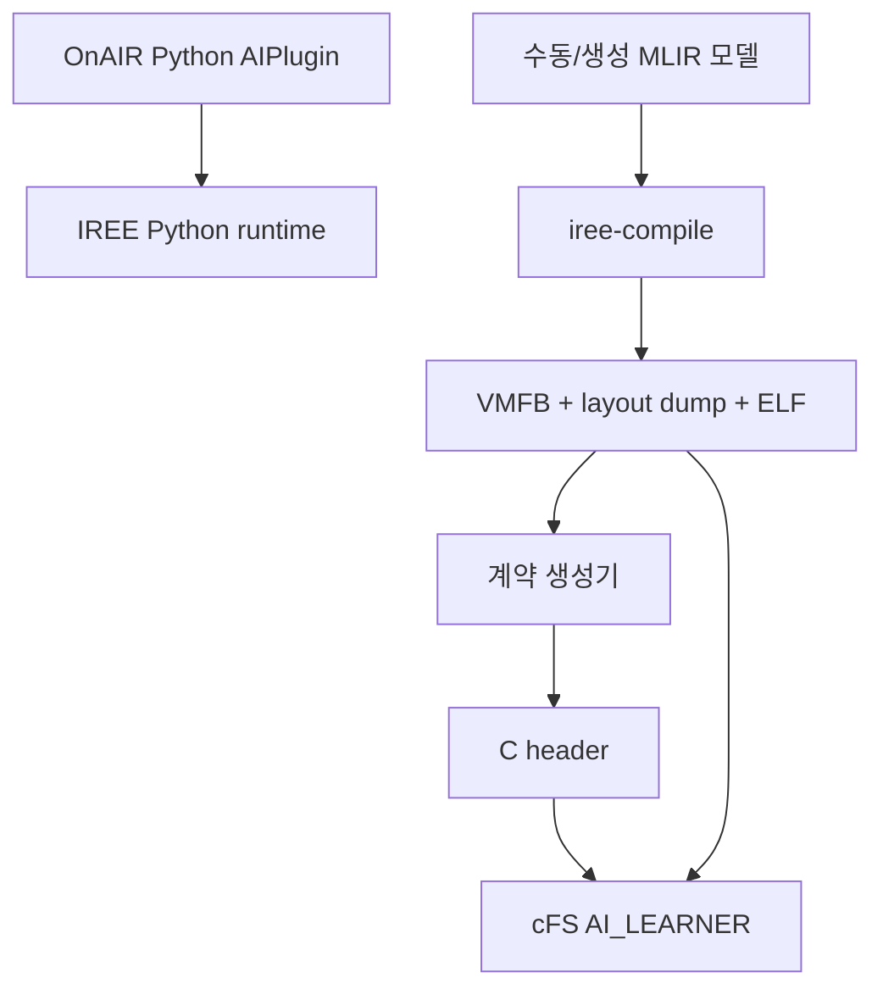

# onAIR-MLIR v0.15 최신 진행 검토

## 1. 검토 기준

- 저장소: <https://github.com/wookjaeya/onAIR-MLIR>
- 기준 브랜치: `claude/review-and-proceed-4y1sag`
- 기준 커밋: [`6e9ac102bf024ddea6c3166bd4ff3b0329b8c3e9`](https://github.com/wookjaeya/onAIR-MLIR/commit/6e9ac102bf024ddea6c3166bd4ff3b0329b8c3e9)
- 이전 검토 기준: `33e1ebc50de30e110f1947e60def308b35b4ed1d`
- 검토 범위: E15–E20의 코드·근거 문서·실험 원장·보관 산출물 및 기존 OnAIR/cFS 연결 구조

## 2. 결론부터

**진행은 실질적이다.** 이전 검토에서 지적한 A5b 미실행, 스택 gate 부재, blob 크기 확인 순서, 정규식 파서의 fail-open, 구조적 검증 부재를 상당 부분 실제 코드와 시험으로 보완했다. 특히 E20에서 자기 코드의 과잉 거부 결함을 찾아 정정한 이력은 연구 신뢰도에 긍정적이다.

그러나 현재 단계는 다음과 같이 정의해야 정확하다.

> **IREE LLVM-CPU 아티팩트의 일부 프로그램 메모리 영역에 대해, 배포 전 계약을 생성하고 cFS 앱 기동 시 예산·아티팩트·스택 설정을 검사하는 연구 프로토타입이다. MLIR Python API 기반 구조적 분석기는 현재 정규식 추출기의 선택적 이중 검증기다.**

반대로 아직 다음을 주장하면 안 된다.

- 전체 온보드 컴퓨터 메모리 수용 가능성 보장
- 여러 cFS 앱을 포함한 시스템 차원의 메모리 admission 또는 예약
- 정식 MLIR compiler pass 구현 완료
- OnAIR 모델에서 cFS 배포물까지 이어지는 자동·동일 아티팩트 파이프라인
- TFLite Micro 등 대안보다 MLIR/IREE가 우월하거나 필수라는 결론
- 실제 AArch64 하드웨어의 실행시간·WCET·비행 적합성

현재 연구 품질은 **강해진 시스템 프로토타입과 내부 검증 연구** 수준이다. 논문의 핵심인 H3, 즉 “시험한 정적 모델과 실행 구성에서 부분 메모리 계약에 따른 사전 판정이 가능하다”는 주장은 더 강해졌다. 다만 아래 P0 결함을 닫기 전에는 `fail-closed`, `mandatory cross-check`, `MLIR pass`라는 표현을 전면에 두지 않는 것이 안전하다.

## 3. 이전 검토 이후 실제로 좋아진 점

| 변경 | 평가 | 논문상 의미 |
|---|---|---|
| E15: 음수 bound, 미지원 method, ABI/triple/ELF 불일치, 미인식 op 등에 대한 음성 시험 | 의미 있는 보강 | 정상 사례 수보다 “잘못된 입력을 거부하는가”를 시험하기 시작했다. |
| E16: cFS 스택 부족 실거부, VMFB 크기 선검사 | 이전 결함을 직접 수정 | 스택 검사가 텔레메트리에서 실제 기동 gate로 바뀌었고, 크기가 다른 파일에 대해 무제한 blob 할당을 먼저 하지 않는다. |
| E17: FlatBuffer 구조 손상 A5b, 재시작 2회와 DELETE | 계획 대비 핵심 공백을 보완 | binding 통과 후 IREE loader가 손상 아티팩트를 안전하게 거부하고 cFS가 생존하는 경로를 관찰했다. |
| E18: `iree.compiler.ir` 기반 Operation/Value 순회 | 정규식 단독보다 확실히 낫다 | 출력 문자열만 긁는 방식에서 파싱된 MLIR 객체와 SSA 정의를 읽는 방향으로 이동했다. |
| E19: 구조적 분석기를 계약 생성 경로에 연결 | 방향은 타당 | 서로 다른 두 분석 구현이 일치해야 한다는 방어층이 생겼다. |
| E20: `whole` 대 `p`, `dense_sum` 대 `const_b` 오류 수정 | 매우 좋은 자기 정정 | 14개 corpus 통과만으로 로직 건전성을 단정하지 않고, print 순서와 padding 반례를 회귀 시험으로 고정했다. |
| TFLM 관련 1차 문서 정정 | 정직한 범위 설정 | `arena_used_bytes()`가 단순 추론 계측만은 아니라는 점을 인정했다. 다만 비교 실험은 아직 없다. |

## 4. 새로 확인한 주요 문제

### F1. `single_invocation`을 확인하지 못해도 계약 생성이 성공한다 — High, P0

[`make_contract.py`](https://github.com/wookjaeya/onAIR-MLIR/blob/6e9ac102bf024ddea6c3166bd4ff3b0329b8c3e9/harness/make_contract.py#L481-L537)는 대조 결과가 `False`일 때만 오류를 추가한다. dump 파일이 없어서 결과가 `None`이면 거부하지 않고, 마지막에 `single_invocation=false`를 기록한 계약 객체를 반환한다.

저장된 AArch64 Conv2D 입력을 사용하고 외부 보고 도구만 격리한 단위 재현 결과는 다음과 같았다.

```json
{
  "BUILD_SUCCEEDED": true,
  "single_invocation": false,
  "dump_file_count": 0,
  "dump_elf_sha256_in_vmfb": null,
  "structural_available": false,
  "bounded_bytes": 3528
}
```

이는 “불일치를 발견하지 못함”을 “동일 호출임이 확인됨”과 구분하지 못한 전형적인 3값 논리 오류다. 계약을 쓰려면 `dump_elf_in_vmfb is True`, `stem_in_dump is True`, `layout_dispatches_in_dump is True`를 모두 요구해야 한다. 확인 불가는 기본 거부하고, 필요한 경우에만 명시적 unsafe override를 허용해야 한다.

### F2. ABI reflection이 사라진 경우는 mismatch와 달리 거부하지 않는다 — High, P0

[`make_contract.py`](https://github.com/wookjaeya/onAIR-MLIR/blob/6e9ac102bf024ddea6c3166bd4ff3b0329b8c3e9/harness/make_contract.py#L277-L292)는 ABI가 존재하면서 소스와 다를 때는 거부하지만, ABI 자체가 없으면 note만 남긴다.

저장된 Conv2D layout IR에서 `iree.abi.declaration`만 제거하고 현재 검사를 재현한 결과는 다음과 같았다.

```json
{
  "BUILD_SUCCEEDED": true,
  "single_invocation": true,
  "abi_declaration_matches_source": false,
  "notes": ["no iree.abi.declaration for @infer in the layout IR"],
  "bounded_bytes": 3528
}
```

프린터 형식 변경이나 잘못된 IR 조합 때문에 ABI를 읽지 못한 경우에도 소스 쪽 인터페이스만 믿고 계약을 만들 수 있다. `ABI missing`도 기본 hard fail로 바꾸고 `--allow-missing-abi`를 별도로 두는 편이 맞다.

### F3. “필수 구조적 크로스체크”가 실제로는 선택 사항이다 — High, P0

[`make_contract.py`](https://github.com/wookjaeya/onAIR-MLIR/blob/6e9ac102bf024ddea6c3166bd4ff3b0329b8c3e9/harness/make_contract.py#L340-L426)는 주석과 문서에서 `MANDATORY`라고 부르지만, `iree.compiler.ir`가 없으면 정규식 파서만으로 계속 진행한다.

따라서 현재 의미는 “설치돼 있으면 필수”인 **opportunistic cross-check**다. 구조적 검증을 논문 기여로 삼으려면 기본값을 다음처럼 바꾸는 것이 타당하다.

- 구조적 분석기 미설치: 계약 생성 거부
- 구조적 파싱 실패 또는 불일치: 계약 생성 거부
- 연구·디버그용 예외: `--allow-no-structural-check` 또는 `--allow-structural-mismatch`를 명시하고 계약에 unsafe 상태 기록

### F4. E18–E20은 아직 “정규 MLIR pass”가 아니다 — High, 논문 표현 P0

`mlir_alloc_walk.py`는 실제 MLIR Python 객체와 SSA owner를 읽으므로 단순 정규식 파서보다 구조적으로 낫다. 그러나 다음 이유로 compiler pass라고 부르기는 어렵다.

- `--mlir-print-ir-after`의 텍스트 dump를 다시 입력으로 받는다.
- 조각난 함수 dump를 합치기 위해 `util.global.load/store`를 정규식으로 읽고 가짜 전역 선언을 합성한다.
- pass pipeline에 등록되어 완전한 in-memory module에서 실행되지 않는다.
- 계약이나 manifest를 compiler invocation의 산출물로 직접 emit하지 않는다.
- 문서는 `Operation.walk()` 사용이라고 쓰지만 실제 코드는 자체 재귀 함수 `_walk()`를 쓴다. 기능상 MLIR 객체 순회라는 핵심은 맞지만 서술은 고쳐야 한다.

따라서 현재 명칭은 **“MLIR API 기반 구조적 post-processing verifier”**가 정확하다. 진짜 pass 단계는 전체 module에 대해 실행되는 IREE/MLIR pass 또는 instrumentation으로 자원 계약 manifest를 직접 내보내는 구현이다.

### F5. `stream.resource.pack`의 비상수 index operand가 구조적 분석기에서 조용히 사라진다 — Medium–High, P0

[`mlir_alloc_walk.py`](https://github.com/wookjaeya/onAIR-MLIR/blob/6e9ac102bf024ddea6c3166bd4ff3b0329b8c3e9/harness/mlir_alloc_walk.py#L133-L180)의 `stream.resource.pack` 처리에서 `_resolve_index_value()`가 실패하면 `unresolved`에 추가하는 `else`가 없다. 코드 주석의 “unresolved ones are reported, not skipped”와 실제 동작이 다르다.

현재 14개 corpus에는 이 op가 없어 발동하지 않았고, 정규식 파서가 같은 조건을 발견하면 cross-check 불일치로 막힐 수 있다. 하지만 구조적 분석기 단독의 fail-closed 성질은 성립하지 않는다. 최소한 다음 시험이 필요하다.

- 실제 IREE가 생성한 `stream.resource.pack` 양성 fixture
- 비상수 slice size 음성 fixture
- offset, lifetime, size 등 index operand 역할을 구분하는 검증
- 수정 전 실패하고 수정 후 `UNKNOWN_BOUND`가 되는 회귀 시험

### F6. 스택이 “분석 불완전”이어도 헤더는 `KNOWN=1`로 생성된다 — High, P0

[`gen_contract_header.py`](https://github.com/wookjaeya/onAIR-MLIR/blob/6e9ac102bf024ddea6c3166bd4ff3b0329b8c3e9/harness/gen_contract_header.py#L118-L134)는 stack 값이 정수인지만 확인한다. `kernel_stack_classification`, `kernel_dynamic_stack_alloc`, `kernel_external_call_insns`는 보지 않는다.

Conv2D 계약을 다음처럼 적대적으로 바꿔 직접 실행했다.

- `kernel_stack_classification = bucket_4_unaccounted_dynamic_stack`
- `kernel_dynamic_stack_alloc = true`
- `kernel_external_call_insns = 1`
- 기존 정수 stack 값은 유지

결과는 종료 코드 0이며 다음 헤더가 생성됐다.

```c
#define CONTRACT_KERNEL_STACK_BYTES_KNOWN 1
#define CONTRACT_KERNEL_STACK_BYTES 191L
```

현재 보관 모델은 모두 call 0, dynamic stack false라 기존 결과를 뒤집지는 않는다. 하지만 새 모델에 대한 fail-closed 성질은 없다. classification이 `none` 또는 `bucket_2_task_stack_budget`일 때만 known으로 인정해야 한다.

### F7. cFS C gate의 “single-f32” 방어선은 실제로 개수만 검사한다 — Medium, P1

[`ai_learner.c`](https://github.com/wookjaeya/onAIR-MLIR/blob/6e9ac102bf024ddea6c3166bd4ff3b0329b8c3e9/native/cfs_app/fsw/src/ai_learner.c#L224-L235)는 이벤트 메시지에서 single-f32를 검사한다고 쓰지만 실제 조건은 입력·출력 개수만 본다. dtype macro 자체가 생성되지 않는다.

헤더 생성기가 정상 경로의 잘못된 dtype을 먼저 거부하므로 현재 corpus는 안전하다. 다만 이 C 검사의 목적이 stale 또는 hand-edited header에 대한 defense-in-depth라면 dtype까지 독립적으로 검사해야 설명과 구현이 일치한다.

### F8. 최신 E16–E17 실행 결과는 저장소에서 독립 재검증할 원자료가 없다 — High, 논문 재현성 P0

`EXPERIMENT_LOG.md` 자체가 E17 게스트 산출물을 “임시, results/ 미보관”으로 기록한다. E16·E17 커밋에도 실행 로그·scenario summary가 추가되지 않았고 결과는 근거 문서의 요약문으로만 남아 있다.

특히 E17은 다음 재현 불일치가 있다.

- 실제 성공 사례는 FlatBuffer root-table uoffset을 구조적으로 손상했지만, [`e14_make_scenarios.py`](https://github.com/wookjaeya/onAIR-MLIR/blob/6e9ac102bf024ddea6c3166bd4ff3b0329b8c3e9/harness/e14_make_scenarios.py#L43-L49)의 A5b는 여전히 offset 4096 임의 bit flip을 만든다. 이전 검토에서 부적절하다고 판정된 방식이다.
- [`EVIDENCE_v0.12`](https://github.com/wookjaeya/onAIR-MLIR/blob/6e9ac102bf024ddea6c3166bd4ff3b0329b8c3e9/docs/EVIDENCE_v0.12_E17.md#L120-L146)의 A5b 재현은 실제 변환 스크립트 없이 주석으로만 설명한다.
- 같은 문서의 restart/delete 명령은 연속 실행으로 적혀 있지만, `cfs_cmd.py`는 ES 작업 완료를 위해 명령 사이 최소 약 8초 대기를 요구한다고 설명한다.

따라서 E17의 보고를 거짓이라고 볼 근거는 없지만, **현재 저장소만으로 제3자가 같은 결과를 재현하거나 로그를 재분석할 수 없다.** 구조 손상 생성기, 계약 재서명, 명령 대기, 로그 수집, 판정까지 한 시나리오 스크립트로 고정해야 한다.

### F9. “96/96, 환경 구축 불필요”는 fresh clone 기준으로 재현되지 않는다 — High, P0

README는 `contract_negative_tests.py`가 환경 구축 없이 96/96이라고 쓴다. 그러나 실제 fresh 환경에서 실행하면 `iree.compiler.ir` 부재로 구조적 walker 단계가 예외 종료했다. 또한 회귀 시험이 요구하는 `results/e14_aarch64_qemu/*/dump/<model>` 디렉터리는 [`.gitignore`](https://github.com/wookjaeya/onAIR-MLIR/blob/6e9ac102bf024ddea6c3166bd4ff3b0329b8c3e9/.gitignore#L10-L11)에 의해 저장소에서 제외되어 있다.

즉 96/96은 저자의 당시 작업 환경에서 얻은 결과로는 유효할 수 있지만, **공개 저장소의 재현 가능한 시험 결과로는 아직 부족하다.** 다음이 필요하다.

- 버전 고정된 `requirements.txt` 또는 lock file: 최소 `iree-base-compiler`, `iree-base-runtime`, `jsonschema`
- 테스트 시작 전 prerequisite 검사와 명확한 SKIP/FAIL 정책
- 계약 재생성에 필요한 최소 dump evidence bundle 보관
- CI에서 fresh clone → dependency 설치 → 96/96 실행
- README의 “환경 구축 불필요” 문구 정정

### F10. OnAIR 경로와 native-cFS 경로는 아직 하나의 배포 파이프라인이 아니다 — High, 연구 타당성 P0/P1

현재 실제 구조는 다음과 같다.



여기서 A→M 또는 B→G의 자동·동일성 보장은 없다.

- OnAIR `CompiledLearner`는 contract의 VMFB SHA-256이나 메모리 예산을 검사하지 않고 VMFB를 바로 로드한다.
- OnAIR plugin은 `weights.npz`를 별도 인수로 전달하지만 native-cFS 실험은 baked-weight VMFB를 사용한다.
- cFS 앱은 OnAIR plugin을 이식한 것이 아니라 별도 C 앱이며, `CFE_ES_HK_TLM_MID` payload를 feature로 사용한다.
- 같은 입력에 대해 OnAIR Python, OnAIR IREE, native C, cFS 앱 출력이 동치라는 end-to-end 시험이 없다.

따라서 cFS를 실험 대상으로 쓰는 것은 타당하지만, 현재 결과는 **“OnAIR에서 생성된 AI workload가 동일한 의미로 cFS에 배포됐다”**는 증거가 아니다. 논문 제목과 문제 제기에서 OnAIR를 핵심에 둘 경우 이 연결을 반드시 구현·검증해야 한다.

### F11. 현재 admission은 시스템 메모리 수용성 검사가 아니라 앱 로컬 정책 비교다 — 기존 한계, P1

현재 cFS 앱의 판정은 다음과 같다.

\[
M_{contract}=M_{input}+M_{output}+M_{transient\ slab}+M_{module\ constants}
\]

그리고 빌드 시 주어진 `AI_LEARNER_BUDGET_BYTES`와 비교한다. 이 값에는 IREE runtime context, cFS/OSAL 메모리, 다른 앱, allocator fragmentation, 동시 실행 모델, task stack이 포함되지 않는다. 예산을 실제 시스템에서 예약하지도 않는다.

따라서 두 AI 앱이 각각 예산을 통과해도 동시에 실행하면 전체 메모리를 초과할 수 있다. 현재 결과는 “이 부분 계약 값이 로컬 정책 한도 이하인가”를 판정한 것이지, “현재 온보드 컴퓨터가 이 모델을 수용 가능한가”를 판정한 것이 아니다.

이 한계를 연구 문제로 승격하면 오히려 다음 단계가 명확해진다. cFS 레벨의 contract registry/admission manager가 앱별 계약을 합산하고, 정적 예약·해제 및 동시성 규칙을 관리하게 해야 한다.

## 5. 실험 결과의 현재 해석

| 질문 | 현재 답 |
|---|---|
| cFS 안에서 IREE CPU 모델이 동작하는가? | 예. x86-64 native_std와 QEMU AArch64 기능 실행 근거가 있다. |
| 예산 B−1/B/B+1 gate가 동작하는가? | 시험한 모델·경로에서는 동작한다. 다만 cFS 전체 corpus가 모두 수행된 것은 아니다. |
| 손상·교체된 artifact를 안전하게 거부하는가? | hash mismatch와 구조 손상 후 loader failure 경로는 보고됐다. E17 원로그와 자동 재현은 보강해야 한다. |
| 계산한 메모리가 전체 OBC 메모리 상한인가? | 아니다. HAL 프로그램 버퍼와 module constant라는 부분 경계다. |
| 여러 앱이 동시에 안전하게 수용되는가? | 알 수 없다. 전역 예약과 동시 admission이 없다. |
| MLIR이 꼭 필요한가? | 아직 입증되지 않았다. 구조적 분석 가능성은 보였지만 TFLM 동일 경계 비교가 없다. |
| 정식 MLIR pass가 완성됐는가? | 아니다. 현재는 MLIR API 기반 dump post-processor와 verifier다. |
| QEMU AArch64 결과가 유효한가? | ISA·ABI·기능·거부 경로 검증에는 유효하다. 실제 timing/WCET/하드웨어 메모리 특성의 근거는 아니다. |

모델 수 역시 정확히 표현해야 한다. “7 models”는 세 static topology(MLP, Conv2D, multibranch), 그 weight-swap 변형, dynamic negative case를 합친 수다. 일반화 근거를 말할 때는 **3개 정적 구조군 + 1개 동적 음성 구조**라고 쓰는 편이 정직하다.

## 6. 논문 방향에 반영할 문장

### 현재 사용 가능한 중심 주장

> 본 연구는 IREE LLVM-CPU로 AOT 컴파일된 정적 AI 모델에 대해, post-layout 자원 할당 정보와 target ELF 분석으로부터 부분 메모리 계약을 생성하고, 이를 cFS 앱 기동 전의 예산·아티팩트·스택 설정 검증에 결합했다. 시험한 세 정적 구조군과 x86-64/AArch64 기능 환경에서 경계값 판정 및 주요 실패 경로를 검증했다.

### P0 수정 후 사용 가능한 MLIR 주장

> 문자열 기반 분석의 취약성을 줄이기 위해 MLIR Operation/Value/SSA 정보를 사용하는 독립 구조적 verifier를 구현하고, 두 분석기의 불일치 또는 미분석 상태를 배포 계약 생성 실패로 처리한다.

### 아직 사용하면 안 되는 주장

- “MLIR pass가 전체 OBC 메모리의 sound upper bound를 자동 생성한다.”
- “OnAIR AI 모델을 자동으로 flight-ready cFS app으로 변환한다.”
- “TFLM보다 더 정확하거나 더 적은 메모리를 사용한다.”
- “QEMU Cortex-A53 결과로 실제 우주용 AArch64 보드의 실시간성을 보장한다.”
- “cFS가 여러 AI 앱의 총 메모리 수용성을 보장한다.”

## 7. 다음 작업 우선순위

### P0 — 다음 실험 전에 코드와 증거를 먼저 닫을 것

1. `make_contract.py`에서 provenance 신호가 모두 `True`가 아니면 거부한다.
2. ABI missing과 structural checker missing을 기본 거부로 바꾼다.
3. `gen_contract_header.py`가 unaccounted dynamic stack과 unresolved call을 거부하게 한다.
4. `stream.resource.pack`의 비상수 operand를 `unresolved`로 올리고 실제 pack fixture로 시험한다.
5. E16/E17 원로그, summary, 환경 manifest, 손상 VMFB 생성 절차를 보관한다.
6. A5b 구조 손상과 restart 간 대기를 자동 시나리오에 반영한다.
7. dependency lock과 CI를 추가하고 fresh clone에서 전체 시험을 재실행한다.

### P1 — 논문 기여를 강화할 것

1. dump 재파싱 대신 완전한 module에서 실행되는 실제 MLIR/IREE pass를 구현한다.
2. pass가 계약 manifest를 직접 emit하고 VMFB·ELF·compiler identity와 cryptographically 결합되게 한다.
3. 같은 모델·가중치·입력으로 OnAIR Python, OnAIR IREE, native C, cFS C의 출력 동치 시험을 만든다.
4. OnAIR plugin에서도 artifact hash와 계약·예산을 검사하거나, OnAIR config에서 cFS 배포 bundle을 만드는 명시적 변환기를 둔다.
5. TFLite Micro를 같은 모델, 같은 dtype/shape, 같은 AArch64 CPU target, 같은 메모리 경계로 비교한다.

### P2 — 시스템 연구로 확장할 경우

1. cFS contract registry와 전역 memory reservation을 구현한다.
2. 두 개 이상의 AI 앱 동시 기동·거부·삭제 후 반환을 시험한다.
3. runtime context와 allocator overhead를 별도 보수 항 또는 platform profile로 모델링한다.
4. timing 주장은 QEMU가 아니라 고정 주파수·코어 격리 가능한 저가 AArch64 실기기에서만 시작한다.

## 8. 최종 판정

이 버전은 이전 `33e1ebc`보다 분명히 좋아졌다. 특히 **실패 경로와 도구 자체의 오류를 실험 대상으로 삼기 시작했다는 점**이 가장 큰 발전이다. H3의 제한적 주장은 유지할 수 있고, cFS와 QEMU AArch64를 기능 검증 대상으로 쓰는 것도 타당하다.

다만 현재 가장 큰 위험은 연구가 스스로 `mandatory`, `fail-closed`, `MLIR pass`, `OnAIR-to-cFS`라고 부르는 범위가 실제 코드보다 넓다는 점이다. P0 항목을 닫고 명칭을 정확히 조정하면 논문의 방어력은 크게 올라간다. 그다음 승부처는 모델 수를 더 늘리는 것이 아니라 다음 세 가지다.

1. **fresh clone에서 재현되는 증거 사슬**
2. **진짜 MLIR pass와 artifact provenance 결합**
3. **TFLM 동일 경계 비교 및 OnAIR→cFS 의미 동치**

이 세 가지가 확보되면 연구는 “cFS에서 AI를 한번 돌려본 구현”이 아니라, **컴파일러가 산출한 배포 계약을 이용해 우주 소프트웨어의 AI 탑재 위험을 배치 전에 거부하는 방법**이라는 분명한 논문 형태를 갖게 된다.
