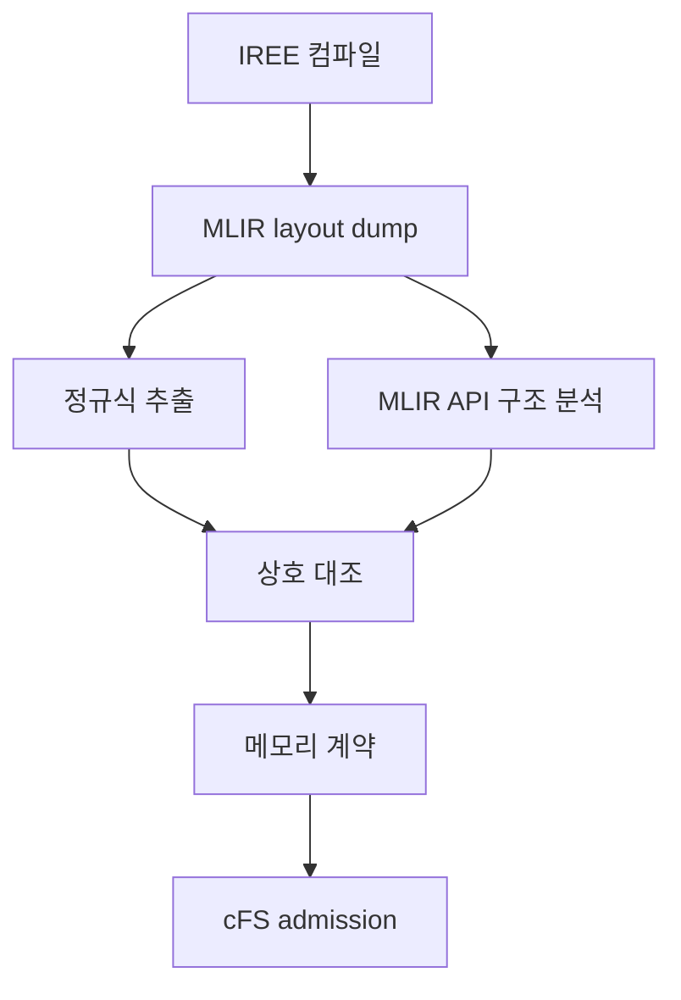

# onAIR-MLIR v0.19 / E24 재검토 — 연구 목표 중심 재정리본

- 저장소: [`wookjaeya/onAIR-MLIR`](https://github.com/wookjaeya/onAIR-MLIR)
- 검토 커밋: [`f51f66e04953cee8f445cbba441b3dd01d39ecb8`](https://github.com/wookjaeya/onAIR-MLIR/commit/f51f66e04953cee8f445cbba441b3dd01d39ecb8)
- 이전 검토 기준: [`52bff0d3a8cdbed40aac0fd9d5b394620fe84b6a`](https://github.com/wookjaeya/onAIR-MLIR/commit/52bff0d3a8cdbed40aac0fd9d5b394620fe84b6a)
- 검토일: 2026-09-09
- 관점: 구현 결함의 존재 여부뿐 아니라 **현재 연구 목적과 논문 기여에 실제로 중요한가**를 기준으로 재평가

## 1. 최종 결론

E24는 이전 검토에서 지적한 fail-open·과잉 거부·CI 신뢰성 문제를 상당 부분 실제로 해결했다. 최신 저장소는 단순 아이디어나 mock-up이 아니라 다음을 갖춘 **강한 연구 프로토타입**이다.

- IREE 컴파일 중간 산출물에서 프로그램 메모리 상한 생성
- MLIR API 기반 구조 분석과 기존 추출기의 상호 검증
- VMFB·layout IR·ELF 간 provenance 결속
- 계약에서 C 헤더를 생성해 cFS 시작 전 admission 수행
- VMFB 크기·SHA-256 검증
- x86-64와 AArch64/QEMU 기능 실험
- 음성 시험, 회귀시험, raw artifact, 정오표 및 CI

다만 이전 재검토에서 새로 확인한 음수 스택·산술 불일치·shape 충돌을 모두 “논문 claim blocker”로 취급한 것은 **연구 목적에 비해 과도했다**. 이 반례들은 기술적으로 유효하지만 대부분 정상 `make_contract.py` 경로에서는 생성되지 않고, 저장된 계약을 수동으로 변조해야 도달한다.

따라서 정확한 판정은 다음과 같다.

> **현재 연구의 핵심 위험은 개별 JSON 방어 조건이 아니라, 부분 메모리 계약의 범위를 어디까지로 주장할 것인지, OnAIR와 cFS가 실제로 동일한 모델을 실행하는지, 그리고 현재의 MLIR dump 후처리가 충분한 학술적 기여인지에 있다.**

새 반례는 짧은 hardening 작업으로 고치되, 다음 대형 실험의 중심으로 삼을 필요는 없다.

## 2. 연구 목표의 정확한 정의

현재 코드와 실험이 실제로 지지하는 연구 목표는 다음과 같다.

> IREE/MLIR 컴파일 산출물로부터 AI 모델의 **프로그램 할당 메모리 일부**에 대한 정적 계약을 만들고, 이를 cFS 애플리케이션별 메모리 예산과 비교하여 IREE runtime 초기화 전에 모델 실행을 허용하거나 거부한다.

현재 계약의 중심 수식은 다음이다.

\[
B_{contract}
= B_{per-call\;HAL\;buffers}
+ B_{module\;constants}
\]

이 계약은 다음을 포함하지 않는다.

- IREE runtime instance·device·session 자체 메모리
- cFS·OSAL 및 다른 애플리케이션의 메모리
- C wrapper의 BSS, 일반 함수 스택 및 보조 배열
- allocator fragmentation
- 다중 추론 또는 다중 앱 동시 실행
- 외부 파일로 유지되는 가중치
- 시스템 전체 schedulability

따라서 논문의 표현은 **전체 온보드 컴퓨터 수용성 보장**이 아니라 **명시된 경계의 부분 메모리 admission**이어야 한다.

## 3. 독립 검증 결과

깨끗한 최신 체크아웃에서 다음을 실행했다.

```text
python3 -m compileall -q harness plugins
→ PASS

python3 harness/contract_negative_tests.py
→ 59/59 checks passed, 8 skipped, exit 0
```

검토 환경에는 `iree.compiler.ir`, `iree.runtime`, `iree-dump-module`, `jsonschema`가 없고 PyYAML은 있었다. 따라서 전체 IREE 경로는 재현하지 못했지만 다음은 실제로 확인했다.

- 기본 OnAIR `contract.json + model.vmfb` binding `MATCH`
- 크기·SHA-256 누락 및 불일치 거부
- workflow YAML 파싱
- VMFB 손상 생성기의 결정성·크기 보존·ZIP CRC 유지
- 구조적 checker 부재의 기본 거부 및 override 기록
- 무의존성 조건에서 시험 하네스가 크래시나 거짓 FAIL 없이 종료

저장소 문서는 GitHub CI 결과를 `full 142/142 + 1 SKIP`, `without-iree 58/58 + 9 SKIP`, `stdlib-only 58/58 + 9 SKIP`으로 기록한다. 이번 세션에서는 최신 Actions 상태를 독립 조회하지 못했으므로 이 숫자는 저장소 문서의 기록과 로컬 부분 재현을 구분해 인용해야 한다.

## 4. E24 변경의 평가

이전 기준점 이후 7개 커밋, 16개 파일, 약 `+1170/-42`가 변경됐다.

| 이전 지적 | 현재 판정 | 연구적 의미 |
|---|---|---|
| N1 상수량 모순 통과 | **대부분 해결** | 실제 계약 수치의 artifact-side 교차 확인이 강화됨 |
| N2 incomplete provenance 통과 | **기본 경로 해결** | 세 신호가 모두 `True`여야 single invocation으로 인정 |
| N3 단수형 f16 공허참 | **해결** | C runtime의 single-f32 전제와 계약이 일치 |
| N4 스택 신뢰 필드 누락 | **해결** | 분석 결과 부재를 신뢰로 오인하던 문제 제거 |
| N5 기본 OnAIR fixture 거부 | **바인딩 회귀 해결** | 기본 VMFB가 새 binding gate를 통과 |
| N6 CI 명칭·jsonschema 오탐 | **해결** | `full/without-iree/stdlib-only` 조건이 분명해짐 |
| D33 workflow YAML 오류 | **해결** | YAML parse guard 추가 |
| D34 CI 수치 문서 오류 | **해결** | 저자 환경과 fresh CI 결과를 구분 |

이는 실질적인 품질 향상이다. 다만 E24는 **계약 도구와 증거 신뢰성의 개선**이지 새 MLIR 변환, 최적화 또는 새로운 cFS 자원관리 정책의 실험은 아니다.

## 5. 연구 목표 기준의 우선순위

### 5.1 연구·논문 핵심 문제

#### C1. 부분 메모리 경계의 타당성 — 최우선

현재 가장 중요한 질문은 계산된 수치가 맞는가뿐 아니라, 그 수치가 실제 cFS 배포 판단에 얼마나 유용한가이다.

검증해야 할 내용:

- 계약 포함 영역과 제외 영역의 측정 분리
- HAL 계약 외 메모리가 모델 크기에 따라 얼마나 증가하는지
- 전체 peak 중 계약 영역이 차지하는 비율
- 모델별로 부분 계약이 admission 의사결정에 실질적인 차이를 만드는지
- 제외된 runtime·wrapper 비용을 고정 오버헤드 또는 별도 bucket으로 다룰 수 있는지

이 문제를 해결하지 않으면 정확한 `bounded_bytes`를 얻어도 “왜 이 계약이 필요한가”라는 질문에 충분히 답하기 어렵다.

#### C2. OnAIR와 cFS의 동일 모델·동일 의미 검증 — 최우선

현재 OnAIR 기본 fixture는 외부 `weights.npz`를 사용하고, cFS의 주요 실험은 baked-weight VMFB를 사용한다. 두 경로가 동일한 모델을 실행한다고 자동으로 볼 수 없다.

필요한 검증:

- 동일 topology와 가중치
- 동일 입력 및 전처리
- 동일 VMFB 또는 동등성이 검증된 artifact bundle
- Python reference, OnAIR-IREE, native C, cFS AArch64 출력 비교
- 명시적 수치 tolerance

이 검증이 없으면 안전한 표현은 “OnAIR와 cFS에 각각 IREE 실행 경로를 구현했다”이며, “동일한 OnAIR AI 모델을 cFS에 배치했다”는 표현은 강하다.

#### C3. MLIR 사용의 학술적 기여 — 최우선

현재 구현은 compiler pipeline에 등록된 정규 MLIR pass가 아니다. IREE가 출력한 MLIR dump를 다음 두 방식으로 읽는 post-processing verifier다.



프로토타입으로는 충분히 의미가 있지만, MLIR 연구로서의 기여를 강하게 하려면 다음 중 하나를 선택해야 한다.

1. **후처리 verifier를 유지:** 기존 도구와의 비침습성, 감사 가능성, cFS 통합 방법을 기여로 명확히 정의
2. **정규 pass로 발전:** pipeline 안에서 resource-contract metadata를 생성하고 VMFB와 직접 결속

중요한 것은 현재 구현을 pass라고 부르는 것이 아니라, **왜 MLIR 수준의 정보가 C/LLVM IR 또는 runtime 계측보다 계약 생성에 유리한지 비교 실험으로 보이는 것**이다.

#### C4. 외적 타당성 — 높음

현재 모델군은 MLP·Conv2D·multi-branch·dynamic shape로 구조적 다양성은 있으나 실제 임무형 AI workload와 컴파일러 버전 다양성은 부족하다.

필요한 확장:

- 실제 위성 CPU에서 가능한 경량 임무 모델 1~2개
- topology와 크기에 따른 계약 정확도
- 새로운 IREE 버전에서 추출기의 호환성과 명시적 실패
- x86-64/AArch64에서 동일한 값과 달라지는 값을 구분

### 5.2 필요한 구현 보강이지만 연구 중심은 아닌 항목

이전 재검토에서 다음 반례를 실제로 재현했다.

| 반례 | 결과 | 정상 생성 경로 도달성 | 재분류 |
|---|---|---:|---|
| `kernel_task_stack_invocation_bytes=-300000` | KNOWN 헤더 생성, cFS 필요 스택 `-37856` | 매우 낮음: 수동 변조 필요 | 구현 hardening |
| `bounded_bytes=1`, 구성요소 합 `3528` | KNOWN 헤더 생성 | 매우 낮음: 생성기는 합을 직접 계산 | 구현 hardening |
| `validity`와 `interface` shape 충돌 | KNOWN 헤더 생성 | 매우 낮음: 정상 생성 시 같은 서명에서 파생 | 구현 hardening |
| 상수 세그먼트 25개, 확인 결과 `false` | 계약·KNOWN 헤더 생성 | 가능: 복잡한 artifact에서 발생 가능 | 중간 우선순위 |
| `single_invocation=false` override 계약 | KNOWN 헤더 생성 | 명시적 override 필요 | 정책·범위 문제 |

이 반례들은 코드 품질 관점에서는 모두 유효하다. 그러나 앞의 세 개는 다음 전제를 두면 논문의 핵심 반증이 아니다.

> 배포 계약은 저장소의 신뢰된 생성기로 만들며, 생성 후 수동 변경하지 않는다.

반대로 계약 JSON을 외부 교환 형식, 장기 보관 형식 또는 비신뢰 입력으로 취급한다면 중요도가 다시 올라간다. 논문은 어느 threat model을 채택하는지 명시해야 한다.

권장 조치는 별도 대형 실험이 아니라 작은 sanitization 묶음이다.

- 모든 메모리·스택 값에 `>= 0` 검증
- `bounded_bytes >= per_call + constants` 강제
- 중복 shape·dtype 표현의 동치 확인
- C `_Static_assert` 추가
- 상수 세그먼트 열거 포기는 `unevaluated`로 분리하고 기본 거부
- override 계약에는 `deployment_eligible=false` 또는 trust grade 기록

### 5.3 명시적 범위 밖으로 둘 수 있는 항목

- 온보드 컴퓨터 전체 메모리 admission
- 여러 cFS 앱의 동시 reservation
- 전역 메모리 fragmentation
- 시간 partition 및 전체 schedulability
- WCET 보장
- 방사선 환경 신뢰성

이 항목들은 중요하지만 현재 연구 하나에 모두 넣으면 범위가 무너진다. 후속 연구로 분리하는 것이 타당하다.

## 6. OnAIR fixture와 외부 weights의 판정

현재 기본 OnAIR VMFB는 계약의 `artifact.bytes=10642`와 SHA-256에 일치하며 binding smoke test도 통과한다. 그러나 `weights.npz`는 `2,884,078 B`이고 계약 밖에 있다.

이 문제의 중요도는 논문 주장에 따라 달라진다.

| 논문 주장 | weights 문제의 중요도 |
|---|---|
| “VMFB 아티팩트 결속 방법을 구현했다” | 범위 제한을 명시하면 허용 가능 |
| “배포된 AI 모델 전체 identity를 보장한다” | 반드시 해결 필요 |
| “OnAIR와 cFS가 동일 모델을 실행한다” | 반드시 해결 필요 |
| “baked-weight cFS 모델의 부분 메모리 admission” | 기본 OnAIR fixture를 부차적 데모로 분리 가능 |

권장안은 OnAIR와 cFS 모두 baked-weight VMFB로 통일하는 것이다. 외부 weights를 유지해야 한다면 VMFB, weights, preprocessing mapping의 파일명·크기·SHA-256을 하나의 artifact bundle manifest에 묶어야 한다.

기본 plugin 계약이 현행 schema의 resources 필수 필드와 timing enum에 미달하는 문제는 정리해야 하지만, 그 자체가 핵심 가설의 반증은 아니다.

## 7. 남은 실험의 재구성

### 단기 정리 — 별도 대형 실험으로 만들지 않음

- 음수 값, 합계, shape 동치 검사 추가
- 24개 초과 상수 세그먼트 상태 구분
- override trust grade 전파
- 해당 변이 회귀시험 추가

### E25 — Same-model artifact binding and semantic equivalence

가장 우선할 다음 실험이다.

1. OnAIR와 cFS의 모델·가중치·VMFB를 통일한다.
2. 동일 입력 벡터와 전처리를 사용한다.
3. Python reference, OnAIR-IREE, native C, cFS x86-64, cFS AArch64 결과를 비교한다.
4. 절대·상대 오차 tolerance와 pass 기준을 사전에 정의한다.
5. 외부 weights를 제거하거나 artifact bundle에 결속한다.
6. E23의 결정적 A5b 생성기로 AArch64 cFS guest raw log를 다시 남긴다.

### E26 — 계약 경계의 유용성과 외적 타당성

1. 모델별로 계약 영역, IREE runtime, wrapper, cFS/OSAL 메모리를 분리 측정한다.
2. 계약값과 실제 HAL peak의 soundness·tightness를 모델별로 비교한다.
3. 실제 임무형 경량 모델을 추가한다.
4. 다른 IREE 버전에서 계약 생성 성공·명시적 거부·수치 변화를 측정한다.
5. x86-64와 AArch64에서 ISA 독립 영역과 ISA 종속 영역을 구분한다.

### E27 — MLIR 기여 강화

논문의 목표 수준에 따라 선택한다.

- 최소안: 현 post-processing verifier와 runtime-only/C/LLVM-IR 접근을 비교
- 강화안: 정규 MLIR/IREE pass로 계약 metadata 생성
- 평가: 추출 완전성, compiler-version 취약성, 수동 dump 의존성, 계약 생성 실패율, 감사 가능성

## 8. 하드웨어의 위치

실물 AArch64 하드웨어는 현재 핵심 기능 논리를 증명하는 필수조건은 아니다. QEMU는 다음 주장에 충분하다.

- AArch64 바이너리 생성 및 실행 가능
- cFS 앱 통합과 시작 전 gate 동작
- artifact 불일치 및 손상 파일 거부
- 정리·재시작·오류 경로의 기능 동작

그러나 다음을 주장하려면 실물 하드웨어가 필요하다.

- latency 및 jitter
- WCET 또는 deadline 충족
- RSS·allocator·cache의 현실적 거동
- 실제 온보드 CPU에 대한 운용 적합성

따라서 현 단계에서는 비싼 우주급 보드가 아니라 저가 AArch64 SBC로 후반부 실험을 보완하면 충분하다. 하드웨어 구매보다 E25·E26의 의미 동치와 계약 경계 검증이 우선이다.

## 9. 논문에서 가능한 주장과 피해야 할 주장

### 현재 가능한 주장

> IREE 컴파일 중간표현과 VMFB/ELF 산출물을 결속하여 AI 모델의 프로그램 할당 메모리 일부에 대한 정적 계약을 생성하고, 이를 cFS 애플리케이션 시작 전 admission 및 artifact identity 검사에 연결하는 프로토타입을 구현했다.

> x86-64와 AArch64/QEMU 환경에서 정상·경계·손상·동적형상 시나리오를 통해 기능적 거부 동작과 계약 생성의 재현성을 평가했다.

### 아직 피해야 할 주장

- 온보드 컴퓨터 전체 메모리 수용성을 보장한다.
- 모든 계약 불변식을 검증한다.
- 정규 MLIR compiler pass를 구현했다.
- 실시간 성능 또는 WCET를 보장한다.
- OnAIR와 cFS가 동일한 AI 모델을 의미적으로 동등하게 실행한다.
- 실제 비행 하드웨어에서 검증됐다.

## 10. 최종 판정

E24의 구현 개선은 실제이며, 저장소의 재현성과 감사 가능성은 상당히 높다. 새로 발견된 음수 스택·산술 불일치·shape 충돌은 수정해야 하지만 정상 생성 경로에서는 거의 도달하지 않으므로 연구 전체의 심각한 결함으로 확대할 필요는 없다.

현재 연구를 좌우하는 것은 다음 세 가지다.

1. **부분 메모리 계약의 유용성과 경계를 실험적으로 설명하는 것**
2. **OnAIR와 cFS가 동일 모델·가중치·입출력을 사용한다는 것을 증명하는 것**
3. **MLIR 후처리 verifier가 갖는 고유한 장점을 비교 실험으로 입증하거나 정규 pass로 발전시키는 것**

따라서 현재 상태는 다음 표현이 가장 정확하다.

> **onAIR-MLIR v0.19는 구현 완성도와 재현성이 높은 cFS/IREE 부분 메모리 admission 프로토타입이다. 남은 핵심 과제는 주변적인 방어 조건을 계속 늘리는 것이 아니라, 계약 경계의 실질적 가치, OnAIR↔cFS 의미 동치, MLIR 기반 접근의 고유 기여를 증명하는 것이다.**

