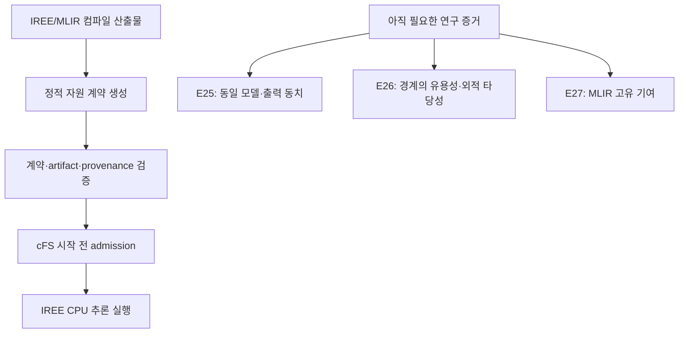

# onAIR-MLIR 최신 저장소 검토

> 검토 기준: `c680424eb0fe29123335264b524d43874a46bcb5`  
> 대상 브랜치: `claude/review-and-proceed-4y1sag`  
> 비교 기준: `f51f66e04953cee8f445cbba441b3dd01d39ecb8`  
> 검토일: 2026-09-09

## 1. 한 줄 결론

**v0.20/E24b는 방어적 구현과 감사 가능성이 상당히 좋아진 강한 프로토타입이지만, 논문의 핵심 연구 질문을 증명한 단계는 아니다.** 이전 검토의 R1·R3과 smoke 경로는 사실상 해결됐고 R2·R4·R5도 큰 폭으로 개선됐다. 다만 세 항목에는 아직 경계 조건이 남아 있다. 이들은 짧은 보강으로 닫되, 더 이상의 결함 탐색을 주 실험으로 삼지 말고 이제 E25 → E26 → E27로 전환해야 한다.

## 2. 이번 변경의 성격

비교 기준 이후 9개 커밋, 29개 파일, 약 `+1510/-188` 줄이 변경됐다. 핵심은 다음과 같다.

- 음수 스택, 계약 산술 모순, shape 모순을 기본 거부한다.
- 상수 세그먼트 확인을 24개 제한 휴리스틱에서 tri-state subset-sum으로 교체했다.
- `--allow-*`로 실제 면제된 검사를 provenance에 기록한다.
- override가 기록된 계약의 헤더 생성을 기본 거부한다.
- 문서화된 native/cFS smoke 경로 두 곳을 다시 실행 가능하게 고쳤다.
- 이전 외부 검토 결과를 저장소 안에 보존하고, 우선순위를 E25–E27로 재정렬했다.

이는 단순 문서 수정이 아니라 계약 생성기와 소비자 사이의 fail-closed 성질을 실제로 강화한 변경이다. 반면 **동일 AI 모델의 OnAIR↔cFS 의미 동치, 계약 경계의 실용성, 정규 MLIR pass로서의 기여에는 새 실험 결과가 추가되지 않았다.** 저장소도 이 사실을 명시하고 있어 현재의 자기평가는 정직하다.

## 3. 독립 검증 결과

깨끗한 detached worktree에서 다음을 확인했다.

| 검사 | 결과 | 해석 |
|---|---:|---|
| 원격 HEAD 일치 | `c680424` | 검토 중 원격 변경 없음 |
| Python compileall | 통과 | Python 구문 오류 없음 |
| shell `bash -n` | 통과 | 주요 build/smoke 스크립트 구문 정상 |
| 저장소 JSON 파싱 | 통과 | JSON 문법 정상 |
| GitHub Actions YAML 파싱 | 통과 | workflow 문법 정상 |
| `contract_negative_tests.py` | **86/86 통과, 8 skip** | 현 환경에서 실행 가능한 회귀 검사는 전부 통과 |
| `git diff --check` | 문서 EOF 공백 1건 | 실행 코드 문제는 아니며 기존 검토 문서의 사소한 형식 문제 |

8개 skip은 IREE Python/runtime, `iree-compile`, `iree-dump-module`, `jsonschema`가 현 검토 환경에 없어서 발생했다. 따라서 이 검토가 full-IREE 경로를 독립 재실행한 것은 아니다.

저장소의 E24b 증거 문서는 CI run `34308570379`에서 다음 결과를 기록한다.

- full: `169/169 + 1 skip`
- without-IREE: `85/85 + 9 skip`
- stdlib-only: `85/85 + 9 skip`

이 수치는 저장소에 기록된 증거를 확인한 것이며, 본 검토에서 GitHub Actions API로 원격 로그 자체를 재검증한 수치는 아니다.

## 4. 이전 R1–R5 판정

| 항목 | 최신 판정 | 연구상 의미 |
|---|---|---|
| R1 음수 스택 | **해결** | 생성기와 헤더 소비 경계가 모두 음수를 거부한다. 단, 원인 설명의 `unsigned 비교` 표현은 실제 C 코드와 다르다. |
| R2 `bounded = per_call + constants` | **대부분 해결, 경계 보강 필요** | 정상 생성 계약은 보호된다. nullable/음수 구성요소에는 우회가 남는다. |
| R3 ABI/target/shape 모순 | **해결** | 현재 계약 표현과 정상 생성 경로 범위에서는 모순을 fail-closed 처리한다. |
| R4 상수 subset 확인 | **큰 폭 개선, 지원 한계 처리 필요** | 24-segment cap 제거와 비공허 회귀 검사는 좋다. 256 MiB 초과 시 `None` 처리 정책이 미완성이다. |
| R5 override provenance | **기록은 해결, 종단 간 강제는 부분 해결** | 명시된 override는 잡지만 provenance 삭제/legacy 경로와 C 소비가 남는다. |
| 문서 smoke 경로 | **해결** | 두 기본 경로가 회귀 검사에 포함되고 통과한다. |

## 5. 남은 주요 발견

### F1. provenance가 없는 계약은 기본 허용되고, C 게이트는 검증 매크로를 사용하지 않는다

**분류:** 논문 주장 차단 가능 / 프로토타입 운용정책 결정 필요

`gen_contract_header.py`는 provenance가 존재하면서 `overrides_applied`가 비어 있지 않거나 `verification_grade != verified`, 또는 `single_invocation != true`이면 기본 거부한다. 이 부분은 올바르게 구현됐다.

그러나 다음 경로는 남아 있다.

1. override 계약에서 `provenance` 블록을 삭제하면 헤더 생성이 성공한다.
2. 헤더에는 `CONTRACT_PROVENANCE_VERIFIED 0`이 기록된다.
3. `ai_learner.c`를 포함한 C 소비자는 이 매크로를 admission 조건으로 사용하지 않는다.

이는 하위 호환성을 위한 의도적 정책이지만, **“검증된 계약만 배포된다” 또는 “override provenance를 종단 간 강제한다”는 주장은 현재 성립하지 않는다.** 내부의 신뢰된 생성기 출력만 입력으로 인정한다면 P2 hardening이다. 반대로 계약 JSON을 교환 형식이나 배포 보안 경계로 주장한다면 P1이다.

권고:

- 현재 스키마 버전을 명시한다.
- 신규 버전에서는 provenance를 필수로 한다.
- legacy 계약은 `--allow-legacy-contract` 같은 명시적 경로로만 허용한다.
- cFS admission에도 `CONTRACT_PROVENANCE_VERIFIED == 1`을 적용하거나, 적용하지 않는다면 threat model에서 그 이유와 신뢰 경계를 명시한다.

### F2. R2 산술 검사는 구성요소가 정수일 때만 실행된다

**분류:** 신뢰 모델에 따라 P1 또는 P2

현재 `bound_known`은 `bound_method`, `bounded_bytes`, `unresolved`만으로 결정된다. 그 뒤 `static_per_call_bytes`와 `module_resident_constant_bytes`가 **둘 다 정수일 때만** 합계 일치를 검사한다.

따라서 다음과 같은 계약도 `BOUND_KNOWN=1` 헤더가 된다.

- `static_per_call_bytes = null`, `bounded_bytes = 3528`
- `static_per_call_bytes = 3529`, `module_resident_constant_bytes = -1`, `bounded_bytes = 3528`

스키마도 `static_per_call_bytes`의 `null`을 허용하고 정수 필드에 `minimum: 0`을 요구하지 않는다. 정상 `make_contract.py` 출력에서는 발생하지 않으므로 생성기를 신뢰하면 핵심 연구를 막는 문제는 아니다. 그러나 스키마 유효 계약 전체에 대해 헤더 소비 안전성을 주장하려면 닫아야 한다.

권고: `bound_known` 계약에는 두 구성요소가 모두 비음수 정수임을 요구하고, 스키마에도 조건부 제약 또는 소비자 측 명시 검사를 추가한다.

### F3. 256 MiB를 넘는 상수 총량은 `unevaluable`이지만 기본 거부되지 않는다

**분류:** 지원 범위 정의가 필요한 경계 정확성 문제

`subset_sum_match()`는 총량이 `SUBSET_SUM_MAX_TOTAL = 256 MiB`보다 크면 `None`을 반환한다. 그러나 호출부는 `iree-dump-module` 자체가 없을 때의 `rodata_unavailable`과 명백한 모순인 `False`만 거부한다. **연산 예산 초과로 생긴 `None`은 주석만 남기고 bound-known 계약을 계속 생성할 수 있다.**

이는 intended small onboard CPU model에서는 드물 가능성이 크므로 실험 우선순위를 뒤집을 문제는 아니다. 다만 알고리즘의 지원 영역을 명시하지 않은 채 “artifact-side로 constants를 독립 확인한다”고 일반화하면 반례가 된다.

권고는 둘 중 하나다.

- 256 MiB 초과를 기본 거부하고 명시적 override만 허용한다.
- 계약에 `constants_confirmation = unevaluable_budget_exceeded`를 기계 판독 가능한 상태로 기록하고, 논문 주장을 `≤256 MiB` 지원 영역으로 제한한다.

### F4. 31-segment 실측 산출물은 저장소에 충분히 보존되지 않았다

**분류:** P2 재현성 보강

회귀 테스트는 31개 정수 배열을 합성하여 이전 24-cap 결함을 정확히 검사한다. 수정 후 테스트가 공허하지도 않고 알고리즘 단위 검증으로는 적절하다.

다만 문서는 실제 compile flag로 31개의 data segment를 얻었다고 기록하면서, 그 MLIR/VMFB/dump 산출물과 실행 결과 파일은 보관하지 않았다. 논문에서 이 사례를 “실제 IREE 산출물 검증”으로 사용할 예정이면 최소 재현 명령, 도구 버전, 관련 dump 또는 해시를 보존하는 편이 좋다.

### F5. R1 문서의 `unsigned 비교` 원인 설명은 실제 코드와 다르다

**분류:** P2 문서 정확성

`ai_learner.c`의 `es_stack`과 `stack_needed`는 모두 `long`이며 `info.StackSize`도 `(long)`으로 변환된다. 음수 계약 스택이 통과했던 이유는 unsigned 승격이 아니라, 예를 들어 `stack_needed`가 큰 음수가 되어 정상적인 비음수 `es_stack >= stack_needed`가 참이 되기 때문이다.

코드 수정 자체는 맞다. `CLAUDE.md`와 E24b 증거 문서의 원인 설명만 signed 비교에 맞게 정정하면 된다.

## 6. 연구 구조에서 현재 위치

현재 저장소는 위쪽 실행 경로의 **구현 안전성**을 상당히 잘 만들었다. 하지만 논문 기여는 아래쪽 세 증거가 결정한다.

### E25 — OnAIR와 cFS가 같은 모델을 실행한다는 증명

현재 OnAIR 측은 외부 `weights.npz`, cFS 측은 주로 baked-weight VMFB를 사용한다. 따라서 “양쪽에서 AI가 돈다”는 것과 “동일한 학습 파라미터·전처리·입력으로 의미상 동일한 모델이 돈다”는 것은 아직 다르다.

최소 산출물:

- 하나의 canonical model/weight 출처
- 동일 입력 벡터와 전처리
- OnAIR와 cFS의 출력 비교
- 허용 오차, dtype, layout, label mapping 명시
- 모델→VMFB→계약→실행 로그를 연결하는 hash/ID

### E26 — 계약한 부분 메모리 경계가 실제로 유용한가

현재 경계는 전체 OBC 메모리가 아니라 `per-call buffers + module constants`라는 **부분 경계**다. 이 정의는 정직하고 구현 가능하지만, 다음을 보여야 연구적 가치가 생긴다.

- 모델 크기·shape·분기 구조 변화에 따라 계약 값이 합리적으로 변하는가
- 정적 bound와 실제 관측 peak 사이의 차이가 얼마나 되는가
- 예산 경계 전후에서 ADMIT/DENY가 의도대로 바뀌는가
- 경계 밖인 runtime context, allocator overhead, cFS pipe/stack을 어떻게 별도 귀속하는가

### E27 — 왜 일반 LLVM 분석이 아니라 MLIR/IREE 단계여야 하는가

현 구현은 MLIR/IREE 산출물을 읽는 API 후처리 verifier이지, 등록된 정규 MLIR pass는 아니다. 이것은 프로토타입으로 유효하지만 “MLIR compiler pass 기여”라고 부르면 과장이다.

다음 중 최소 하나가 필요하다.

- MLIR operation/type/attribute를 직접 다루는 pass 또는 dialect-level analysis
- lowering 전후 정보 손실을 정량화한 비교
- LLVM IR/ELF에서 복원하기 어렵지만 MLIR에서는 정확히 보존되는 shape·allocation lifetime·dispatch 관계를 이용한 분석
- 동일 계약을 LLVM/ELF-only 방식과 비교한 정확도·보수성·진단 가능성 결과

## 7. 권장 다음 순서

1. **E25를 즉시 수행한다.** 지금 논문의 가장 큰 구조적 공백이다.
2. F1–F3는 별도 대형 실험으로 키우지 말고, E25 전에 짧은 hardening patch와 회귀 테스트로 닫는다.
3. E26에서 여러 모델/shape/예산을 사용해 부분 경계의 유용성과 한계를 정량화한다.
4. E27에서 실제 MLIR-level 분석 또는 LLVM/ELF-only baseline 비교로 고유 기여를 만든다.
5. 그 뒤 AArch64 QEMU와 가능하면 저가 AArch64 SBC로 portability와 wall-time/RSS를 보완한다. QEMU만으로 기능·ISA 이식성 논리는 성립하지만 실제 성능, WCET, 전력 주장은 하지 않는다.

## 8. 냉정한 최종 평가

| 평가축 | 상태 |
|---|---|
| 구현 완성도 | 높음 — 실패 경로와 회귀 테스트가 체계적임 |
| 증거 추적성 | 높음 — 결정·실험·반례 이력이 잘 남아 있음 |
| 계약 소비 안전성 | 중상 — 정상 생성 경로는 강함, legacy/nullable/limit 경계가 남음 |
| cFS 통합 타당성 | 중상 — admission 위치와 artifact binding은 설득력 있음 |
| AI 실험 타당성 | 중간 — 양쪽 동일 모델·동일 출력 증명이 아직 없음 |
| MLIR 학술 기여 | 중하 — 현재는 MLIR API 기반 후처리 도구에 가까움 |
| 논문 핵심 주장 준비도 | 중간 — H3 일부는 지지되나 E25–E27 없이는 중심 기여가 약함 |

**종합 판정:** 실패한 연구가 아니라, 연구 인프라와 방어적 구현이 본 실험보다 앞서간 상태다. E24b는 필요한 마무리였지만 같은 유형의 review–patch 순환을 계속하면 연구가 지엽화된다. 지금부터는 결함 수를 더 줄이는 것보다 **같은 모델을 실제로 연결하고(E25), 이 부분 경계가 쓸모 있음을 보이며(E26), MLIR에서만 얻는 이득을 입증하는 것(E27)**이 우선이다.

## 9. 근거 코드와 기록

- 저장소: <https://github.com/wookjaeya/onAIR-MLIR>
- 검토 커밋: <https://github.com/wookjaeya/onAIR-MLIR/commit/c680424eb0fe29123335264b524d43874a46bcb5>
- R2/R5 헤더 검사: <https://github.com/wookjaeya/onAIR-MLIR/blob/c680424eb0fe29123335264b524d43874a46bcb5/harness/gen_contract_header.py>
- R4 subset-sum과 계약 생성: <https://github.com/wookjaeya/onAIR-MLIR/blob/c680424eb0fe29123335264b524d43874a46bcb5/harness/make_contract.py>
- cFS admission/stack gate: <https://github.com/wookjaeya/onAIR-MLIR/blob/c680424eb0fe29123335264b524d43874a46bcb5/native/cfs_app/fsw/src/ai_learner.c>
- 계약 스키마: <https://github.com/wookjaeya/onAIR-MLIR/blob/c680424eb0fe29123335264b524d43874a46bcb5/contracts/contract.schema.json>
- E24b 증거: <https://github.com/wookjaeya/onAIR-MLIR/blob/c680424eb0fe29123335264b524d43874a46bcb5/docs/EVIDENCE_v0.20_E24b.md>
- 저장소 기록 CI run: <https://github.com/wookjaeya/onAIR-MLIR/actions/runs/34308570379>
