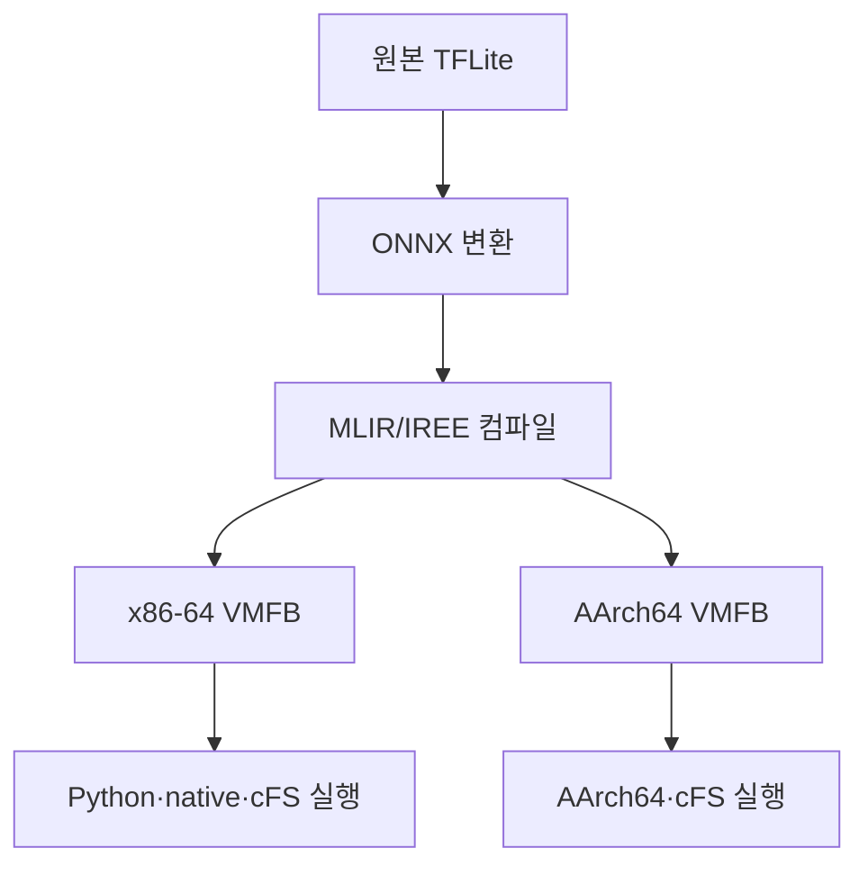

# TFLite 비교실험 필요성 및 구성 분석

## 1. 결론

TFLite 비교는 필요하다. 다만 논문에서 담당하는 역할을 정확히 제한해야 한다.

> **TFLite는 MLIR보다 열등하다는 것을 보이기 위한 경쟁 대상이 아니라, 변환 전 실제 모델의 기능과 품질이 IREE/MLIR 경로에서도 보존됐음을 확인하는 원본 기준선이다.**

현재 연구의 핵심은 `MLIR/IREE에서 실행 전 부분 메모리 계약을 산출하고 cFS admission에 사용하는 것`이다. 따라서 비교실험은 다음 세 층으로 분리하는 것이 가장 타당하다.

| 비교 층 | 질문 | 필요성 | 논문의 역할 |
|---|---|---:|---|
| 의미 동치 | TFLite 모델과 IREE 모델이 같은 계산을 하는가? | **필수** | 모델 변환의 타당성 |
| 메모리 특성 | TFLite와 IREE 실행 시 실제 메모리는 어떻게 다른가? | 권장 | 시스템적 배경·외부 타당성 |
| admission 방법 | MLIR 계약이 단순 크기·프로파일링보다 안전하고 유용한가? | **필수** | 논문의 핵심 기여 |

TFLite 의미 동치 비교 없이 실제 레퍼런스 모델을 사용하면 심사자는 다음과 같이 반박할 수 있다.

> 메모리 계약은 맞을 수 있지만, TFLite→ONNX→IREE 변환 과정에서 모델의 계산이나 정확도가 바뀌었을 가능성이 있다.

반면 TFLite와 IREE의 실행시간이나 전체 RSS만 단순 비교하면 서로 다른 런타임·커널·allocator의 차이가 섞이므로 MLIR 계약의 효과를 입증하지 못한다.

---

## 2. 먼저 구분해야 할 대상

### 2.1 TFLite 모델 파일

`.tflite`는 학습된 연산 그래프·가중치·양자화 정보를 담는 모델 표현이다. 현재 연구에서 실제 레퍼런스 모델의 원본 또는 배포 기준 산출물 역할을 한다.

### 2.2 TensorFlow Lite runtime

Linux/AArch64와 같은 CPU 환경에서 `.tflite` 모델을 실행하는 일반 런타임이다. IREE 실행 결과와 원본 출력의 의미 동치를 확인할 때 적합하다.

### 2.3 TensorFlow Lite Micro

마이크로컨트롤러용 정적 메모리 arena 중심 런타임이다. MLPerf Tiny 모델의 배포 기준으로 의미가 있지만, 현재 연구의 AArch64 CPU+cFS 환경과 동일한 실행환경은 아니다.

따라서 논문에서 `TFLite`와 `TFLite Micro`를 같은 baseline으로 서술하면 안 된다.

- 원본 모델 기능 검증: TFLite runtime이 직접적 기준선
- MCU 정적 메모리 관리와의 비교: TFLite Micro가 선택적 기준선
- 현재 AArch64 CPU+cFS 배치 타당성: IREE AArch64와 cFS 경로가 직접적 대상

---

## 3. 왜 의미 동치 비교가 필수인가

현재 외부 모델의 변환 경로에는 대체로 다음 단계가 포함된다.

각 변환 단계에서 다음 차이가 발생할 수 있다.

- 연산자 치환 또는 미지원 연산의 우회
- 입력·출력 tensor layout 변경
- 전처리의 dtype·정규화·채널 순서 차이
- quantization scale·zero point 처리 차이
- padding, resize, activation 등의 의미 차이
- 부동소수점 연산 순서에 따른 수치 오차
- label 순서 및 후처리 차이

따라서 VMFB가 정상 실행되고 출력 shape가 같다는 사실만으로는 동일 모델이라고 할 수 없다.

필요한 논증은 다음 두 수준이다.

### 3.1 수치적 동치

같은 입력 byte를 사용하여 원본 TFLite 출력과 IREE 출력의 차이를 측정한다.

권장 지표:

- maximum absolute error
- maximum relative error
- mean absolute error 또는 RMSE
- cosine similarity
- Top-1 또는 argmax 일치 여부

FP32 모델은 사전에 정한 `atol`·`rtol`을 사용한다. `1e-4`, `1e-5` 같은 값은 출발점일 뿐이며, 모델 연산과 변환 특성에 따라 근거를 제시해야 한다.

양자화 모델은 단순 FP32 tolerance를 적용하지 말고 다음을 고정한다.

- 입력·출력 scale 및 zero point
- integer tensor 직접 비교 여부
- dequantization 후 비교 여부
- 허용 오차를 quantization step 단위로 정의

### 3.2 과업 수준 동치

출력 tensor가 근접해도 최종 과업 결과가 달라질 수 있다. 공식 validation/test dataset에서 다음을 함께 보고해야 한다.

| 과업 | 최소 지표 |
|---|---|
| 이미지 분류 | accuracy, Top-1 agreement, confusion matrix |
| 이상 탐지 | AUC 또는 공식 벤치마크 지표, threshold별 판정 일치 |
| 다중 클래스 SmartCam | 클래스별 precision/recall 또는 최소한 클래스별 일치율 |

핵심 보고값은 다음과 같다.

\[
\Delta Q = Q_{\mathrm{IREE}} - Q_{\mathrm{TFLite}}
\]

논문에서는 `정확도가 비슷해 보였다`가 아니라 다음을 명시해야 한다.

- 평가 데이터셋과 split
- 샘플 수
- 전처리 코드와 checksum
- 허용 가능한 품질 저하 기준
- 불일치 샘플 수와 유형

공식 전체 평가셋을 사용할 수 없다면 `정확도 보존`을 주장하지 말고 `공개된 golden/sample input에 대한 출력 동치`로 주장을 제한한다.

---

## 4. TFLite 메모리 비교는 어디까지 필요한가

### 4.1 권장되는 이유

TFLite 메모리 측정을 포함하면 실제 모델이 다른 배포 런타임에서 어느 정도 메모리를 요구하는지 보여줄 수 있다. 또한 MLIR 계약의 보수성이 비정상적인 수준인지 판단하는 참고값이 된다.

그러나 다음처럼 직접 결론을 내리면 안 된다.

> IREE peak가 TFLite peak보다 작으므로 MLIR 계약 방식이 우수하다.

이 차이는 MLIR 계약 때문이 아니라 runtime, kernel, allocator, constant loading, memory mapping 정책 차이일 수 있다.

### 4.2 메모리 범위를 맞춰야 한다

현재 계약은 전체 프로세스 메모리 계약이 아니라 모델 실행과 직접 관련된 부분적 계약이다. 비교 범위를 다음처럼 분리해야 한다.

| 범위 | 포함 대상 | 비교 가능성 |
|---|---|---|
| S1 모델 buffer | activation, temporary tensor, per-call allocation | 직접 비교 가능 |
| S2 모델 상수 | weights/constants의 map 또는 copy | 정책을 맞춘 뒤 비교 |
| S3 runtime/session | interpreter·HAL·driver 상태 | 별도 보고 |
| S4 process total | 코드, shared library, cFS/OSAL, stack, allocator overhead | 계약값과 직접 비교 금지 |

다음처럼 서로 다른 값을 비교하면 안 된다.

\[
\text{MLIR partial contract} \quad \text{vs.} \quad \text{TFLite process RSS}
\]

가능하면 두 런타임 모두 allocator instrumentation을 이용해 S1–S4를 분리한다. 분리가 불가능하면 TFLite memory peak는 설명적 참고값으로만 제시하고 계약의 soundness 판단에는 사용하지 않는다.

### 4.3 TFLite Micro를 포함할 조건

다음 중 하나를 주장할 때만 TFLite Micro memory arena를 비교 대상으로 포함한다.

- MLPerf Tiny의 표준 embedded deployment와 비교한다.
- 정적 arena 기반 메모리 계획과 MLIR 조건부 계약의 차이를 분석한다.
- 향후 MCU급 온보드 컴퓨터까지 적용범위를 확장한다.

현재 논문이 AArch64 CPU+cFS를 대상으로 한다면 TFLite Micro는 필수 baseline이 아니다. 포함하더라도 별도의 보조 실험으로 두고 `서로 다른 runtime 간 메모리 요구 특성 비교`로 표현해야 한다.

---

## 5. MLIR 기여를 입증하는 주된 baseline

TFLite는 MLIR 고유 기여를 증명하는 가장 직접적인 baseline이 아니다. 핵심 비교는 동일한 IREE 모델과 동일한 실행환경 안에서 정보 수준만 바꾸어야 한다.

| 방법 | 사용하는 정보 | 비교 목적 |
|---|---|---|
| 파일 크기 기반 | VMFB file size | 가장 단순한 휴리스틱 |
| ELF/VMFB artifact-only | section·embedded data | compiled artifact 기반 추정 |
| runtime profiling | 관찰된 allocation peak | 특정 실행에서의 경험값 |
| MLIR universal contract | 모든 경로의 보수적 상한 | 실행 전 soundness |
| MLIR conditional contract | 경로 조건별 상한 | soundness와 tightness 동시 개선 |

이 비교에서는 다음 조건을 동일하게 유지해야 한다.

- 동일한 원본 모델과 VMFB
- 동일 target ISA
- 동일 IREE 버전과 build option
- 동일한 model loading 방식
- 동일한 memory scope
- 동일한 fail-closed 정책
- 동일한 입력 집합

이 구조여야 측정 차이를 MLIR 정보의 기여로 귀속할 수 있다.

---

## 6. 권장 실험 매트릭스

### 6.1 대상 모델

| ID | 모델 | TFLite 비교 역할 |
|---|---|---|
| B0 | 합성 회귀 모델 | 연산·분기 단위 검증; 실제 정확도 비교 대상 아님 |
| B1 | OPS-SAT SmartCam MobileNetV2 | 실제 응용 모델의 golden/과업 동치 |
| B2 | MLPerf Tiny ResNet | CIFAR-10 분류 정확도·출력 동치 |
| B3 | MLPerf Tiny Deep Autoencoder | ToyADMOS 기반 anomaly score·AUC 동치 |
| B4 | MLPerf Tiny VWW | VWW 분류 정확도·출력 동치 |

B0는 계약 분석기의 회귀시험용이다. 논문의 외부 타당성은 B1–B4가 담당해야 한다.

### 6.2 실행 경로

각 실제 모델에 대해 가능한 범위에서 다음 경로를 구성한다.

| 경로 | 목적 |
|---|---|
| TFLite reference | 원본 출력·품질 기준 |
| IREE Python x86-64 | 변환 직후 의미 동치 |
| IREE native x86-64 | wrapper 독립성 |
| cFS x86-64 | admission 통합 검증 |
| IREE native AArch64 | target ISA 동치 |
| cFS AArch64 | 최종 배치 경로 검증 |

모든 경로에서 동일한 입력 byte, preprocessing 결과 및 label mapping을 사용해야 한다. 각 wrapper가 별도로 이미지를 resize하거나 normalize하도록 두면 비교가 무효화될 수 있다.

### 6.3 최소 실험 세트

현실적인 최소 구성은 다음과 같다.

1. B1–B4의 TFLite↔IREE x86-64 출력 동치
2. 공식 평가셋을 사용할 수 있는 B2–B4의 과업 품질 비교
3. B1 또는 B2 한 개 모델의 TFLite↔IREE↔cFS↔AArch64 end-to-end 비교
4. 동일 IREE 실행에 대한 MLIR 계약 soundness 검증
5. 파일 크기·artifact-only·profiling·universal·conditional 계약 비교

TFLite를 모든 cFS 경로에 내장할 필요는 없다. TFLite는 원본 기준선으로 독립 실행하고, cFS에는 제안한 IREE/MLIR 경로만 연결해도 연구 논리는 성립한다.

---

## 7. 측정 및 반복 설계

### 7.1 의미 동치

- 모델당 공식 evaluation dataset 전체 사용을 원칙으로 한다.
- 전체 dataset이 불가능한 경우 모든 class를 포함한 고정 subset을 사전 정의한다.
- 입력 파일 목록과 checksum을 공개한다.
- preprocessing 결과 자체를 binary fixture로 저장하여 런타임별 차이를 제거한다.
- 모델 변환과 VMFB 생성 명령·버전·checksum을 기록한다.
- 출력 전체를 저장하고 argmax만 비교하지 않는다.

출력이 tolerance 안에서 완전히 일치하면 단순 유의성 검정은 필요하지 않다. 불일치가 발생하면 다음을 보고한다.

- 불일치 비율과 95% confidence interval
- class별 불일치 분포
- decision boundary 근처 샘플인지 여부
- 변환 단계별 중간 출력 또는 연산자 차이

### 7.2 메모리

- cold process start를 기준으로 반복한다.
- 입력 class와 shape 조건을 포괄한다.
- 반복 실행 횟수를 사전에 고정한다.
- map 경로와 copy fallback 경로를 분리한다.
- observed peak의 maximum을 계약 soundness 비교에 사용한다.
- 평균 peak만으로 soundness를 판단하지 않는다.

계약 soundness의 기본 판정식은 다음이다.

\[
\forall m,i,t,p:\quad P(m,i,t,p) \le B(m,t,p)
\]

- `m`: model
- `i`: input
- `t`: target
- `p`: execution path
- `P`: observed peak
- `B`: static contract bound

추가로 계약의 보수성을 다음과 같이 보고한다.

\[
\text{Tightness Ratio}=\frac{B}{P}
\]

`B/P`가 클수록 안전할 수는 있지만 실제 admission에서 불필요한 거부가 증가한다. 따라서 soundness와 tightness를 동시에 보고해야 한다.

### 7.3 admission 유용성

`B-1/B/B+1`은 경계 구현의 정확성을 확인하는 시험이다. 실제 유용성은 현실적인 memory budget grid에서 다음을 측정해야 한다.

- unsafe admit rate
- false reject rate
- admission coverage
- universal 계약 대비 conditional 계약의 추가 admit 수
- map 조건이 증명되지 않을 때 worst-case로 안전하게 fallback하는 비율

---

## 8. 논문 RQ와 TFLite의 위치

### RQ1. 변환된 모델은 원본 기능을 보존하는가?

- 기준선: TFLite
- 대상: IREE x86-64, IREE AArch64, cFS 경로
- 지표: 수치 오차, Top-1 agreement, accuracy/AUC delta

### RQ2. MLIR 계약은 실제 IREE 실행 메모리를 안전하게 상한하는가?

- 기준선: IREE runtime allocation trace
- TFLite 역할: 없음 또는 참고용
- 지표: violation count, tightness ratio

### RQ3. 조건부 MLIR 계약은 다른 admission 방법보다 유용한가?

- 기준선: 파일 크기, artifact-only, runtime profile, universal contract
- TFLite 역할: 핵심 baseline이 아님
- 지표: unsafe admit, false reject, coverage

### RQ4. 실제 cFS/AArch64 배치 경로에서도 계약과 의미가 유지되는가?

- 기준선: TFLite 원본 출력과 IREE x86-64 출력
- 대상: cFS AArch64
- 지표: admission 결과, observed peak, 출력 동치

---

## 9. 예상 심사 지적과 대응

### 지적 1. 왜 TFLite를 직접 cFS에서 실행하지 않았는가?

대응:

- 본 연구의 대상은 IREE/MLIR 기반 cFS admission 구조다.
- TFLite는 원본 모델 의미의 기준선으로 사용한다.
- TFLite cFS 통합은 다른 runtime integration 연구이며 핵심 가설 검증에 필요하지 않다.

### 지적 2. TFLite보다 메모리를 더 많이 쓰면 제안 방식이 무의미하지 않은가?

대응:

- 연구의 목적은 최소 메모리 runtime 경쟁이 아니다.
- 핵심은 실행 전에 검증 가능한 상한을 제공하는 것이다.
- 전체 footprint와 부분 실행 계약을 분리하여 보고한다.

단, 제안 구조의 전체 footprint가 실제 온보드 예산을 현저히 초과한다면 적용 가능성의 한계로 명시해야 한다.

### 지적 3. TFLite Micro에는 이미 정적 arena가 있는데 MLIR이 왜 필요한가?

대응하려면 단일 상한이 아니라 다음 기여가 필요하다.

- map/copy fallback 등 실행 경로별 조건부 계약
- cFS mission table과 연동되는 admission decision
- AArch64 CPU와 IREE 배포 artifact에 대한 계약
- runtime을 실행하기 전 배치 가능성 판단

단순히 `MLIR로 메모리 숫자 하나를 추출했다`는 수준이면 TFLite Micro의 arena planning 대비 차별성이 약하다.

### 지적 4. TFLite와 IREE의 메모리를 왜 직접 비교했는가?

대응:

- 동일한 scope로 계측한 값만 정량 비교한다.
- runtime 전체 RSS는 별도 표로 보고한다.
- cross-runtime 결과는 구조적 차이를 설명하는 보조 자료로만 사용한다.

---

## 10. 하지 않아도 되는 실험

현재 논문의 핵심 범위를 유지하려면 다음은 제외할 수 있다.

- TFLite와 IREE의 광범위한 latency 우열 비교
- GPU/NPU 성능 비교
- 모든 TFLite 연산자에 대한 호환성 시험
- TFLite runtime 자체의 cFS porting
- 공급망·모델 서명·계약 JSON 공격 시험
- QEMU latency를 실제 하드웨어 성능으로 일반화

이들은 메모리 계약의 soundness·utility·MLIR 고유 기여를 직접 논증하지 않는다.

---

## 11. 최종 권고

### 반드시 수행

1. 실제 모델 B1–B4의 TFLite↔IREE 출력 동치
2. 공식 데이터셋을 이용한 accuracy/AUC guardrail
3. 최소 한 실제 모델의 TFLite↔IREE↔cFS AArch64 end-to-end 의미 동치
4. 동일 IREE 환경에서 MLIR 계약과 observed peak 비교
5. 동일 fail-closed 정책을 사용한 admission baseline 비교

### 권장 수행

1. TFLite와 IREE의 모델 buffer·constant·runtime memory 분리 측정
2. TFLite Micro arena와 MLIR 계약의 제한적 보조 비교
3. universal 계약과 map/copy 조건부 계약의 false reject 비교

### 논문에서 피할 주장

- `MLIR/IREE가 TFLite보다 빠르다`
- `MLIR/IREE가 TFLite보다 항상 메모리를 적게 사용한다`
- `부분 메모리 계약이 cFS 전체 메모리 안전성을 보장한다`
- `QEMU 결과가 실제 우주 온보드 하드웨어의 시간 성능을 대표한다`

최종적으로 TFLite 비교는 다음 한 문장으로 위치를 정리할 수 있다.

> **TFLite 비교는 제안 방식의 경쟁 우위를 직접 증명하는 실험이 아니라, 실제 레퍼런스 모델이 MLIR/IREE 및 cFS 배치 경로에서도 원래의 의미와 품질을 유지한다는 것을 보장하는 필수 검증층이다. MLIR의 고유 기여는 동일 IREE 실행을 대상으로 한 정적·조건부 메모리 계약과 admission baseline 비교에서 증명해야 한다.**
